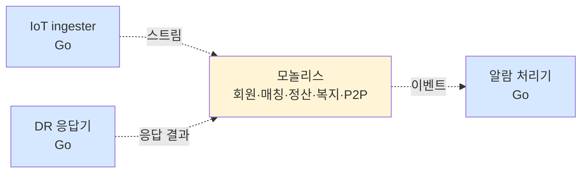

# 1장. 아키텍처 기초 — 작은 조직 / 공공 협력 위에서

> 같은 트레이드오프 박스가 25명 조직과 220명 조직에서 다른 결정으로 이어진다.

## 이 장에서 답하는 질문

- 25명 조직의 아키텍트는 매일 무엇을 하는가?
- 1권의 NFR 7가지가 동네에너지에서는 어떻게 우선순위가 달라지는가?
- 모놀리스 / 모듈러 / MSA — 25명 조직에서는 어떻게 결정하는가?
- 공공 협력은 의사결정에 어떤 새로운 제약을 추가하는가?

## 들어가며

[1권 1장](../../manuscript/01-아키텍처-기초/README.md) 에서 다룬 사고 골격은 그대로다 — 비기능 요구사항(NFR), Bounded Context, ADR, C4 모델.
달라지는 것은 **NFR 우선순위 · 스타일 선택 · 조직 자율성** 이 25명·공공 협력의 무게 아래에서 어떻게 다른 결정을 만드는가다.

> 본 장은 1권 1장의 골격을 가정하고 차별점만 정리한다. 사고법 자체를 처음 접하는 독자는 1권 1장을 먼저 권한다.

## 1. 25명 조직의 아키텍트

### 1.1 1권 (220명) 과의 시간 분배 차이

| 활동 | 1권 (220명) | 2권 (25명) |
|------|-------------|-----------|
| 코드 작성 | 30% | **50%** (직접 IoT ingester / 핵심 도메인 작성) |
| 의사결정 / 회의 | 25% | 15% (회의 자체가 적음) |
| 글쓰기 (ADR / 설계) | 15% | 15% (필수 — 사람이 적어 인계 더 중요) |
| 코드 리뷰 | 15% | 10% |
| 외부 협력 | 5% | **20%** (한전·세종시·복지부) |
| 채용 / 멘토링 | 10% | 5% (채용 자체가 분기 단위) |

### 1.2 흔한 함정 — 25명에서 220명 책을 그대로 따라가지 말 것

> - **MSA 80개** — 220명에서도 빠듯한데 25명에서는 운영 불가능. 모놀리스 + 1~3개 추출이 한계
> - **SRE 별도 팀** — 25명에서 SRE 3명은 한 본부. 인프라/플랫폼 3명이 SRE·DevOps·관측성 겸함
> - **도메인팀 분리** — 25명에서 도메인을 7개로 나누면 팀당 평균 2명. 인지 부하 부족 → 모놀리스 안에서 모듈 경계
> - **자체 관측성 self-host** — Loki / Tempo / Prometheus 운영은 SRE 1.5명. 매니지드 Grafana Cloud 가 거의 강제

## 2. 비기능 요구사항(NFR) — 동네에너지의 우선순위 재배치

1권의 NFR 7가지 (성능·가용성·확장성·보안·운영성·유지보수성·비용) 는 그대로. **우선순위가 다르다**.

| NFR | 1권 (커머스) 우선 | 2권 (동네에너지) 우선 |
|-----|------------------|---------------------|
| 가용성 | ★★★ (결제 99.99%) | ★★★★ (**취약계층 알람 99.99% + IoT 손실률 0.1%**) |
| 성능 | ★★★ (p95 < 200ms) | ★★ (시민 앱 p95 < 500ms — 시니어 고려) |
| 확장성 | ★★★ (10배 트래픽) | ★★ (DR 5,000 TPS 폭주 외엔 평이) |
| 보안 | ★★★ (PII + 결제) | ★★★★ (**준 민감정보 + 공공 위탁 1건 사고 = 사업 중단**) |
| 운영성 | ★★ | ★★★★ (**25명 운영 — 자동화 없으면 불가**) |
| 유지보수성 | ★★ | ★★ |
| 비용 | ★★ (매출 6~8%) | ★★★ (매출 18~25% — 공공 sponsor 일부) |

### 트레이드오프 — 우선순위가 바뀐 두 영역

| 영역 | 1권 결정 | 2권 결정 | 이유 |
|------|---------|---------|------|
| **보안** | ISMS 의무 / PG 위탁 | + 분산에너지법 / 공공 위탁 책임 / 준 민감정보 | 사고 1건 = 사업 중단 |
| **운영성** | SRE 8 + 도메인팀 1차 | **인프라 3명이 모든 SRE / 도메인팀 = 백엔드 1팀** | 인력 절대 부족 |

## 3. 아키텍처 스타일 — 모놀리스가 더 오래 유지된다

### 3.1 1권 결정 매트릭스 다시 보기

[1권 1장 3.3 결정 매트릭스](../../manuscript/01-아키텍처-기초/README.md#33-결정-매트릭스) 의 5개 질문에 2권 답을 채우면:

| 질문 | 1권 (원픽 220명) | 2권 (동네에너지 25명) |
|------|----------------|---------------------|
| 팀이 30명 이상? | Yes | **No** |
| 서로 다른 도메인이 명확히 분리됨? | Yes (커머스·결제·검색 분명) | **부분적** (IoT 와 매칭은 다르지만 그 외는 결합 강) |
| 팀별로 배포 주기가 다름? | Yes | **No** (한 팀 = 한 배포) |
| 운영 인력 충분 (DevOps/SRE)? | Yes | **No** (3명, IoT 운영 겸함) |
| 분산 시스템 디버깅 경험 있음? | 일부 | **제한적** |

**No 가 4개 → 모듈러 모놀리스 + 최소 추출** 이 정답에 가깝다.

### 3.2 동네에너지의 선택

- **모놀리스**: 회원 / 매칭 / 정산 / 복지 / P2P — Spring Boot (Kotlin) 한 덩어리
- **추출 서비스 (3개)**:
  - **IoT ingester** (Go) — 초당 수만 record 처리, 모놀리스 분리 필수 (작업 특성 / 부하 격리)
  - **DR 응답 처리기** (Go) — 순간 5,000 TPS 폭주 격리
  - **알람 처리기** (Go) — 다중화 (앱 푸시 → SMS → 전화) 분리

### 3.3 1권의 "추출 단계" 와 다른 점

1권은 4단계 점진 이행 (모듈러 → 검색·추천 추출 → 결제 분리 → 평가).
2권은 처음부터 IoT 가 별도 — **부하 / 작업 성격이 도메인보다 더 큰 분리 기준**.

### 트레이드오프 — 분리 기준의 차이

| 기준 | 1권 (커머스) | 2권 (에너지) |
|------|--------------|------------|
| 도메인 분리 | 검색·추천을 별도로 | 시계열 / DR 폭주를 별도로 |
| 데이터 분리 | 도메인 DB 분리 | 시계열 (TimescaleDB extension) 만 분리, 도메인 DB 는 한 PostgreSQL |
| 분리 시점 | 모놀리스 운영 5년차 | **처음부터** (IoT 특성상) |

## 4. 공공 협력이라는 새 제약

1권에는 없던 영역. 25명 조직의 아키텍트는 외부 협력 시간이 20% 라고 했다.

### 4.1 공공 협력의 의사결정 영향

- **데이터 공유 위탁계약** — 한전·복지부·세종시 와의 데이터 흐름은 계약서에 박힌다. 변경 = 계약 수정.
- **공공 데이터허브 연계** — 세종시 데이터허브 의 API 스펙 변경 = 우리 API 변경. 우리 자율성 일부 양보.
- **공공 위탁비** — 시행기준 / 분기 보고. ADR 외 별도 보고서 형식.
- **공공 신뢰 사고 = 위탁 중단** — 결제 사고와 다른 차원의 비즈니스 리스크.

### 4.2 ADR 의 사용 — 공공 친화 표기

1권에서는 ADR Context / Decision / Consequences 표준 형식.
2권에서는 추가로 **"공공 위탁 영향"** 한 줄 — 본 결정이 한전 / KPX / 세종시 / 복지부 위탁 계약에 어떤 영향을 주는가.

## 5. 케이스 — 동네에너지의 아키텍처 결정 (1권 비교)

### 5.1 결정 요약

| 영역 | 1권 (원픽) | 2권 (동네에너지) |
|------|-----------|------------------|
| 스타일 | 모듈러 모놀리스 + 부분 추출 (검색·추천·라이브 등) | **모놀리스 + 작업성격별 추출 3개 (IoT / DR / 알람)** |
| 분리 기준 | 도메인 (Bounded Context) | **작업 부하 + 도메인** |
| 클라우드 | AWS 메인 + NCP 보조 | **NCP 메인 + AWS 보조** (공공 가점) |
| 관측성 | Grafana Cloud (변경 후) | Grafana Cloud (처음부터) |
| 데이터 | 도메인별 분리 (6종) | **한 PostgreSQL + TimescaleDB extension** (운영 단순) |
| 외부 협력 | PG / 본인인증 | **+ 공공 (한전 / KPX / 세종시 / 복지부)** |
| 운영 | SRE 본부 / 도메인팀 자율 | **인프라 3명이 SRE 겸함 / 백엔드팀 1차 온콜** |

### 트레이드오프 — 1권 결정을 그대로 가져왔다면

| 1권 결정 | 2권에서 그대로 채택 시 결과 |
|---------|---------------------------|
| AWS 메인 | 공공 사업 가점 손실 + 세종시 데이터허브 호환 부담 |
| 도메인 DB 분리 (6종) | 운영 인력 부족 → 백업·튜닝 누락 → 데이터 사고 |
| SRE 별도 본부 | 25명 중 5명을 SRE 에 — 도메인 개발 멈춤 |
| MSA 추출 5개+ | 분산 디버깅 비용 폭발 — 인프라팀 3명으로 불가 |

## 정리 — 체크리스트

- [ ] 1권의 NFR 7가지를 자기 조직 우선순위로 다시 매겼는가
- [ ] 1권 4가지 결정 매트릭스 답을 자기 환경으로 다시 풀었는가
- [ ] 작은 조직 / 큰 조직의 결정 차이를 한 줄 ADR 로 기록했는가
- [ ] 공공 협력이 있다면 "공공 위탁 영향" 항목을 의사결정 양식에 추가했는가
- [ ] 작업 부하 분리 vs 도메인 분리 둘 다 검토했는가

## 더 읽을거리

> 형식: 책 = `*제목*, N판 — 저자명 (출판사, 연도) — 한 줄 요약` ([ADR-0009](../../adr/0009-챕터-작성-표준.md) 룰 4)

- [1권 1장 — 아키텍처 기초](../../manuscript/01-아키텍처-기초/README.md) — 사고 골격의 원본
- *Software Architecture: The Hard Parts* — Mark Richards, Neal Ford (O'Reilly, 2021) — 분리 결정의 깊이 (1권과 공통)
- *Building Microservices*, 2판 — Sam Newman (O'Reilly, 2021) — 작은 조직의 MSA 함정 (3장)
