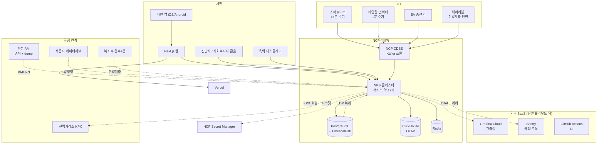

# 2장. 클라우드와 인프라 — 공공 협력 위에서

> 1권은 AWS 메인 + NCP 보조였다. 2권은 그 반대다 — 왜?

## 이 장에서 답하는 질문

- 공공 사업에서 국내 클라우드 우선이 정말 필요한가?
- 25명 조직에서 EKS / NKS vs Managed PaaS 의 결정 무게는 어떻게 다른가?
- 한전 / 세종시 데이터허브 같은 공공 폐쇄망 연계는 어떻게 다루는가?
- IoT 게이트웨이는 클라우드 안에 두는가, 외부에 두는가?

## 들어가며

1권의 클라우드 결정은 "사업의 자유로움" 이 1차 기준이었다.
2권의 클라우드 결정은 **공공 협력 + 데이터 주권** 이 1차 기준이다 — 공공 사업 가점 / 시민 데이터 한국 보관 / 폐쇄망 연계.

## 1. 클라우드 — NCP 우선 결정

### 1.1 1권 결정 매트릭스 재방문

| 질문 | 1권 답 | 2권 답 |
|------|--------|--------|
| 공공·금융 사업 비중이 큰가? | No | **Yes (사업 자체) → NCP 우선** |
| 한국어 24/7 지원 필수? | Premier | **NCP / KT 표준** |
| AI/ML 워크로드 핵심? | Yes | 부분적 (Prophet / XGBoost — 무거운 모델 아님) |
| 글로벌 진출 1~2년? | 검토 | **No (세종 단일)** |
| 망분리·격리망 요구? | 부분 | **공공 폐쇄망 연계 (한전 일부) — 부분 요구** |
| 비용 협상력 우선? | Yes (멀티) | 부분 (보조 AWS) |

### 1.2 결정 — NCP 단일 클라우드

- **NCP 단일** — 공공 사업 가점 + 시민 데이터 한국 리전 + 한국어 지원 + 세종시 데이터허브와의 협의 용이 + HyperCLOVA X (한국어 LLM) 자연 통합
- **보조 클라우드 없음** — 25명 조직이 멀티클라우드 운영 부담 못 짊어짐. 명시적 결정.
- **외부 SaaS 만 클라우드 외부** — Grafana Cloud (관측성), Sentry (에러 추적), GitHub Actions (CI). 이들은 클라우드 락인 외부 요소로 분리.

> 락인 회피는 IaC (Terraform NCP Provider) + 표준 도구 (OpenTelemetry / Helm / Kafka 호환 CDSS / S3 호환 Object Storage) 로 부분 완화. 진짜 이전이 필요할 시점이 오면 그때 평가 — 지금은 사업 자체에 집중.

### 트레이드오프 — NCP 단일 vs 멀티 클라우드

| 측면 | NCP 단일 (선택) | NCP 메인 + AWS 보조 | AWS 메인 |
|------|----------------|---------------------|----------|
| 공공 사업 가점 | 강함 | 강함 | 약함 |
| 시민 데이터 주권 | 자동 (한국 리전) | 일부 분산 — 검토 부담 | 검토 부담 |
| 운영 인력 (25명 조직) | 적합 | 부담 | 부담 |
| 매니지드 서비스 폭 | 보통 | 넓음 | 가장 넓음 |
| 인력 채용 (한국) | 풍부 (네이버·라인 출신) | 가장 풍부 | 가장 풍부 |
| AI / ML 도구 | HyperCLOVA X (한국어) | + SageMaker 등 | SageMaker 등 |
| 공공 데이터허브 호환 | 협업 사례 많음 | 강함 | 적음 |
| 락인 위험 | 높음 | 중간 | 높음 (AWS) |
| 비용 협상력 | 약함 | 중간 | 약함 |
| 결정 적합성 (25명 / 공공) | **현 시점 적합** | 과잉 | 부적합 |

## 2. 컨테이너 — 25명 조직의 NKS

### 2.1 1권의 단계론 다시

| 단계 | 1권 (220명) 위치 | 2권 (25명) 위치 |
|------|------------------|------------------|
| 0. VM + Ansible | (지나옴) | (지나옴) |
| 1. Docker | (지나옴) | (지나옴) |
| 2. **Managed PaaS** (ECS / Cloud Run / NCP Container Registry) | 지나옴 | **여기로 충분 검토** |
| 3. Managed Kubernetes (EKS / NKS) | 채택 | 채택 — 단 사용 범위 최소 |
| 4. 자체 Kubernetes | (안 함) | (안 함) |

서비스 12개 안 (모놀리스 + IoT + DR + 알람 + 콘솔들) — Managed PaaS 도 가능하지만 IoT 의 stateful 특성과 도메인팀 자율을 위해 NKS 채택.

### 2.2 NKS 위에 무엇을 얹나

| 영역 | 일반 선택 | 동네에너지 선택 | 이유 |
|------|---------|----------------|------|
| 패키징 | Helm | Helm | 표준 |
| GitOps | ArgoCD | ArgoCD (self-host on NKS) | NCP 매니지드 ArgoCD 없음 — 단일 인스턴스 운영 |
| 서비스 메시 | Istio / Linkerd | **없음** | 1권과 같은 결정 — 인력 부담 |
| Ingress | ALB / Nginx | NCP Load Balancer + Nginx Ingress | NCP 통합 |
| 시크릿 | Vault / Secrets Manager | **NCP Secret Manager** | 단일 클라우드 결정 따름 |
| Object Storage | S3 / GCS | **NCP Object Storage** (S3 호환 API) | DR 백업 + 정적 자산 |
| Serverless | Lambda | **NCP Cloud Functions** | 야간 배치 (reconciliation 등) |

## 3. 공공 폐쇄망 / 데이터허브 연계

1권에 없던 영역. 한전·세종시·복지부 와의 데이터 흐름.

### 3.1 한전 AMI 연계

- **AMI (Advanced Metering Infrastructure)** — 스마트미터 데이터를 한전이 1차 수집 후 우리에게 위탁 제공
- 연계 방식 (시점·기관마다 다름 — 확인 필요):
  - 옵션 A — REST API (개방형) + OAuth2 토큰 / IP 화이트리스트
  - 옵션 B — 전용회선 + VPN (대용량 / 실시간)
  - 옵션 C — 일 단위 sftp dump (대용량 / 비실시간)
- 동네에너지는 **A + C 혼합** — 실시간은 API, 일 정산은 dump

### 3.2 세종시 스마트시티 데이터허브

- 시 차원의 공공 데이터 게이트웨이 — 교통·환경·에너지 등 통합
- **양방향** — 우리는 가구 단위 에너지 집계 (개인정보 제거) 를 시 데이터허브에 공유하고, 시는 인접 데이터 (전기차 충전 위치 등) 를 우리에 제공

### 3.3 복지부 연계

- **취약계층 식별** — 사회보장정보시스템 (행복e음) 과의 연계로 에너지 빈곤 가정 자동 식별
- 별도 연계 협약 + 데이터 공유 동의 + 처리 위탁계약

### 트레이드오프 — 공공 연계의 책임

| 측면 | 위탁 받음 (수신) | 위탁 제공 (송신) |
|------|----------------|----------------|
| 데이터 정합성 책임 | 공공 (한전) | **우리** |
| 사고 시 통지 의무 | 공공 1차 | 우리 1차 + 공공 동시 |
| API 변경 자유도 | 없음 (공공이 결정) | 우리 (단 위탁계약 변경) |
| 보안 점검 의무 | 우리 (위탁자 점검) | 우리 |

## 4. 네트워킹 — 한국 망 + 공공 폐쇄망

1권의 한국 망 환경 (4장) + 추가로:

- **공공 폐쇄망 게이트웨이** — 한전 / 복지부 연계 일부는 폐쇄망. 클라우드 안에서 폐쇄망으로 나가는 별도 게이트웨이 노드 필요 (NCP / AWS 의 Direct Connect 또는 전용회선)
- **세종 5-1 생활권 망** — 자체 인프라가 일부 있어 IoT 게이트웨이를 그 망에 두는 옵션 (혼합)

## 5. 관측성 — Grafana Cloud 처음부터

1권은 self-host (Loki + Tempo) 운영 후 매니지드 전환했지만, 2권은 25명이라 **처음부터 매니지드**.

- 메트릭 + 로그 + 트레이스 통합: Grafana Cloud (단일 매니지드)
- IoT 메트릭 별도 — `iot_ingest_rate` / `dr_response_lag` / `alarm_delivery_time`
- SLO 우선 — IoT 손실률 / 알람 도달 시간

### 5.1 SLO

| 도메인 | SLO | SLI |
|--------|-----|-----|
| IoT ingest | 99.99% | 손실률 < 0.1% / 처리 lag < 60s |
| DR 응답 | 99.95% | p95 < 1s / 한전 보고 정확도 100% |
| 시민 앱 | 99.9% | p95 < 500ms |
| **취약계층 알람** | **99.99%** | **5분 이내 사회복지사 도달** |

## 6. CI/CD — 작은 조직의 단순화

1권의 Canary / Image promotion 단계는 25명에서도 유효. 단:

- 배포 게이트 — PR → main → 자동 staging → 사람 승인 → prod (2단계만)
- Canary — IoT ingester 만 (장애 영향 큼) / 모놀리스는 blue-green
- 보안 스캔 — 1권과 동일 (SAST / SCA / Secret scan)

## 7. 비용 (FinOps) — 매출 대비 18~25%

1권 (10~14%) 보다 높다. 이유:
- 매출 규모 자체가 작음 (연 30~40억) → IT 절대치는 작지만 비율 크게 보임
- IoT 데이터 처리 비용 (시계열 저장·다운샘플링)
- 공공 sponsor 일부 충당 — 실 부담은 매출 12~15% 수준

## 8. 케이스 — 동네에너지 인프라 구성 ([케이스 11.1](../case-study/README.md#111-인프라) 인용)

## 정리 — 체크리스트

- [ ] 클라우드 선택 근거에 "공공 사업 가점 / 데이터 주권" 항목이 있는가
- [ ] 공공 폐쇄망 연계 경로가 IaC 에 정의되어 있는가
- [ ] 한전 / KPX / 세종시 / 복지부 API 호출 한도가 모니터링되는가
- [ ] 관측성이 처음부터 매니지드 (Grafana Cloud) 인가
- [ ] SLO 가 도메인별 (IoT / DR / 시민 앱 / 안전 알람) 로 따로 정의되는가
- [ ] IoT 게이트웨이 위치 (클라우드 / 세종 5-1 생활권 망) 가 명시되었는가

## 더 읽을거리

- [1권 2장 — 클라우드와 인프라](../../manuscript/02-클라우드와-인프라/README.md) — 원본 결정 매트릭스
- NCP 공식 문서 — Naver Cloud Platform (URL 확인 필요)
- 세종 스마트시티 5-1 생활권 통합플랫폼 — 국토교통부 (URL 확인 필요)
