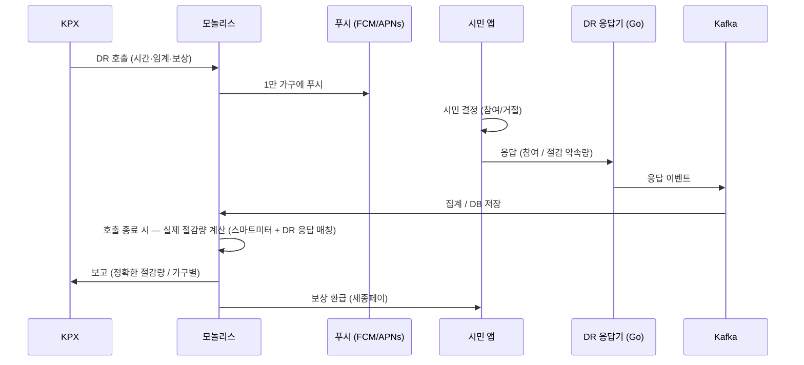
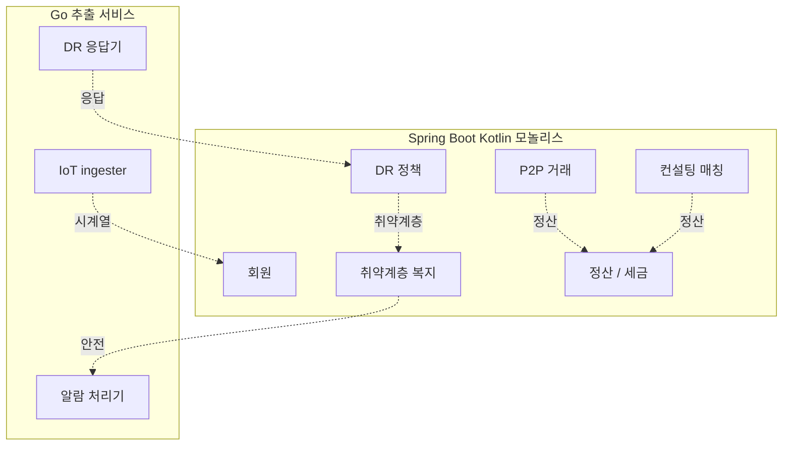

# 3장. 백엔드 — IoT 시계열 + DR 폭주 + 대인 매칭

> 항상 들어오는 스트림과 가끔 폭주하는 응답이 한 시스템 안에 공존한다.

## 이 장에서 답하는 질문

- IoT 스트림과 일반 트랜잭션을 어떻게 분리하는가?
- 순간 5,000 TPS DR 폭주를 25명 조직이 어떻게 견디는가?
- 시계열 + 도메인 데이터를 한 DB 에 둘 수 있는가? (TimescaleDB)
- 대인 매칭 (시민-진단사) 의 정산은 1권 결제와 어떻게 다른가?

## 들어가며

1권 3장의 도메인 모델·API 스타일·Saga·캐시·메시징은 본 책에도 그대로 적용된다.
달라지는 핵심:

- **IoT ingest** — 항상 들어오는 시계열 (일 2,700만 record)
- **DR 응답** — 평소 0, 호출 시 5,000 TPS 폭주
- **시계열 DB** — TimescaleDB (PostgreSQL 확장) 로 도메인 + 시계열을 한 엔진에서

## 1. 서비스 토폴로지

[케이스 11.2.1](../case-study/README.md#1121-서비스-작은-조직--모놀리스--추출) 인용.

- **모놀리스** — 회원·매칭·정산·복지·P2P 거래 (Spring Boot / Kotlin)
- **IoT ingester** (Go) — Kafka 컨슈머 + TimescaleDB INSERT 최적화
- **DR 응답 처리기** (Go) — Kafka 컨슈머 + 모놀리스로 결과 push
- **알람 처리기** (Go) — 다중화 (FCM → SMS → 자동 전화)

## 2. IoT ingest — 항상 들어오는 스트림

### 2.1 부하 특성

- 스마트미터 15분 주기 — 5만 가구 × 96 record/일 = 480만/일 (평균 56 RPS)
- 태양광 1분 주기 — 1만 가구 × 1,440 = 1,440만/일 (평균 166 RPS)
- 합계 평균 ~300 RPS / 피크 (시간 정각) ~3,000 RPS (모든 미터가 한 분에 몰림)

### 2.2 처리 패턴

```
스마트미터/태양광/EV/웨어러블
    ↓ (가구 게이트웨이)
NCP CDSS (Kafka) — partition by 가구 ID
    ↓
IoT ingester (Go) — N개 인스턴스 병렬
    ↓
TimescaleDB hypertable (가구·시각 인덱스)
    ↓ (continuous aggregate)
1시간·1일 다운샘플링 → ClickHouse 분석용
```

### 2.3 손실률 0.1% 의 의미

손실 = DR 보상 정산 오차 = 한전과의 대조 시 차이.
실제 운영 패턴:
- 가구 게이트웨이 ↔ Kafka 까지는 at-least-once + idempotency
- Kafka ↔ TimescaleDB 는 batch INSERT (1,000 row / 100ms) + ON CONFLICT DO NOTHING
- 일 단위 한전 dump 와 reconciliation 배치 — 불일치 1건도 알람

### 트레이드오프 — IoT ingester 언어 선택

| 측면 | Go (선택) | Kotlin Spring | Rust |
|------|----------|---------------|------|
| 메모리 효율 | 좋음 | 보통 (JVM heap) | 가장 좋음 |
| 처리 속도 | 좋음 | 좋음 | 가장 빠름 |
| 인력 (한국) | 풍부 | 가장 풍부 | 적음 |
| 학습 비용 | 낮음 | 낮음 (모놀리스와 통일) | 높음 |
| 결정 | **IoT 부하 특성 + 인력** | 도메인 통일에 좋지만 메모리 부담 | 25명에 인력 부담 |

## 3. DR 응답 — 평소 0, 호출 시 폭주

### 3.1 폭주 패턴

한전 / KPX 가 DR 호출 → 우리가 시민에게 푸시 → 시민 응답 → 우리가 한전에 보고.

- 호출 빈도: 월 평균 5~10회 / 혹한·혹서기 일 평균 1~2회
- 호출 당 응답: 1만 가구가 1시간 안에 응답 (대부분 첫 10분에 몰림)
- TPS 폭주: 첫 1분 5,000 → 첫 5분 1,000 → 1시간 100 으로 감쇠

### 3.2 처리 설계



### 3.3 폭주 대응

- **DR 응답기 (Go)** 가 polling 가능. Spring 모놀리스 보호.
- Kafka partition 16+ — 응답 분산.
- 응답 idempotency 키 — 같은 시민이 푸시 알림에서 두 번 누르면 한 번만.
- Auto-scale — 폭주 시 인스턴스 1 → 8 (분당). 후 자동 축소.

## 4. 대인 매칭의 정산 — 1권 결제와 다른 점

### 4.1 매칭 흐름

시민 (수요) ↔ 진단사 / 시공사 (공급) — 1권의 PG 결제와 결정적으로 다른 점:

| 측면 | 1권 (PG 결제) | 2권 (매칭 후 시공사 정산) |
|------|--------------|-------------------------|
| 결제 시점 | 주문 즉시 | 시공 완료 후 (수 일 ~ 수 주) |
| 정산 주기 | 매일 | 월 2회 + 부가세 신고 |
| 책임 분담 | 단순 (시민 ↔ PG) | 복잡 (시민 ↔ 진단사 ↔ 시공사 ↔ 우리 ↔ 세무) |
| 분쟁 | PG 가 1차 응대 | **우리가 1차 응대** — 대인 사고 책임 큼 |
| 신뢰 메커니즘 | 카드 회사 신뢰 | **본인인증 + 평점 + 신원 검증** 직접 관리 |

### 4.2 결제 인프라 — 1권의 Saga / Outbox / Idempotency 그대로 사용

[1권 3장 4.2](../../manuscript/03-백엔드/README.md#42-분산-트랜잭션의-두-패턴) 의 Saga + Outbox + Idempotency 패턴은 그대로 적용.
다만:

- **세종페이 (지역화폐)** 연동 — 일반 PG 와 정산 흐름 다름 (지자체 직불)
- **세무 신고 자동화** — 시공사 매출의 세금계산서 발행 자동 (작은 조직에 수동 처리 부담)

## 5. 캐시 — 시계열 캐시의 특수성

1권의 Cache-aside / Read-through 패턴은 그대로. 추가:

- **시계열 최근 N분 캐시** — 시민 앱 첫 화면의 "오늘 전력 사용량" 은 Redis 에 5분 단위 캐시
- **시민 앱 첫 화면 데이터 합성 캐시** — 시니어 사용자가 많아 첫 화면 빨라야 함

## 6. 메시징 — NCP CDSS

| 도구 | 용도 |
|------|------|
| **NCP CDSS** (Kafka 호환) | IoT ingest + DR 응답 + 도메인 이벤트 |
| Redis Pub/Sub | 시민 앱 실시간 (DR 호출 알림) |
| SaaS 큐 (별도) | SMS / 자동 전화 알람 (다중화) |

## 7. 인증 / 인가 — 시니어 친화

### 7.1 1권과의 차이

- 토큰: Access **30분** (1권 15분) — 시니어 재로그인 부담 감소
- Refresh: 60일 (1권 30일) + reuse detection 동일
- MFA: 사회복지사·진단사 콘솔만 TOTP. **일반 시민은 PASS 단일 인증** (시니어 TOTP 부담)
- 본인인증: PASS 우선 (이통3사 — 시니어 친화)

### 7.2 권한 — 세 계층

```
관리자 (소수)
운영자 (시민 응대 / 진단사 등록 / 사회복지사 조율)
↓
시민 (자신의 데이터만)
진단사 / 시공사 (자기 매칭 건만)
사회복지사 (담당 시민의 안전 데이터만 + 별도 동의 기록)
```

## 8. 케이스 — 동네에너지 백엔드 ([케이스 11.2](../case-study/README.md#112-백엔드) 인용)

### 8.1 도메인 분할 (단순)



### 8.2 데이터 ([케이스 11.2.2](../case-study/README.md#1122-db))

- **PostgreSQL (NCP Cloud DB)**: 회원 / 매칭 / 정산 / DR 정책 / 복지 / P2P
  + **TimescaleDB 확장**: 시계열 hypertable (같은 DB 인스턴스 — 운영 단순)
- **Redis**: 캐시·세션·실시간 알림
- **ClickHouse**: OLAP / DR 분석 / 시민 보고서
- (1권의 6종 DB 와 비교 — **단일 PostgreSQL** 로 시작, 분리 시점은 신호 기반)

### 8.3 시나리오 — DR 호출

[2.3 처리 설계 다이어그램](#32-처리-설계) 참조.
실패 처리:
- 푸시 실패 → SMS 자동 fallback
- 시민 응답 없음 → "거절" 으로 자동 기록 (5분 응답 시한)
- 절감량 측정 오차 (>1%) → 한전 보고 전 운영팀 확인

## 정리 — 체크리스트

- [ ] IoT ingest 가 모놀리스와 분리되어 부하 영향 안 주는가
- [ ] DR 폭주 대응이 부하 테스트로 검증되었는가 (분당 5,000+)
- [ ] 시계열 데이터의 손실률이 일 단위로 측정·알람되는가
- [ ] 매칭 정산이 세무 / 부가세 자동 처리되는가
- [ ] 시니어 친화 인증 (PASS / Access 30분 / MFA 면제) 가 적용되었는가
- [ ] 알람 다중화 (푸시 → SMS → 자동 전화) 가 drill 되는가

## 더 읽을거리

- [1권 3장 — 백엔드](../../manuscript/03-백엔드/README.md) — 원본 (Saga / Outbox / Idempotency)
- *Designing Data-Intensive Applications* — Martin Kleppmann (O'Reilly, 2017) — 시계열·스트림 처리
- TimescaleDB 공식 문서 — Timescale (URL 확인 필요)
