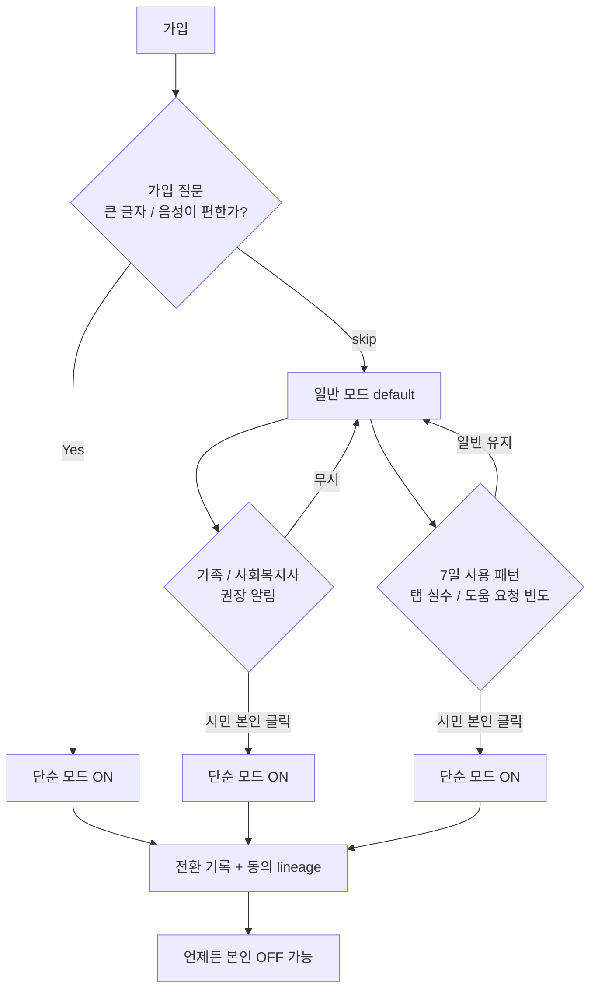
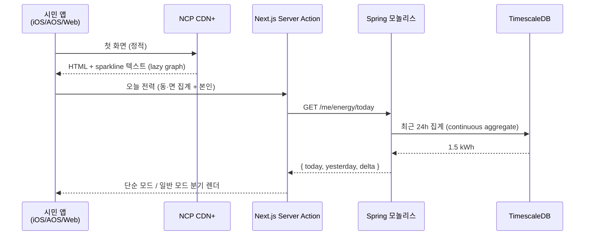

# 4장. 프론트엔드 — 시니어 / 옥외 디스플레이까지

> 1권은 결제 컨버전이 1차 KPI. 2권은 **접근성** 이 1차 KPI.

## 이 장에서 답하는 질문

- 시니어 / 취약계층 UX 를 일반 시민 UX 와 어떻게 한 앱에 담는가?
- 옥외 디스플레이 (동네 단위 전력 절감 현황) 는 어떤 기술이고 어떻게 운영하는가?
- 진단사 / 시공사 / 사회복지사 콘솔은 별도 앱인가?
- 시민 앱의 첫 화면 < 250KB 를 어떻게 달성하는가?

> 약어 풀이 — KWCAG (Korean Web Content Accessibility Guidelines, 한국형 웹 접근성 지침 2.2), WCAG (Web Content Accessibility Guidelines), MFA (Multi-Factor Authentication), TOTP (Time-based One-Time Password), ISR (Incremental Static Regeneration), MDM (Mobile Device Management), IP65 (먼지·물 방진방수 등급), BFF (Backend For Frontend), WER (Word Error Rate, 음성인식 오류율).

## 1. 채널 구성

[케이스 11.3](../case-study/README.md#113-프론트엔드) 인용.

| 채널 | 기술 | 비중 / 특이 |
|------|------|------|
| 시민 앱 iOS | Swift / SwiftUI | **접근성 강제** (큰 글자 / VoiceOver / 음성 명령) |
| 시민 앱 Android | Kotlin / Jetpack Compose | 동일 |
| 시민 웹 | Next.js (NKS 내부 호스팅) | 정적 위주 + 일부 SSR — Vercel 미사용 (데이터 주권 / 단일 클라우드 결정) |
| 진단사 / 시공사 콘솔 | Next.js (별도 도메인) | 내부 도구 |
| 사회복지사 콘솔 | Next.js (별도 도메인 + MFA) | 매우 민감 |
| 옥외 디스플레이 | **Next.js Kiosk 모드** | 동네 단위 전력 절감 현황 (공공 광장 설치) |

### 트레이드오프 — 채널 6개 분리

| 측면 | 단일 앱 통합 | **6 채널 분리 (선택)** |
|------|-------------|-----------------------|
| 배포 복잡도 | 낮음 | 중간 (6 파이프라인) |
| 접근성 / 권한 격리 | 어렵움 (한 앱에 시민·사회복지사·진단사 권한) | **쉬움 (도메인 / 토큰 scope 분리)** |
| 코드 공유 | 한 코드베이스 | 모노레포 packages/ 로 보완 |
| 결정 | 채널별 요구사항 / 사용자 / 보안 등급이 너무 달라 통합 시 의사결정 마비 | **6 채널 분리 + 디자인 시스템 공유** |

## 2. 접근성 — 시니어 / 취약계층

### 2.1 1권과의 차이

[1권 4장 7.1](../../manuscript/04-프론트엔드/README.md#71-접근성-a11y-accessibility) 의 WCAG 2.1 AA + 키보드 네비게이션 + ARIA 는 그대로 + **KWCAG 2.2 AA 강제** (공공 위탁 의무).
추가:

- **큰 글자 모드** — 시스템 글자 크기 200% 까지 깨지지 않는 레이아웃
- **음성 명령** — "오늘 전력 알려줘" 등 핵심 동작 음성
  - iOS: SFSpeechRecognizer (Native) — 한국어 시니어 WER 더 안정
  - Android: SpeechRecognizer (Native, on-device 우선)
  - Web: Web Speech API 는 보조 (브라우저 / OS 의존도 높고 시니어 한국어 WER 1.5~2배 — 핵심 동작은 Native 우선)
- **단순 모드** — 핵심 3개 기능만 표시 (전력·DR 참여·도움 요청) — 기본 default 기준은 [2.3](#23-단순-모드-default-기준)
- **VoiceOver / TalkBack** — 모든 그래프에 텍스트 대체 (오늘 전력 사용량 = "1.5 kWh, 어제보다 0.3 kWh 적음")

### 2.2 법적 근거 — 「장애인차별금지법」 + 「지능정보화 기본법」 제46조 + KWCAG 2.2

본 사업은 공공 위탁이라 단순 권고가 아닌 **법적 의무**:

- **「장애인차별금지법」** — 정당한 편의 제공 의무. 위반 시 손해배상.
- **「지능정보화 기본법」 제46조** — 정보접근권 보장 (장애인·고령자 정보 접근 보장).
- **KWCAG 2.2 AA** — 공공·공익 성격 웹·앱·키오스크 의무 (한국형, WCAG 2.2 한국 적용).
- **2023년 시행령 개정** — 무인정보단말기 (키오스크) 접근성 의무 — 옥외 디스플레이도 포함.

수준: **KWCAG 2.2 AA 최소, 일부 AAA 까지 목표** (예: 시니어 음성 명령은 AAA 영역).

### 2.3 단순 모드 default 기준

> ⚠️ "65세 자동 ON" 은 차별 (역으로 시니어가 일반 모드를 못 보게 막음). "본인 토글만" 은 가장 필요한 시니어가 못 찾음. **두 함정 사이의 운영 룰**:

- **default OFF** (일반 모드) — 모든 시민
- **3 경로 중 하나로 ON 권장 알림 발송** (직접 ON 은 본인이):
  1. 가입 시 "글자 크기 / 음성이 더 편한가요?" 질문 (강제 X, skip 가능)
  2. 가족 / 사회복지사 추천 — 시민 본인 동의 후 ON
  3. 첫 7일 사용 패턴 (탭 위치·실수 / 도움 요청 빈도) 분석 → 권장 알림 (시민이 클릭해야 ON)
- **사회복지사 권한** — 강제 ON 권한 없음. 권장 알림만 발송 가능 + 기록 남김.

> 이렇게 하지 않으면 — 공공 위탁 평가에서 차별 / 자율성 침해 둘 다 짚힌다.



## 3. 옥외 디스플레이 (Kiosk) — 5층 운영

### 3.1 무엇

세종시 동·면 단위 공공 광장에 설치된 옥외 디스플레이.
**우리 동네 오늘 전력 절감 현황 / DR 참여율 / 누적 절감 보상** 등을 시각화.

### 3.2 5층 운영 (Next.js Kiosk 모드는 SW 1층일 뿐)

| 층 | 무엇 | 책임 |
|----|------|------|
| 1. **소프트웨어** | Next.js Kiosk 모드 + 자동 새로고침 + DevTools 차단 | 프론트팀 |
| 2. **콘텐츠 검증 / 배포** | 시간당 ISR 갱신·시민에게 노출 전 운영 승인 (틀린 수치 / 정치성 / 부적절 문구) | 운영 + 프론트 |
| 3. **하드웨어** | IP65 방진방수 / 옥외 휘도 1,500cd 이상 / 작동 온도 -20~50°C | 외부 H/W 벤더 + 운영 |
| 4. **네트워크 / OS·MDM** | LTE / WiFi 이중화·MDM 으로 OS 락다운·원격 재부팅·OTA 패치 | 인프라 |
| 5. **물리 보안** | 단말 잠금·CCTV / 광장 관리 위탁·이상 보고 | 사업 / 공공 협력 |

> "Next.js Kiosk 모드만 쓰면 끝" 은 1층만 본 것이다. 옥외 광장 단말은 사람이 만지고 비 맞고 누가 꺼버린다 — 5층 모두 운영 룰이 있어야 한다.

### 3.3 보안

- 단말 별 토큰 (디스플레이 ID 인증) + 일정 시간 갱신
- URL 변경 / DevTools / 키보드 단축키 차단 (Kiosk 모드 + OS 정책)
- 화면에 표시되는 데이터는 **공개 가능 수준만** (가구별 X, 동·면 집계만)

## 4. 시민 웹 / 앱의 첫 화면 < 250KB

1권은 200KB. 2권은 250KB — 시니어 / 옥외용 큰 글자 / 그래프 라이브러리 부담 고려.

> **현실 예산** — Pretendard subset 80~120KB + Recharts 또는 SVG 60~80KB = 140~200KB. 그래프 첫 화면이면 사실상 200KB 시작. **그래프는 lazy load + 첫 화면은 텍스트 + 한 줄 sparkline 만** — 시니어 단순 모드는 더 가볍게.

- 그래프 라이브러리 — 가벼운 SVG 직접 그리기 또는 Recharts (lazy)
- 폰트 — Pretendard subset (KS X 1001 + 추가 자주 쓰는 한자 / 기호) — 1권 함정에서 회수한 결정
- 이미지 — 최소화 (광고 / 마케팅 X)
- 3rd party SDK — 광고 / 분석 SDK 사용 최소 (공공 신뢰 영역)
- **DR 5분 응답 = 1인당 6초 결정 의 시니어 부담** — 시니어 응답률 30~50% 로 떨어진다. UI 결정: 단순 모드는 **"참여 / 안 함 / 자동" 3 큰 버튼 + 음성** + 자동 모드는 사전 동의 가구만 (전 가구 자동 X — 자율성 침해)

## 5. 진단사 / 시공사 / 사회복지사 콘솔

별도 도메인 + 별도 인증 (MFA TOTP).
같은 모노레포 (`apps/console-vendor`, `apps/console-welfare`) 에서 디자인 시스템 공유.

> **함정** — MFA TOTP 를 콘솔에만 적용하고 같은 사용자가 시민 앱에서 우회 로그인하면 MFA 무력화. **역할별 도메인 + 토큰 scope 분리** + 사회복지사 / 진단사 계정은 시민 앱 로그인 자체 차단.

## 6. 디자인 시스템

- 토큰 — 1권과 같은 형식 (Style Dictionary)
- 단 컬러는 **공공 친화 (파랑·녹색 위주)** — 공공 신뢰 / 에너지 / 환경
- 한글 폰트 / 줄바꿈 / 숫자 표기는 1권 그대로
- Storybook + Visual regression

> **체크리스트** — 6 채널 (모바일 iOS / AOS / 시민 웹 / 콘솔 3종 / 키오스크) 에 한 토큰이 적용되는가 / 큰 글자 모드 시 깨지지 않는가 / 공공 친화 컬러가 대비 (WCAG AA) 를 만족하는가.

## 7. 케이스 — 동네에너지 프론트 ([케이스 11.3](../case-study/README.md#113-프론트엔드) 인용)

### 7.1 모노레포 (가정)

> ⚠️ 모노레포 구조는 본 책 가정. 케이스 단일 출처는 [11.3](../case-study/README.md#113-프론트엔드) — 채널 구성만 정의하고 코드 조직은 자율 결정.

```
apps/
├── citizen-app-ios/        # Swift
├── citizen-app-android/    # Kotlin
├── citizen-web/            # Next.js (NKS 호스팅)
├── console-vendor/         # 진단사 / 시공사
├── console-welfare/        # 사회복지사 (별도 도메인 + MFA)
└── kiosk-display/          # 옥외 디스플레이 Kiosk
packages/
├── design-tokens/
├── ui/                     # 공통 디자인 시스템
├── api-client/             # GraphQL / REST 자동 생성
└── a11y/                   # 접근성 헬퍼 (큰 글자 / VoiceOver / 음성)
```

### 7.2 시민 앱 화면 — 단순 모드 vs 일반 모드

| 화면 | 일반 모드 (default) | **단순 모드 (본인 / 가족 / 사회복지사 권장으로 ON)** |
|------|----------|--------------------------|
| 홈 | 그래프·최근 7일·DR / P2P / 매칭 4 카드 | **오늘 전력·도움 요청 2 카드** |
| DR 호출 알림 | 일반 푸시 | **큰 글자 + 음성 알림 + 3 큰 버튼 (참여·안 함·자동)** |
| 매칭 요청 | 진단사 리스트 + 필터 | **'추천 진단사' 1명 + 전화 버튼** |

### 7.3 옥외 디스플레이 화면

```
┌───────────────────────────────────┐
│ 오늘 우리 동네 전력 절감              │
│                                   │
│   [큰 숫자] 1,245 kWh             │
│   어제보다 ▼ 8.3%                 │
│                                   │
│ DR 참여 가구: 432 / 동네 평균 28%  │
│                                   │
│ 이번 달 누적 보상: 320만 원         │
└───────────────────────────────────┘
```

### 7.4 채널별 BFF 시퀀스 (Mermaid)



> BFF 가 없는 대신 Next.js Server Action 이 BFF 역할. 26명에 별도 BFF 팀 둘 인력 없음 ([케이스 11.3](../case-study/README.md#113-프론트엔드)).

## 정리 — 체크리스트

- [ ] 단순 모드 default 가 3 경로 (가입 질문 / 가족·복지사 권장 / 사용 패턴 권장) 로 운영되는가
- [ ] KWCAG 2.2 AA 점검이 CI 게이트인가 (공공 위탁 의무)
- [ ] 「장애인차별금지법」 + 「지능정보화 기본법」 제46조 + 키오스크 접근성 (2023 시행령) 이 운영 룰에 반영되었는가
- [ ] 음성 명령이 Native (SFSpeech / Android SpeechRecognizer) 우선인가
- [ ] 옥외 디스플레이가 5층 (SW·콘텐츠·HW·OS/MDM·물리) 운영되는가
- [ ] 모든 그래프에 텍스트 대체가 있는가
- [ ] 첫 화면 < 250KB 가 RUM 으로 측정되고 그래프는 lazy load 되는가
- [ ] DR 5분 응답에 시니어 응답률이 별도로 추적되는가

## 더 읽을거리

> 형식: 책 = `*제목*, N판 — 저자명 (출판사, 연도)` / 공식 자료 = `이름 — 발행처 (URL — 확인된 것만)` ([ADR-0009](../../adr/0009-챕터-작성-표준.md))

- [1권 4장 — 프론트엔드](../../manuscript/04-프론트엔드/README.md) — 원본 (BFF / 디자인 시스템)
- *Inclusive Components* — Heydon Pickering (자체 출판, 2018) — 접근성 컴포넌트
- KWCAG 2.2 — 한국지능정보사회진흥원 / W3C WCAG 2.2 (URL 확인 필요)
- 「장애인차별금지 및 권리구제 등에 관한 법률」 / 「지능정보화 기본법」 — 국가법령정보센터 (URL 확인 필요)
