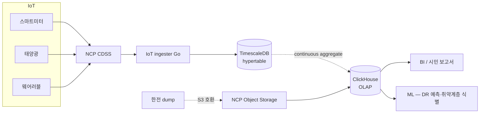
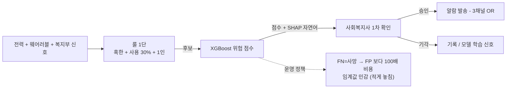

# 5장. 데이터와 AI — IoT 시계열 / 취약계층 식별 / HyperCLOVA X

> 1권은 트랜잭션 데이터의 시각. 2권은 시계열·실시간·공공 데이터의 시각.

## 이 장에서 답하는 질문

- 일 2,700만 record 시계열을 어떤 DB / 어떤 다운샘플링으로?
- DR 예측 / 취약계층 식별 모델의 정확성과 설명 가능성 균형 + FP/FN 비대칭 비용은 어떻게 다루는가?
- HyperCLOVA X 를 시민 챗봇에 어떻게 통합하는가? (Zero Retention 은 어떤 조건에서?)
- 공공 데이터허브와의 양방향 데이터 흐름은 어떻게 운영하는가?

> 약어 풀이 — DR (Demand Response, 수요반응), MAPE (Mean Absolute Percentage Error, 평균 절대 백분율 오차), FP (False Positive, 거짓 양성), FN (False Negative, 거짓 음성), SHAP (SHapley Additive exPlanations, 모델 해석), RAG (Retrieval Augmented Generation), HCX (HyperCLOVA X), ZRR (Zero Retention, 입력 데이터 무보존), CAGG (TimescaleDB Continuous Aggregate), PII (Personally Identifiable Information), k-익명성 (한 집계 셀의 가구 수 < k 이면 재식별 위험).

## 1. 데이터 플랫폼 (NCP)



> **트레이드오프 — 한 클라우드에 데이터 / AI 다 두는 결정** — 멀티 클라우드 (예: BigQuery 분석) 가 분석 도구는 강력하지만 26명에 두 클라우드 운영 부담 + 데이터 주권 위반. 본 케이스는 NCP 단일 → ClickHouse self-host + HyperCLOVA X 결합으로 한국 리전 유지.

## 2. 시계열 DB 결정 — TimescaleDB

### 트레이드오프 — TimescaleDB vs InfluxDB vs ClickHouse

| 측면 | TimescaleDB (선택) | InfluxDB | ClickHouse |
|------|--------------------|----------|------------|
| SQL | 완전 (PostgreSQL) | InfluxQL / Flux | 완전 |
| 도메인 DB 와 통합 | 같은 엔진·**별도 인스턴스** | 별도 | 별도 |
| 운영 부담 (26명) | 낮음 (PostgreSQL 운영 스킬 재사용) | 별 도구 학습 | 별 도구 학습 |
| 쓰기 처리량 | 충분 (수만 TPS) | 가장 좋음 | 좋음 |
| 분석 쿼리 | 보통 | 보통 | **가장 좋음** |
| 동네에너지 결정 | **운영 시계열 (전용 인스턴스)** | (제외) | **분석 OLAP (NKS self-host)** |

→ **운영은 TimescaleDB, 분석은 ClickHouse** — 두 엔진 조합.

> **인스턴스 분리가 중요한 이유** — 같은 PostgreSQL 인스턴스에 OLTP (회원·정산) 와 TimescaleDB hypertable (IoT 대량 ingest) 을 두면 chunk 압축·CAGG 갱신·retention drop 이 WAL / VACUUM 을 잡아먹어 OLTP 응답시간이 침해된다. ⇒ **TimescaleDB 는 전용 인스턴스** ([케이스 11.2.2](../case-study/README.md#1122-db) 일치). hypertable 운영 함정: chunk 너무 작게 (메모리 폭발) / 너무 크게 (압축 효율 ↓) — 가구수 × 미터 종류 × 일 단위 기준 시행착오 필요.

## 3. 다운샘플링 — Continuous Aggregate

```sql
-- 15분 raw → 1시간 평균 (자동 갱신)
SELECT add_continuous_aggregate_policy(
  'meter_hourly',
  start_offset => INTERVAL '7 days',
  end_offset => INTERVAL '1 hour',
  schedule_interval => INTERVAL '1 hour'
);
```

- raw: 90일 보존
- 1시간 집계: 1년
- 1일 집계: 5년 (개보법 상 시민 전기 사용량 — 시행령 별표 / 정보 통신 서비스 분류에 따라 5년 가정. 사업자별 조문 / 해석 다름 — 운영 시 확인)
- ClickHouse 로 익스포트: 1년 + 5년 cold

> **함정** — CAGG 갱신 정책 (`schedule_interval`) 이 너무 길면 BI / 시민 보고서가 오래된 데이터로 응답. 너무 짧으면 OLTP 인스턴스 부하. raw 90일 보존도 운영 디스크 / 비용 대비 검토 — 90일 미만으로 줄이면 reconciliation 회수 어려움.

## 4. DR 예측 모델

목표: 다음 DR 호출 시 **동·면 단위 (행정구역 50~500 가구) 응답 예측** (참여 확률 / 절감량 추정). **가구별 예측은 보조 신호로만 사용** — 보상 정산에 직접 쓰지 않음.

### 4.1 예측 단위 결정 — 동·면 집계가 1차, 가구별은 보조

| 단위 | MAPE | 운영 적합 | 비고 |
|------|------|----------|------|
| 가구별 | 25~40% | **부적합 (보조만)** | 분산이 커서 보상 정산 못 함. 시민 행동 변동성 극심 (출장·휴가·날씨) |
| **동·면 집계 (50~500 가구)** | **8~12% 목표** | **운영 1차** | 큰 수 법칙으로 변동성 완충. 한전 정산 정합과도 맞음 |
| 시 단위 | 5~8% | 너무 거침 | 동·면 간 차이 무시 — 의미 손실 |

> **그대로 가구별 Prophet 으로 운영하면 1분기 안에 모델 폐기** — MAPE 30% 모델로 정산하면 한전 측 정합 감사에서 오차 폭주. 행정구역 집계가 운영 현실.

### 4.2 모델 선택 — 가벼움 + 설명 가능성 + 비대칭 비용

| 모델 | 정확도 | 설명 가능 | 운영 부담 | 결정 |
|------|--------|----------|----------|------|
| 동·면 평균 / 룰 | 낮음 | 매우 좋음 | 매우 낮음 | 0단계 baseline |
| **동·면 Prophet** | 보통~좋음 (MAPE 8~12%) | 좋음 | 낮음 | **선택 — 행정구역 단위 시계열** |
| 가구별 Prophet | 낮음 (MAPE 25~40%) | 좋음 | 중간 | 참고용·보조 신호 |
| LSTM / Transformer | 좋음 | 나쁨 | 높음 | 26명에 과잉 |

### 4.3 FP / FN 비대칭 비용 — 보수적 threshold

- **FP (실제 절약 X → "절약 했다" 보고)**: 한전 정산 감사 시 위탁계약 위반 / 공공 신뢰 사고 — **회사 위기**
- **FN (실제 절약 했음 → 누락 / 미보고)**: 시민 보상 미환급 — CS 응대로 회복 가능

→ **FP 비용 >> FN 비용** ⇒ 임계값을 보수적으로 (FP 최소화). FP 1건 = FN 100건 가정 운영 룰.

설명 가능성이 중요한 이유: **취약계층 알람 / 보상 정산이 시민 신뢰와 직결** — "왜 이 가구 / 이 동·면이 예측됐는지" 답할 수 있어야.

## 5. 취약계층 식별 모델

목표: 에너지 빈곤 / 안전 위험 가구를 사전 식별.

### 5.1 입력 신호 (윤리적 고려)

| 신호 | 활용 | 윤리 위험 |
|------|------|---------|
| 전력 사용 패턴 (월별·시간대별) | 난방·취사 부재 패턴 → 부재 / 빈곤 추정 | **준 민감정보** — 별도 동의 필수 |
| 웨어러블 (취약계층 한정) | 활동량 급감 → 안전 위험 | 별도 동의 |
| 가구원 정보 (복지부 연계) | 1인 노인 가구 등 | 매우 민감 — 처리 위탁 |
| 외부 (기상 / 동절기 임계) | 혹한·혹서기 자동 알람 강화 | 공공 정보 |

### 5.2 모델 — 룰 + 가벼운 분류 + 자연어 사유

- 룰 1단: "혹한기 + 전력 사용 < 평균 30% + 1인 가구" → 안전 위험 후보
- 분류 모델 (XGBoost): 후보 중 실제 위험 점수
- **SHAP → 자연어 변환**: 점수만 보여주지 않고 사회복지사 콘솔에 사유 문장 — 예: "난방비 평균 대비 230% / 야간 활동 감소 / 1인 노인 가구". 모델 raw SHAP 값은 사회복지사가 이해 못 함.
- **인간 리뷰**: 점수 임계 이상은 사회복지사 1차 확인 후 알람 발송

### 5.3 FP / FN 비대칭 — 취약계층 (DR 와 반대)

| 영역 | FP (오탐) | FN (놓침) | 비대칭 방향 |
|------|-----------|-----------|------------|
| DR 보상 | **회사 위기** | CS 회복 | FP < FN ⇒ 보수적 |
| **취약계층 안전** | 사회복지사 신뢰 손실 (반복 시 무시) | **사망 / 안전 사고 / 사업 중단** | **FN << FP** ⇒ 민감하게 (FN 1 = FP 100 가정) |

→ DR 과 취약계층은 임계값을 **반대 방향** 으로 잡아야 한다. 같은 모델 인프라라고 같은 정책 쓰면 안 됨.

### 트레이드오프 — 정확도 vs 설명 가능성 vs 편향

| 측면 | 룰 단독 | 룰 + XGBoost (선택) | 딥러닝 모델 |
|------|--------|--------------------|---------|
| 정확도 | 낮음 | 보통 | 가장 좋음 |
| 설명 가능 | 매우 좋음 | 좋음 (SHAP 등) | 매우 나쁨 |
| 편향 위험 | 낮음 (룰 명시) | 중간 | 높음 (감지 어려움) |
| 알람 오류 비용 | 낮음 | 보통 | 높음 (시민 신뢰 사고) |

## 6. HyperCLOVA X 통합 — 시민 챗봇

### 6.1 사용처

- 에너지 절약 팁 답변 ("우리 집 전력이 평균보다 높은데 어떻게 줄여요?")
- DR 호출 안내 ("오늘 DR 호출이 뭔가요?")
- 매칭 추천 ("우리 집 단열에 적합한 시공사 추천")

### 6.2 통합 패턴 — AI Gateway 가 PII 출입문

- **RAG (Retrieval Augmented Generation)** — 사내 FAQ + 가구별 데이터 컨텍스트
- **AI Gateway** — 외부 LLM (HyperCLOVA X / GPT-4o-mini 등) 라우팅·캐시·비용 추적·**PII 마스킹 강제**
- 시민 데이터는 **마스킹 후 컨텍스트 주입** — 가구 식별 번호 / 전화 / 주소 차단. 패턴만.
- **함정 — fallback 라우팅** — HCX 가 실패하면 자동 GPT 로 fallback 하도록 두면, PII 마스킹이 HCX 만 적용되고 GPT 로 raw 가 흘러간다. **fallback 전에도 동일 마스킹 강제** + ZRR 계약 없는 모델로의 fallback 은 차단.

### 6.3 한국어 + 공공 가점 + ZRR 조건

HyperCLOVA X 는 한국어 능력 + 공공 사업 가점에서 외부 글로벌 모델 대비 유리. 단:

- **ZRR (Zero Retention) 은 단정 X** — 모델별 / 계약별 정책 다름. 2026년 상반기 시점 HCX 의 ZRR 은 **별도 기업 계약** 필요. 일반 API 키만으로는 입력이 학습 / 로그 보존될 수 있다는 가정.
- 가구 데이터를 LLM 에 보내는 영역은 **별도 동의 + 마스킹 + ZRR 계약 체결 확인 후** 만 (계약 전이면 RAG 의 컨텍스트에 가구 데이터 X)
- 한국어 정확도도 도메인 특화 평가 (에너지 절약 팁 한국어) 가 필요 — 일반 벤치마크 결과를 운영에 곧장 적용 X
- 가격 모델도 단정 X — 분기마다 변동, 도입 시점에 다시 비교

## 7. 공공 데이터허브 양방향

### 7.1 우리 → 세종시 (송신)

- 동·면 단위 에너지 절감 통계 (개인 식별 제거)
- DR 참여율
- 취약계층 분포 (집계만)

> **k<5 자동 차단 룰** — 한 집계 셀의 가구 수가 5 미만이면 자동 차단 (재식별 위험). 예: "○○동 1인 노인 가구 3명 절감률 89%" 는 동·면 단위라도 가구 수가 적으면 특정 개인이 식별된다. AI Gateway 와 동일하게 **공공 송신 게이트웨이 단에서 자동 차단** — 사람이 매번 검토 X.

### 7.2 세종시 → 우리 (수신)

- 전기차 충전소 위치 / 사용량
- 기상 / 환경 데이터
- 인구·가구 통계

### 7.3 책임

데이터 송신은 **우리 책임** — 개인정보 제거 검증 / API 변경 시 사전 통보 (계약 의무).

> **함정** — 분기 1회 정합 검증만으로는 세종시와의 수치 불일치를 3개월 후 발견. 일 단위 자동 비교 (sum / count / 동·면 별 절감률) + 이상 시 자동 알람으로 사고 잠복 기간 단축.

## 8. 데이터 거버넌스

- **카탈로그**: 사내 wiki (OpenMetadata 같은 도구는 26명에 과잉)
- **개인정보**: 별도 스키마 (`pii_*`) + 컬럼 마스킹 + **동의 lineage 메타데이터** (어떤 동의 항목으로 수집된 데이터인지 컬럼 / 테이블 단위로 표기, 동의 철회 시 자동 차단)
- **감사**: NCP Cloud Activity Tracker + 사내 SIEM (외부 SaaS — Splunk 등 검토)
- **품질**: dbt tests + Great Expectations 일 단위

> **체크리스트** — pii_* 스키마 외 일반 스키마에 PII 가 섞이지 않는가 / 동의 lineage 가 컬럼 단위로 추적되는가 / SIEM 이 데이터 접근을 사용자·시간 단위로 잡는가 / 분기 1회 (감사) + 일 1회 (품질 / 정합) 자동화되어 있는가.

## 9. 케이스 — 동네에너지 데이터 / AI ([케이스 11.4](../case-study/README.md#114-데이터--ai) 인용)

### 9.1 책임 모델

| 책임 | 주체 |
|------|------|
| 시계열 스키마 변경 | 데이터팀 (3명) |
| 카탈로그 / 품질 | 데이터팀 |
| PII 마스킹 / 감사 | 보안 (1명 + 외부 자문) |
| DR 예측 모델 | 데이터팀 |
| 취약계층 식별 모델 | 데이터팀 + 사회복지사 인간 리뷰 |
| 공공 데이터허브 연계 | 인프라 + 사업 협력 |

### 9.2 흔한 함정

> - **TimescaleDB hypertable 인덱스 누락** — 가구·시각 복합 인덱스 없으면 시민 앱 첫 화면 느림
> - **continuous aggregate 갱신 지연** — 1시간 집계가 안 돌아가면 BI 가 오래된 데이터
> - **LLM 에 PII 흘림** — 가구 ID 제거 잊으면 ZRR 위반
> - **공공 데이터 송신 정합 오차** — 분기 1회 보고 시 발견 → 신뢰 사고

### 9.3 취약계층 식별 — 룰 + 모델 + 인간 리뷰 3 안전망 (Mermaid)



## 정리 — 체크리스트

- [ ] 시계열 raw / 1시간 / 1일 다운샘플링이 자동인가
- [ ] TimescaleDB 가 OLTP 와 별도 인스턴스로 분리되어 chunk·CAGG·retention 이 OLTP 응답을 침해하지 않는가
- [ ] DR 예측 단위가 동·면 집계 1차 / 가구별 보조로 명시되었고 MAPE 가 분기 추적되는가
- [ ] DR (FP < FN) 과 취약계층 (FN << FP) 비대칭이 임계값에 반대 방향으로 적용되었는가
- [ ] DR 예측 / 취약계층 모델의 설명 가능성 (SHAP → 자연어) 이 사회복지사 콘솔에 노출되는가
- [ ] AI Gateway PII 마스킹이 fallback 라우팅에도 동일 적용되는가
- [ ] HCX ZRR 계약 체결 후에만 가구 데이터를 RAG 컨텍스트에 주입하는가
- [ ] 공공 송신 시 k<5 셀이 자동 차단되는가
- [ ] 동의 lineage 가 컬럼·테이블 단위로 기록되고 동의 철회 시 자동 차단되는가
- [ ] 공공 데이터허브 송신 정합이 일 단위 검증되는가
- [ ] 취약계층 알람은 인간 리뷰 단계 거치는가

## 더 읽을거리

> 형식: 책 = `*제목*, N판 — 저자명 (출판사, 연도)` / 공식 자료 = `이름 — 발행처 (URL — 확인된 것만)` ([ADR-0009](../../adr/0009-챕터-작성-표준.md))

- [1권 5장 — 데이터와 AI](../../manuscript/05-데이터와-AI/README.md) — 원본
- TimescaleDB 공식 문서 — Timescale (URL 확인 필요)
- HyperCLOVA X 문서 — NAVER Cloud (URL 확인 필요)
- *Interpretable Machine Learning*, 2판 — Christoph Molnar (자체 출판, 2022) — SHAP / 설명 가능성
