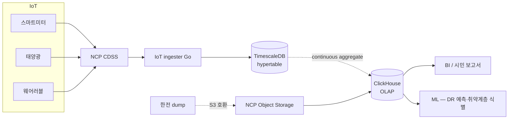

# 5장. 데이터와 AI — IoT 시계열 / 취약계층 식별 / HyperCLOVA X

> 1권은 트랜잭션 데이터의 시각. 2권은 시계열·실시간·공공 데이터의 시각.

## 이 장에서 답하는 질문

- 일 2,700만 record 시계열을 어떤 DB / 어떤 다운샘플링으로?
- DR 예측 / 취약계층 식별 모델의 정확성과 설명 가능성 균형
- HyperCLOVA X 를 시민 챗봇에 어떻게 통합하는가?
- 공공 데이터허브와의 양방향 데이터 흐름은 어떻게 운영하는가?

## 1. 데이터 플랫폼 (NCP)



## 2. 시계열 DB 결정 — TimescaleDB

### 트레이드오프 — TimescaleDB vs InfluxDB vs ClickHouse

| 측면 | TimescaleDB (선택) | InfluxDB | ClickHouse |
|------|--------------------|----------|------------|
| SQL | 완전 (PostgreSQL) | InfluxQL / Flux | 완전 |
| 도메인 DB 와 통합 | **한 인스턴스** | 별도 | 별도 |
| 운영 부담 (25명) | 낮음 (PostgreSQL 운영 스킬 재사용) | 별 도구 학습 | 별 도구 학습 |
| 쓰기 처리량 | 충분 (수만 TPS) | 가장 좋음 | 좋음 |
| 분석 쿼리 | 보통 | 보통 | **가장 좋음** |
| 동네에너지 결정 | **운영 시계열** | (제외) | **분석 OLAP** |

→ **운영은 TimescaleDB, 분석은 ClickHouse** — 두 엔진 조합.

## 3. 다운샘플링 — Continuous Aggregate

```sql
-- 15분 raw → 1시간 평균 (자동 갱신)
SELECT add_continuous_aggregate_policy(
  'meter_hourly',
  start_offset => INTERVAL '7 days',
  end_offset => INTERVAL '1 hour',
  schedule_interval => INTERVAL '1 hour'
);
```

- raw: 90일 보존
- 1시간 집계: 1년
- 1일 집계: 5년 (개보법 시행령)
- ClickHouse 로 익스포트: 1년 + 5년 cold

## 4. DR 예측 모델

목표: 다음 DR 호출 시 가구별 응답 예측 (참여 확률 / 절감량 추정).

### 4.1 모델 선택 — 가벼움 + 설명 가능성 우선

| 모델 | 정확도 | 설명 가능 | 운영 부담 | 결정 |
|------|--------|----------|----------|------|
| 가구별 평균 / 룰 | 낮음 | 매우 좋음 | 매우 낮음 | 0단계 baseline |
| Prophet | 보통 | 좋음 | 낮음 | **선택 — 가구별 일간 시계열** |
| LSTM / Transformer | 좋음 | 나쁨 | 높음 | 25명에 과잉 |

설명 가능성이 중요한 이유: **취약계층 알람 / 보상 정산이 시민 신뢰와 직결** — "왜 이 가구가 예측됐는지" 답할 수 있어야.

## 5. 취약계층 식별 모델

목표: 에너지 빈곤 / 안전 위험 가구를 사전 식별.

### 5.1 입력 신호 (윤리적 고려)

| 신호 | 활용 | 윤리 위험 |
|------|------|---------|
| 전력 사용 패턴 (월별·시간대별) | 난방·취사 부재 패턴 → 부재 / 빈곤 추정 | **준 민감정보** — 별도 동의 필수 |
| 웨어러블 (취약계층 한정) | 활동량 급감 → 안전 위험 | 별도 동의 |
| 가구원 정보 (복지부 연계) | 1인 노인 가구 등 | 매우 민감 — 처리 위탁 |
| 외부 (기상 / 동절기 임계) | 혹한·혹서기 자동 알람 강화 | 공공 정보 |

### 5.2 모델 — 룰 + 가벼운 분류

- 룰 1단: "혹한기 + 전력 사용 < 평균 30% + 1인 가구" → 안전 위험 후보
- 분류 모델 (XGBoost): 후보 중 실제 위험 점수
- **인간 리뷰**: 점수 임계 이상은 사회복지사 1차 확인 후 알람 발송

### 트레이드오프 — 정확도 vs 설명 가능성 vs 편향

| 측면 | 룰 단독 | 룰 + XGBoost (선택) | 딥러닝 모델 |
|------|--------|--------------------|---------|
| 정확도 | 낮음 | 보통 | 가장 좋음 |
| 설명 가능 | 매우 좋음 | 좋음 (SHAP 등) | 매우 나쁨 |
| 편향 위험 | 낮음 (룰 명시) | 중간 | 높음 (감지 어려움) |
| 알람 오류 비용 | 낮음 | 보통 | 높음 (시민 신뢰 사고) |

## 6. HyperCLOVA X 통합 — 시민 챗봇

### 6.1 사용처

- 에너지 절약 팁 답변 ("우리 집 전력이 평균보다 높은데 어떻게 줄여요?")
- DR 호출 안내 ("오늘 DR 호출이 뭔가요?")
- 매칭 추천 ("우리 집 단열에 적합한 시공사 추천")

### 6.2 통합 패턴

- **RAG (Retrieval Augmented Generation)** — 사내 FAQ + 가구별 데이터 컨텍스트
- AI Gateway — 외부 LLM (HyperCLOVA X / GPT-4o-mini 등) 라우팅·캐시·비용 추적
- 시민 데이터는 **마스킹 후 컨텍스트 주입** — 가구 식별 번호 제거, 패턴만

### 6.3 한국어 + 공공 가점

HyperCLOVA X 는 한국어 능력 + 공공 사업 가점에서 외부 글로벌 모델 대비 유리.
단 가구 데이터를 LLM 에 보내는 영역은 별도 동의 + 마스킹 + Zero Retention.

## 7. 공공 데이터허브 양방향

### 7.1 우리 → 세종시 (송신)

- 동·면 단위 에너지 절감 통계 (개인 식별 제거)
- DR 참여율
- 취약계층 분포 (집계만)

### 7.2 세종시 → 우리 (수신)

- 전기차 충전소 위치 / 사용량
- 기상 / 환경 데이터
- 인구·가구 통계

### 7.3 책임

데이터 송신은 **우리 책임** — 개인정보 제거 검증 / API 변경 시 사전 통보 (계약 의무).

## 8. 데이터 거버넌스

- **카탈로그**: 사내 wiki (OpenMetadata 같은 도구는 25명에 과잉)
- **개인정보**: 별도 스키마 (`pii_*`) + 컬럼 마스킹
- **감사**: NCP Cloud Activity Tracker + 사내 SIEM (외부 SaaS — Splunk 등 검토)
- **품질**: dbt tests + Great Expectations 일 단위

## 9. 케이스 — 동네에너지 데이터 / AI ([케이스 11.4](../case-study/README.md#114-데이터--ai) 인용)

### 9.1 책임 모델

| 책임 | 주체 |
|------|------|
| 시계열 스키마 변경 | 데이터팀 (3명) |
| 카탈로그 / 품질 | 데이터팀 |
| PII 마스킹 / 감사 | 보안 (1명 + 외부 자문) |
| DR 예측 모델 | 데이터팀 |
| 취약계층 식별 모델 | 데이터팀 + 사회복지사 인간 리뷰 |
| 공공 데이터허브 연계 | 인프라 + 사업 협력 |

### 9.2 흔한 함정

> - **TimescaleDB hypertable 인덱스 누락** — 가구·시각 복합 인덱스 없으면 시민 앱 첫 화면 느림
> - **continuous aggregate 갱신 지연** — 1시간 집계가 안 돌아가면 BI 가 오래된 데이터
> - **LLM 에 PII 흘림** — 가구 ID 제거 잊으면 ZRR 위반
> - **공공 데이터 송신 정합 오차** — 분기 1회 보고 시 발견 → 신뢰 사고

## 정리 — 체크리스트

- [ ] 시계열 raw / 1시간 / 1일 다운샘플링이 자동인가
- [ ] DR 예측 / 취약계층 모델의 설명 가능성 (SHAP 등) 이 운영팀에 노출되는가
- [ ] LLM 호출 시 PII 마스킹이 자동인가
- [ ] 공공 데이터허브 송신 정합이 일 단위 검증되는가
- [ ] 취약계층 알람은 인간 리뷰 단계 거치는가

## 더 읽을거리

- [1권 5장 — 데이터와 AI](../../manuscript/05-데이터와-AI/README.md) — 원본
- TimescaleDB 공식 문서 — Timescale (URL 확인 필요)
- HyperCLOVA X 문서 — NAVER Cloud (URL 확인 필요)
