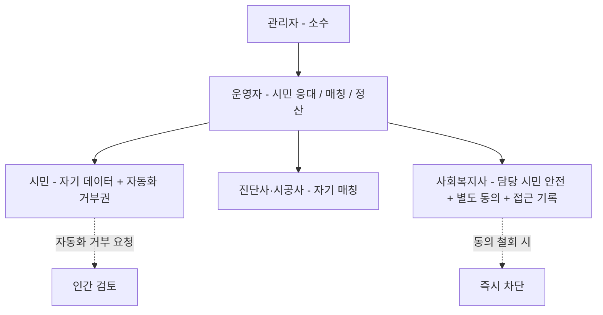
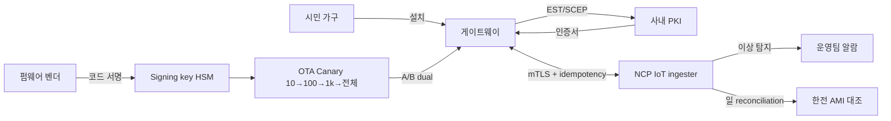
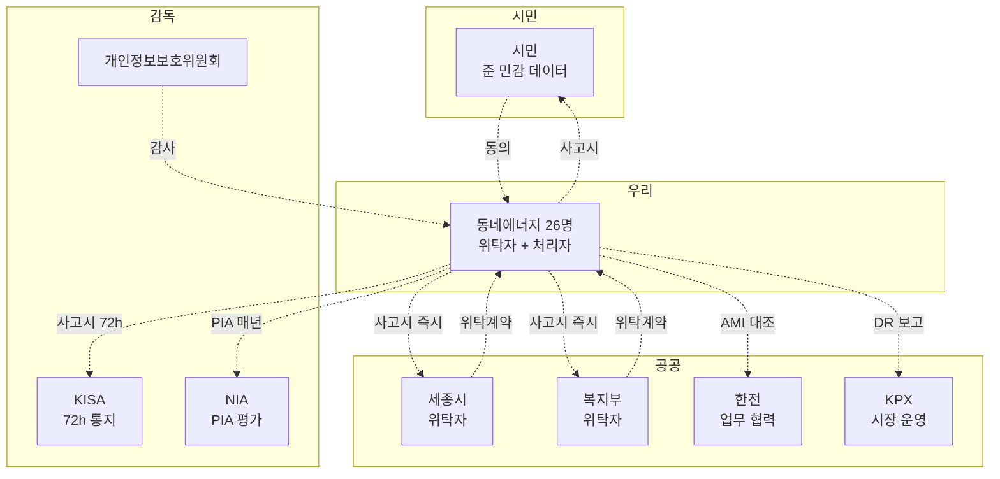

# 6장. 보안과 컴플라이언스 — 에너지 / 공공 / 준 민감정보 / IoT

> 1권의 ISMS-P + 전금법 + 개보법 위에, **에너지 법규 3 경로 + 공공 인증 3종 (CSAP·KCMVP·PIA) + IoT 보안 5층** 이 더해진다.

## 이 장에서 답하는 질문

- 「분산에너지 활성화 특별법」 의 3 경로 (특화지역 / 통합발전소 / 소규모전력중개사업) 중 우리는 어디인가?
- 전기 사용량은 왜 "준 민감정보" 이며, 일반 / 준 민감 / 민감 3분류는 어떻게 갈리는가?
- 공공 위탁의 CSAP / KCMVP / PIA — 1권에 없던 인증 3종을 26명이 어떻게 다루는가?
- IoT 보안 (EST/SCEP / OTA dual partition / SBOM) — 공공 에너지 사업의 1/3 분량이 왜 IoT 인가?

> ⚠️ **법규 인용 시점 면책** — 본 장 모든 법규는 **2026년 상반기 기준**. 에너지 법규는 분기 단위로 변동 — 실 적용 시 최신 조문 확인. 시점 표기 누락은 책의 신뢰를 깎는다.

> 약어 풀이 — ISMS / ISMS-P (Information Security Management System / 개인정보 포함), CSAP (Cloud Security Assurance Program, 공공 클라우드 보안인증), KCMVP (Korean Cryptographic Module Validation Program, 암호 모듈 검증), PIA (Privacy Impact Assessment, 개인정보 영향평가), VPP (Virtual Power Plant, 통합발전소), KPX (한국전력거래소), AMI (Advanced Metering Infrastructure), mTLS (mutual TLS), EST / SCEP (Enrollment over Secure Transport / Simple Certificate Enrollment Protocol — IoT 인증서 자동 발급), OTA (Over-The-Air firmware update), SBOM (Software Bill of Materials), KISA (한국인터넷진흥원).

## 1. 한국 법규 — 동네에너지 특화 (시점 명시)

| 법령 (시점) | 핵심 | 1권 (커머스) 대비 |
|------|------|------------------|
| **「개인정보 보호법」** (2024 개정 시행) — 제15·17·22·23·37조의2 등 | 전기 사용량 처리 + **제23조 민감정보 + 제37조의2 자동화 결정 거부권** | 1권 + 준민감 해석 + 자동화 거부권 |
| 「정보통신망 이용촉진 및 정보보호 등에 관한 법률」 | 시민 알림 / DR 푸시 | 1권과 공통 |
| **「전기사업법」** | 전력 판매 / 중개. 일반인 직거래 원칙 금지. | **신규** |
| **「분산에너지 활성화 특별법」** (2024.6.14 시행, 법률 제19470호) | 시민 참여 3 경로 (특화지역 / 통합발전소 / 소규모전력중개사업) | **신규 / 핵심** |
| 「신·재생에너지 개발·이용·보급 촉진법」 | 태양광 / 보조금 (KEC 인증) | **신규** |
| **「전력시장운영규칙」** (KPX) | DR (수요반응자원) 시장 운영·보상·SLA 근거 | **신규** (※ 「에너지이용합리화법」 은 에너지 절약 일반 정책 근거 — DR 시장 자체는 KPX 운영규칙) |
| 「사회복지사업법」 + 「사회보장급여법」 | 취약계층 데이터 처리 / 정보 공유 동의 | **신규** |
| **「장애인차별금지법」 + 「지능정보화 기본법」 제46조** | 공공 성격 앱 / 키오스크 접근성 (KWCAG 2.2 AA) | **신규** |
| 「공공기관운영법 / 공공계약법」 | 공공 위탁 일반 (계약·감사·종료 시 인계) | **신규** |

### 1.1 분산에너지 활성화 특별법 — 3 경로 분리 (가장 중요)

> 본 케이스 P2P 거래가 합법인지 / 시범사업인지 / 어디서 합법인지를 결정짓는다. 동네에너지의 정체성 자체.

| 경로 | 무엇 | 본 케이스 |
|------|------|----------|
| **(1) 분산에너지 특화지역** | 산업부 지정 지역에서 분산자원 직거래 등 특례 가능 | **세종이 특화지역 지정 여부가 결정적**. 본 책은 "지정 가정" 명시 후 본문 진행 (실 적용 시 산업부 고시 확인) |
| **(2) 통합발전소 (VPP)** | 분산자원을 집합 자원화 → 도매시장 입찰 | 3년 비전 (시즌 2) — Q4 이후 검토 |
| **(3) 소규모전력중개사업** | 분산자원 보유자 위탁 받아 시장 거래·정산 | **본 케이스 P2P 의 등록 경로 (Q2 등록 목표, [케이스 12](../case-study/README.md#12-향후-로드맵-가정))** |

**용어 정정** — "정식 분산자원 사업자 라이선스" 는 명확한 법령 용어가 아니다. 정확한 용어는 **「소규모전력중개사업자 등록」** 또는 **「통합발전소 운영자」**.

### 1.2 전기 사용량 = 3분류 (민감 / 준 민감 / 일반)

법은 "전기 사용량" 자체를 민감정보로 명시하지 않지만 추론 가능성에 따라 **운영상 3분류**:

| 분류 | 데이터 | 처리 정책 |
|------|--------|----------|
| **민감정보 (개보법 제23조)** | 웨어러블 (건강) + 복지부 연계 (1인 노인 등 사회적 카테고리) | **별도 동의 / 컬럼 마스킹 / 접근 시마다 기록 / 보존 6개월 (의료 분쟁 시 연장)** |
| **준 민감정보 (운영상)** | 분 / 시간 단위 전기 사용량 (가전·부재·생활 패턴 추론 가능) | **별도 동의 / 가명 가구 ID / k<5 차단 / 5년 보존** |
| **일반** | 동·면 단위 집계, 월 단위 통합 | 기본 동의 / 공개 가능 |

> "전기 사용량 = PII 와 같은 등급" 은 등급을 낮추는 실수다. 준 민감 / 민감을 일반과 같은 정책으로 다루면 별도 동의 없이 처리되어 사고. 반대로 일반 집계를 민감으로 다루면 운영 비용 폭주. **3분류 + 컬럼 단위 매핑** 이 정답.

### 1.3 「개인정보 보호법」 핵심 조문

- **제15·17조** — 수집·이용·제공 동의
- **제22조** — 동의 받는 방법 (별도 / 명확)
- **제23조 민감정보** — 건강·유전·사상·신념·노조·정치·성생활 + 인종·민족 — **별도 동의 + 별도 안전성 확보 조치**
- **제37조의2 자동화 결정 거부권** — 알고리즘 의사결정 (취약계층 자동 식별 / DR 자동 거절 등) 에 시민이 거부할 권리. 거부 요청 시 인간 검토 절차 보장.
- **제33조 개인정보 영향평가 (PIA)** — 공공기관 위탁 시 영향평가 의무. 1.4 참조.

### 1.4 공공 인증 3종 — CSAP / KCMVP / PIA

| 인증 | 무엇 | 본 케이스 |
|------|------|----------|
| **CSAP** | 공공 위탁 클라우드 보안 인증 (한국 KISA) — 일반 / 표준 / 간편 등급 | **NCP 의 CSAP 등급 보유 사실 확인 후 채택**. 사업자 (우리) 가 별도 받는 인증 X — 클라우드 제공자 인증을 활용. 다만 우리는 위탁 계약서에서 CSAP 등급 명시. |
| **KCMVP** | 행정·공공 정보 암호 모듈 검증 (국정원) | 시민 식별번호·복지 데이터 저장 / 통신 암호화 모듈은 KCMVP 인증 라이브러리 사용 의무. **bcrypt / openssl 등 그대로 쓰면 위반**. KCMVP 인증 모듈 (예: 국정원 등재 모듈) 로 교체. |
| **PIA** | 공공기관 위탁 시 개인정보 영향평가 (개보법 제33조) | **매년 갱신 + 신규 도메인 (예: 웨어러블) 추가 시 재평가**. 외부 PIA 평가기관 (NIA 등록) 통해 수행. 보안 1명으론 못 함 — 외부 자문 필수. |
| 「ISMS-P」 | 정보보호·개인정보보호 통합 인증 (KISA) | 매출 100억 미만은 의무 X 이지만 **공공 위탁 계약서가 사실상 ISMS-P 수준 보안 요구**. |

**책에 0회 등장하면 치명적인 영역** — 공공 사업 책의 보안 장에서 CSAP / KCMVP / PIA 가 없다는 것은 공공 위탁 입찰에서 떨어진다는 뜻.

> **체크리스트** — 본 케이스 P2P 가 분산에너지법 3 경로 (특화지역 / VPP / 소규모전력중개사업) 중 어디인지 명시 / 전기 사용량 3분류 컬럼 매핑 / 자동화 결정 거부권 (제37조의2) UX 노출 / 공공 인증 4종 (CSAP / KCMVP / PIA / ISMS-P) 책임 주체 배정.

## 2. 공공 위탁 책임

### 2.1 공공 위탁자 책임의 무게

| 측면 | 1권 (PG 위탁) | 2권 (공공 위탁) |
|------|--------------|----------------|
| 사고 영향 | 매출 감소 | **사업 중단 + 위탁 회수** |
| 점검 주기 | 연 1회 | 분기 1회 + 수시 |
| 보고 의무 | 사고 발생 시 | **분기 정기 보고 + 사고 시 즉시 (세종시·복지부 동시)** |
| 데이터 외부 이전 | 가능 (해외 데이터 동의 후) | **국내 한정 + 공공 사전 승인** |
| 종료 시 | 사업 종료 | **공공 위탁 회수 + 데이터 안전 인계 + 평판 손상** |
| 사고 통지 | 정보주체 5일 / 보호위·KISA 72h | + **세종시·복지부 즉시** (계약 의무) |

### 2.2 보호 의무 — 1권 외 추가

- 시민 데이터 한국 리전 강제 ([케이스 8](../case-study/README.md#8-인프라--클라우드-정책))
- 정기 보안 감사 보고서 공공 제출 (분기)
- 위탁 종료 시 데이터 인계 + 안전한 파기 (감사 가능한 절차)
- PIA 매년 갱신
- 신규 도메인 (예: 웨어러블) 추가 시 사전 동의 + PIA 재평가

> **함정** — "공공 위탁 = 안정적" 인상이지만 한 번의 사고 = 사업 중단. 1권 (PG 위탁) 의 "사고 후 매출 회복" 시나리오와 다르다. 위탁 회수 후 평판 손상은 비가역.

## 3. 개인정보 — 전기 사용량 처리 (3분류 적용)

### 3.1 수집 동의

- **기본 동의** (가입 시): 가구 식별·일 / 월 단위 전력 사용량 수집·기본 서비스 제공
- **별도 동의** (옵트인):
  - DR 참여 → 한전 / KPX 와 데이터 공유 + 시간 단위 전력 사용량 (준 민감)
  - P2P 거래 → 이웃 가구와 거래량 공유 (개인 식별 X, k<5 차단)
  - 취약계층 보호 → 사회복지사·복지부 데이터 공유 (민감)
  - 웨어러블 (건강) → 별도 동의 (민감정보, 별도 안전성 조치 + 6개월 보존)
  - 통계 / 공공 데이터허브 공유 → 동·면 단위 집계 익명화 (k<5 차단)
- **동의 lineage** — 어떤 동의 항목으로 수집된 데이터인지 컬럼 / 테이블 단위로 표기. 동의 철회 시 자동 차단.

### 3.2 마스킹 / 가명

- 사내 분석은 **가명 가구 ID** (해시) 만 사용
- 공공 송신은 **익명** (동·면 단위 집계, 가구 식별 불가, k<5 자동 차단)
- LLM 컨텍스트는 가구 ID 제거 + 패턴만 + AI Gateway PII 마스킹 + ZRR 계약 모델만

### 3.3 보존

- 시민 전력 사용량: 5년 (개보법 시행령 가정 — 사업자 분류별 조문 / 해석 다름, 운영 시 확인) — 1시간 집계 기준
- 정산 기록: 영구 (세무·정산 분쟁 대비, 「국세기본법」 보존 의무 별도)
- 웨어러블 (취약계층 안전, 민감정보): 6개월 (의료 연계 분쟁 시 연장)
- DR 응답 / 보상 정산: 영구 (한전 정합 감사)

> **체크리스트** — 시민이 동의 범위를 한 화면에서 본인 항목별로 토글 가능한가 / 동의 철회 시 동의 lineage 로 자동 차단되는가 / 5년 / 6개월 / 영구 보존이 자동 retention 정책으로 운영되는가.

## 4. 인증 / 본인인증

- 자체 회원: bcrypt cost ≥ 12 / Argon2id — **단 시민 식별번호 등 행정 데이터는 KCMVP 인증 암호 모듈로 별도 암호화**
- 본인인증: PASS 우선 (시니어 친화) + NICE 보조
- 간편로그인: 카카오 / 네이버
- MFA: 사회복지사·진단사·관리자만 TOTP — 일반 시민은 PASS 단일
- 사회복지사 / 진단사 / 관리자 콘솔은 **mTLS + IP 화이트리스트** 까지 (별도 도메인)

> **함정** — 시니어 친화로 PASS 단일 + Refresh 60일 은 편의지만 device binding + 활동 신호 없이는 60일 부재 노출 ([3장 7.1](../03-백엔드/README.md#71-1권과의-차이) 일치). 일반 시민도 활동 신호 (앱 사용 / 위치 변화) 가 60일 동안 없으면 자동 만료.

## 5. 결제 / 정산

### 5.1 정산 흐름의 보안

- DR 보상 → 세종페이 (지역화폐) 환급 — 시민 ↔ 한전 (우리는 중개)
- P2P 거래 → 시민 ↔ 시민 (우리는 정산, 소규모전력중개사업 경로)
- 매칭 시공사 정산 → 토스페이먼츠 + 세금계산서 + 에스크로 (3장 4.3 신뢰 4계층)

### 5.2 위탁자 책임 — PG + 지역화폐

- 토스페이먼츠 (PG) — 1권과 같은 책임
- 세종페이 (지역화폐) — 별도 협력 + 분기 reconciliation

> **체크리스트** — 세종페이 reconciliation 이 분기 자동인가 / 매칭 정산 신뢰 4계층 ([3장 4.3](../03-백엔드/README.md#43-매칭-신뢰-4계층--1권-pg-위탁이-가져주던-것을-우리가-한다)) 이 결제와 연결되었는가 / PG 단일 (토스) 인 결정의 장애 fallback 부재가 위험 등록부에 있는가.

## 6. IoT 보안 — 분량 1/3 (공공 에너지 사업의 핵심)

> 1권에 없던 영역이자 본 장 분량의 1/3 이상이 IoT 에 할당되어야 한다. 가구 게이트웨이 = 시민의 집에 들어가는 단말 — 한 번 깨지면 5만 가구가 동시에 위험.

### 6.1 게이트웨이 / 미터 인증 — 인증서 자동 발급 / 갱신

- 가구 게이트웨이 ↔ 클라우드 — 모든 통신 **mTLS** (양방향 인증서)
- 인증서 자동 발급 / 갱신 — **EST (RFC 7030)** 또는 **SCEP** 프로토콜 사용. 가구 5만 = 인증서 5만 + 갱신 주기 1년 = 일 평균 137 건 자동 갱신. 사람이 못 함.
- 인증서 만료 / 폐기 (decommission) — 가구 이사 / 게이트웨이 교체 시 **즉시 폐기 (CRL 또는 OCSP)**. 폐기 안 하면 잃어버린 단말로 데이터 위조 가능.
- 루트 CA — 사내 PKI 또는 NCP / 외부 위탁

### 6.2 펌웨어 OTA — Dual Partition + 서명 검증

- 펌웨어 OTA 업데이트 — **A/B Dual Partition** (현재 펌웨어 A, 신 펌웨어 B 에 다운로드 → 검증 → 전환 → 실패 시 A 롤백). 단일 파티션은 OTA 실패 시 5만 가구 brick.
- **서명 검증** — 펌웨어에 코드 서명 (제조사 키) + 게이트웨이가 검증 후만 적용. 서명 검증 안 하면 악성 펌웨어 OTA 로 5만 가구 동시 장악.
- OTA 롤아웃 — Canary (10가구) → 100가구 → 1,000가구 → 전체 단계
- OTA 실패율 SLO — 0.5% 이하 (실패 시 다음 OTA 차수에 자동 재시도)

### 6.3 SBOM (Software Bill of Materials)

- 게이트웨이 펌웨어에 들어간 모든 오픈소스 / 라이브러리 / 버전 목록을 **SBOM 으로 관리** (SPDX / CycloneDX 형식)
- CVE 알람 — 사용 라이브러리에 신규 CVE 등록 시 자동 알람 → 다음 OTA 차수에 패치
- 공공 위탁 입찰에서도 SBOM 제출 요구 증가 (미국 EO 14028 / 한국도 점진 도입)

### 6.4 변조 방지 / 이상 탐지

- 스마트미터 데이터 변조 시도 (P2P 거래 사기 / DR 보상 부정수급) — 한전 AMI 데이터와 **일 단위 reconciliation**
- 의심 패턴 (급격한 증감 / 0 으로 떨어짐 / 알려진 가구 패턴과 5σ 이탈) → 자동 알람 → 운영팀 검토
- 가구 게이트웨이 변조 (펌웨어 다운그레이드 / Root 권한 획득) — **TPM / Secure Boot** 검토 (H/W 비용 vs 위험)

### 6.5 단말 폐기 (Decommission)

- 가구 이사 / 단말 교체 / 사업 종료 — 인증서 폐기 + 단말 내 데이터 wipe + 키 폐기
- 사업 종료 시 (공공 위탁 회수 시) — **전 가구 데이터 안전 인계 + 단말 폐기 절차 문서화 후 공공 감사**

## 7. 어드민 / 권한 — 사회복지사 + 자동화 거부권

- 사회복지사 접근은 **시민 별도 동의 + 접근 시마다 기록 + 동의 철회 시 즉시 차단**.
- 시민의 **자동화 결정 거부권** (개보법 제37조의2) — 취약계층 자동 식별 / DR 자동 거절 등에 거부 요청 가능 → 사회복지사 인간 검토로 전환.

## 8. OWASP + OWASP IoT + 공공 사고 대응

[1권 6장 5절](../../manuscript/06-보안과-컴플라이언스/README.md#5-owasp-top-10--실서비스-적용) 의 **OWASP Top 10** 그대로 + 추가:

### 8.1 OWASP IoT Top 10 (Mermaid — 게이트웨이 보안 흐름)

### 8.2 공공 사고 통지

- **정보주체 5일 / 보호위·KISA 72시간** (1권과 동일)
- + **세종시·복지부 즉시 통지** (위탁 계약 의무)
- 보고서 형식 — 공공 표준 양식 (위탁 계약서에 부속)

## 9. 사내 보안 운영 — 26명 조직

| 영역 | 1권 (220명) | 2권 (26명) |
|------|-------------|----------|
| 보안 전담 | 6명 (보안 본부) | 1명 + 외부 자문 (CSAP / KCMVP / PIA) |
| 시크릿 관리 | Vault / AWS Secrets | NCP Secret Manager (KCMVP 인증 모듈 연동) |
| ISMS-P 단골 8가지 | 모두 자체 | 일부 외부 자문 (위탁자 관리·PIA·DR drill) |
| 외부 모의해킹 | 분기 1회 | 반기 1회 (예산 한정) |
| PIA | 자체 | 외부 평가기관 (NIA 등록) |
| 인프라팀 협업 | SRE / 보안 분리 | **인프라 4명이 CSAP / 인증서 운영 협업** |

## 10. 케이스 — 동네에너지 보안 우선순위 (Mermaid — 책임 흐름)

우선순위:

1. **취약계층 데이터 별도 동의 + 접근 기록 + 자동화 거부권 보장**
2. **시민 전기 사용량 3분류 (민감 / 준 민감 / 일반) 분리 처리**
3. **공공 인증 3종 (CSAP / KCMVP / PIA) — 위탁 입찰 / 운영 기본 요건**
4. **P2P 거래 — 소규모전력중개사업 경로 등록 + 정합 reconciliation 일 단위**
5. **IoT 5층 (인증서 / OTA / SBOM / 변조 / 폐기) — 가구 게이트웨이는 시민 집의 백도어**
6. **공공 위탁 분기 보고서 자동 생성**

## 정리 — 체크리스트

- [ ] 분산에너지 특별법 3 경로 (특화지역 / VPP / 소규모전력중개사업) 중 우리 경로가 명시되었는가
- [ ] 전기 사용량을 3분류 (민감 / 준 민감 / 일반) 로 컬럼 단위 매핑했는가
- [ ] DR / P2P / 사회복지 / 웨어러블 영역별 별도 동의 화면 + 동의 lineage 가 있는가
- [ ] 시민의 자동화 결정 거부권 (개보법 제37조의2) 이 UX 에 노출되었는가
- [ ] CSAP 등급이 위탁 계약서에 명시되었는가 (NCP 인증 활용)
- [ ] KCMVP 인증 암호 모듈로 행정 데이터가 암호화되는가
- [ ] PIA 가 매년 갱신 + 신규 도메인 추가 시 재평가되는가
- [ ] IoT 게이트웨이 인증서 자동 발급 / 갱신 (EST/SCEP) 이 운영되는가
- [ ] OTA Dual Partition + 서명 검증 + Canary 단계가 적용되는가
- [ ] SBOM 이 펌웨어마다 관리되고 CVE 알람이 자동인가
- [ ] 한전 AMI 와 일 단위 reconciliation 으로 변조 탐지되는가
- [ ] 단말 폐기 (decommission) 절차가 문서화되고 감사 가능한가
- [ ] 공공 위탁 사고 통지 (세종시·복지부 즉시) 가 운영 룰에 있는가

## 더 읽을거리

> 형식: 책 = `*제목*, N판 — 저자명 (출판사, 연도)` / 공식 자료 = `이름 — 발행처 (URL — 확인된 것만)` ([ADR-0009](../../adr/0009-챕터-작성-표준.md))

- [1권 6장 — 보안과 컴플라이언스](../../manuscript/06-보안과-컴플라이언스/README.md) — 원본 (ISMS-P 단골 8가지 / OWASP Top 10)
- 「분산에너지 활성화 특별법」 (2024.6.14 시행, 법률 제19470호) — 국가법령정보센터 (URL 확인 필요)
- 「전기사업법」 / 「전력시장운영규칙」 — 국가법령정보센터 / 한국전력거래소 (URL 확인 필요)
- 「개인정보 보호법」 (제15·17·22·23·33·37조의2) — 국가법령정보센터 (URL 확인 필요)
- CSAP / KCMVP 등록 모듈 목록 — KISA / 국가정보원 (URL 확인 필요)
- OWASP IoT Top 10 — OWASP Foundation (URL 확인 필요)
- *Practical IoT Hacking* — Fotios Chantzis et al. (No Starch Press, 2021) — 게이트웨이 / 펌웨어 보안 실습
