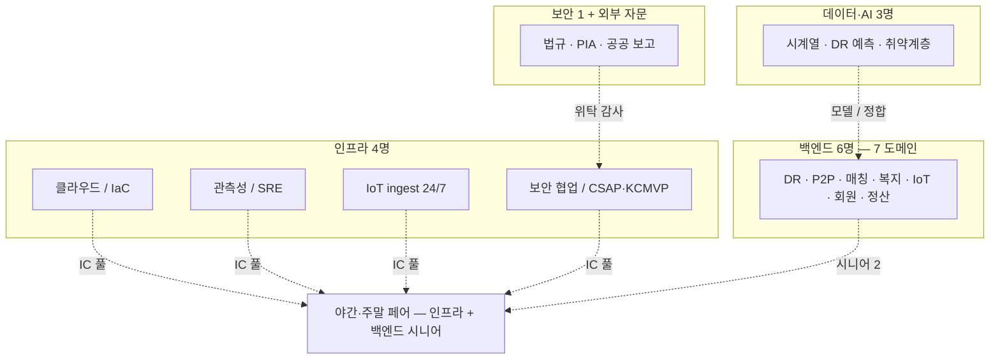
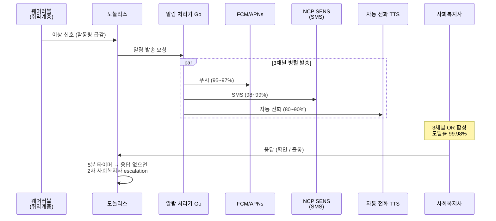

# 7장. 운영과 조직 — 26명 / 공공 신뢰 / 5분 안전 SLA

> 1권 220명 조직의 운영 룰을 그대로 가져오면 26명 조직은 부서진다.

## 이 장에서 답하는 질문

- 26명 조직에서 SLO / 온콜 / 회고는 어떻게 단순화하는가?
- 취약계층 안전 알람 5분 SLA 99.99% 도달률을 인프라 4명 / IC 풀 6명이 어떻게 보장하는가?
- 공공 신뢰 점수 같은 비기술 KPI 가 의사결정에 어떻게 들어오는가?
- 작은 조직의 아키텍트는 모자를 몇 개 써야 하는가?

> 약어 풀이 — SRE (Site Reliability Engineering), SLO (Service Level Objective), SLI (Service Level Indicator), IC (Incident Commander), FCM (Firebase Cloud Messaging), SENS (NCP Simple & Easy Notification Service), FinOps (Financial Operations, 비용 관리), RACI (Responsible / Accountable / Consulted / Informed), ADR (Architecture Decision Record), RFC (Request for Comments).

## 1. 26명 조직의 SRE / 플랫폼

### 1.1 1권과의 차이

| 측면 | 1권 (220명) | 2권 (26명) |
|------|-------------|----------|
| SRE 전담 | 8명 | **0명 (인프라 4명이 겸함)** |
| 플랫폼 본부 | 35명 | **4명 (전체 인프라)** |
| 도메인팀 별 온콜 | 1차 (도메인) + 2차 (SRE) | **백엔드 1팀 + 인프라 1팀, 2명씩 로테이션** |
| 골든 패스 / IDP | Backstage 등 | **README + Makefile** (도구 없음) |
| 사내 PaaS | 자체 IDP | NCP 매니지드 그대로 사용 |

### 1.2 한 사람이 여러 모자 (Mermaid)

- **인프라팀 4명** (3 → 4 보강): SRE + DevOps + 관측성 + 보안 / CSAP·KCMVP 협업 + 공공 인프라 연계 + IoT ingest 24/7 운영. 3명 때는 1.67 FTE 부족했음.
- 백엔드팀 6명: 도메인 개발 + 1차 온콜 + 자체 모니터링
- 데이터팀 3명: 모델 + 데이터 파이프라인 + DR 분석
- 보안 1명: 보안 + 법규 + 공공 보고서 + PIA 외부 자문 협업
- CTO / 엔지니어링 리드 1명: 의사결정 + 외부 협력

> **트레이드오프 — "한 사람 여러 모자" vs "전담 본부"** — 26명에서 본부 분리는 팀당 평균 2명 → 인지 부하 부족. 한 사람 여러 모자 는 깊이 손실 + 번아웃 위험 → 분기 1회 모자 점검·외부 자문 (보안·PIA) 으로 보완. 60명대 (3년 비전) 가 되면 전담 본부 재검토.

## 2. SLO — 도메인별 + 안전 SLA

[케이스 6 SLA](../case-study/README.md#6-운영-sla) 그대로 SLO.

| 도메인 | SLO | 1권 비교 |
|--------|-----|---------|
| IoT ingest | 99.99% / 손실률 < 0.1% | 1권 결제 (99.99%) 와 동급 |
| **취약계층 안전 알람** | **99.99% / 5분 이내 사회복지사 도달** | 1권에 없는 영역 |
| DR 응답 | 99.95% / p95 < 1s | 1권 결제 응답 (p95 2s) 보다 빠름 |
| 시민 앱 | 99.9% / p95 < 500ms | 1권 (200ms) 보다 느슨 — 시니어 고려 |

### 트레이드오프 — 안전 알람 99.99% 의 비용 + 도달률 분해

> 단일 채널은 99.99% 불가. 3채널 OR 합성으로 도달률 만든다.

| 채널 | 단독 도달률 | 비고 |
|------|----------|------|
| FCM / APNs 푸시 | 95~97% | OS 절전 / 알림 차단 / 토큰 만료 |
| SMS (NCP SENS) | 98~99% | 통신사 / 번호 변경 |
| 자동 전화 (TTS) | 80~90% | 받지 않거나 거부 |

**3채널 OR (병렬 발송, 한 채널만 도달해도 성공)**: 1 − (1 − 0.95) × (1 − 0.98) × (1 − 0.80) = **99.98%** — 목표 99.99% 에 근접. 99.99% 는 채널별 도달률을 상한치 (97/99/90) 로 잡으면 1 − 0.03 × 0.01 × 0.10 = **99.997%** 달성.

| 옵션 | 99.99% 가능 | 26명 비용 |
|------|-----------|----------|
| 단일 채널 (앱 푸시) | No (95~97%) | 낮음 |
| **다중화 3채널 OR (앱 → SMS → 자동 전화 병렬)** | **Yes (99.98~99.997%)** | **중간 — NCP SENS + 자동 전화 비용 (월 30건 × 3채널 ≈ 미미)** |
| 다중화 + 다중 인프라 | Yes (99.999%) | 26명 불가능 |

→ **다중화 + 인프라 단일** 채택. 3채널 병렬 발송, 우선순위 X (한 번에 다 보냄 — 시민이 어느 쪽이든 가장 빨리 받는 채널로 응답). 인프라 (NCP) 장애 시 SLA 일시 침범 — 사회복지사 사전 합의.

> **함정** — "푸시 실패 → SMS → 자동 전화" 순차 fallback 은 5분 안에 못 끝낸다. 푸시 timeout 1분 + SMS timeout 30초 + 전화 시도 1분 = 2분 30초 소진 후에야 마지막 채널. 5분 안에 사회복지사 응답까지 가려면 **3채널 동시 발송** 이 정답.

## 3. 인시던트 — 6명 IC 풀

[1권 7장 3절](../../manuscript/07-운영과-조직/README.md#3-인시던트-관리) 의 IC / Ops Lead / Comm / Scribe 구조 그대로.
**26명 조직 IC 풀: 6명 (인프라 4 + 백엔드 시니어 2)**.

### 3.1 야간 / 주말 로테이션

- 1차: 2주 로테이션, 인프라팀 + 백엔드팀 1명씩 (2명 페어)
- 2차: 시니어 1명 자동 escalation
- IC: 큰 사고 (P1) 시에만 풀에서 자동 배정

### 3.2 알람 위생 — 작은 조직에 더 중요

알람 1주 5건 이상 → 정리 우선. 26명은 알람 피로에 더 취약.

### 3.3 5분 안전 알람 흐름 (Mermaid)

## 4. 공공 신뢰 KPI — 1권에 없던 KPI

비기술 KPI 가 의사결정에 들어옴.

| KPI | 측정 | 임계 |
|-----|------|------|
| **시민 신뢰 점수** | 분기 설문 (1~10) | 7.0 미만 시 사업 점검 |
| **공공 위탁 평가** | 분기 보고서 평가 | B 이하 시 임원 회의 |
| **취약계층 알람 도달률** | 5분 이내 도달 % (3채널 OR) | **Q1 99.9% 미만 시 P1 / Q2~Q3 단계 99.99% 도달** ([케이스 12](../case-study/README.md#12-향후-로드맵-가정)) |
| **시민 데이터 사고** | 1건도 발생하면 | 즉시 사업 위기 |
| **공공 sponsor 수입 비중** | 매출 대비 | 30% 미만 / 70% 초과 모두 위험 (균형) |

### 트레이드오프 — 공공 의존도

| 측면 | sponsor 비중 낮음 | 중간 (현재) | 높음 |
|------|----------------|------------|------|
| 자율성 | 강함 | 중간 | 약함 (정치 / 정책 변동 민감) |
| 사업 안정성 | 시장 의존 | 균형 | 공공 의존 (단기 안정) |
| 시민 신뢰 | 사기업 인상 | 공공 + 시장 | 공공기관 인상 (좋을 수도 / 나쁠 수도) |

## 5. 회고 — 비난 없는 + 공공 학습 공유

1권의 비난 없는 회고 그대로 + 추가:

- **공공 사고 회고**: 공공 위탁 영향 사고는 회고 결과를 공공 보고서에 포함
- **타 시군 학습 공유**: 인접 지자체 (대전·청주·천안) 사례 분기 1회 공유 (확장 대비)

## 6. FinOps — 매출 18~25% IT 비용 / **분기 1회 리뷰**

[케이스 2.3·11.5](../case-study/README.md#23-매출--비용-가이드라인) 참조.
1권 (10~14%) 보다 높음 — 매출 규모 작음 + IoT 데이터 처리 + 공공 sponsor 일부 충당. **"실 부담 12~15%" 같은 단정은 책에서 하지 않는다** — 충당 비율은 분기마다 변동.

리뷰 주기는 **분기 1회 전체 인원 참여** (케이스 11.5 일치). 월 1회 전원 참여는 26명에서도 회의 비용이 크다 — 인프라팀이 매월 점검, 전체 회의는 분기.

> **체크리스트** — 분기 리뷰에 IoT 데이터 비용 (TimescaleDB / ClickHouse 디스크·CDSS partition 수) / NCP 시민 데이터 한국 리전 유지 비용 / 공공 sponsor 충당 비율 (분기별 추적) 이 포함되는가.

## 7. 의사결정 — RACI / ADR 단순화

- 큰 결정 (사업 / 공공 협력 영향) → ADR + 대표 + 공공 협력 5명 참여 + **"공공 위탁 영향" 항목** (1장 4.2)
- 작은 결정 (기술 선택 / 라이브러리) → 백엔드 / 인프라 리드 단독
- RFC 형식은 안 함 — 회의로 충분 (26명)

## 8. 아키텍트의 자리 — 작은 조직

- 코드 50% (직접 IoT ingester / 핵심 도메인)
- 의사결정 / 글쓰기 30%
- 외부 협력 (공공) 20%

1권의 "상아탑 아키텍트" 함정은 26명에선 자동 해결 — 모두가 코드 만짐. 단 다른 함정:

> - **모든 결정을 아키텍트 혼자** — 26명이라 가능해 보이지만 위임 부족 → 병목. RFC 까지는 아니어도 ADR 회람.
> - **아키텍트 모자 너무 많음** — 코드 + 결정 + 외부 협력 — 어느 하나 깊이 못 함. 분기 1회 본인 모자 점검 권장.

## 9. 케이스 — 동네에너지 운영 / 조직 (요약)

- 인프라 4명 = SRE + DevOps + 보안·CSAP/KCMVP 협업 + IoT ingest 운영
- 백엔드팀 1차 온콜 / 인프라팀 2차
- IC 풀 6명 / 2주 로테이션
- 분기 SLO 리뷰 (전체 인원)
- **분기 1회 비용 리뷰** + 공공 보고서 검토 (월 1회 X — 케이스 11.5 일치)
- 시민 신뢰 점수 분기 측정

## 정리 — 체크리스트

- [ ] 26명 / 220명 조직의 결정 차이를 자기 조직에 매핑했는가
- [ ] 5분 안전 SLA 도달률이 3채널 OR 합성 (FCM 95~97% × SMS 98~99% × 자동 전화 80~90%) 으로 분해되어 측정되는가
- [ ] 3채널이 순차 fallback 이 아닌 병렬 발송으로 5분 안에 도달하는가
- [ ] 공공 신뢰 KPI (시민 점수 / 위탁 평가) 가 회의 의제인가
- [ ] 아키텍트 본인의 모자 (코드 / 결정 / 외부 협력) 비중이 측정되는가
- [ ] 알람 피로가 1주 5건 임계로 관리되는가
- [ ] 비용 리뷰가 분기 1회 (케이스 11.5 일치) 이고 인프라팀이 매월 점검하는가
- [ ] 인프라 4명 / IC 풀 6명이 24/7 IoT 운영 + 야간·주말 페어를 감당하는가

## 더 읽을거리

> 형식: 책 = `*제목*, N판 — 저자명 (출판사, 연도)` / 공식 자료 = `이름 — 발행처 (URL — 확인된 것만)` ([ADR-0009](../../adr/0009-챕터-작성-표준.md))

- [1권 7장 — 운영과 조직](../../manuscript/07-운영과-조직/README.md) — 원본 (SRE / 팀 토폴로지 / FinOps)
- *Team Topologies* — Matthew Skelton, Manuel Pais (IT Revolution Press, 2019) — 작은 조직에서도 유효한 4유형
- *Site Reliability Engineering* — Betsy Beyer et al. (O'Reilly, 2016) — SLO / 에러 버짓 / 비난 없는 회고
