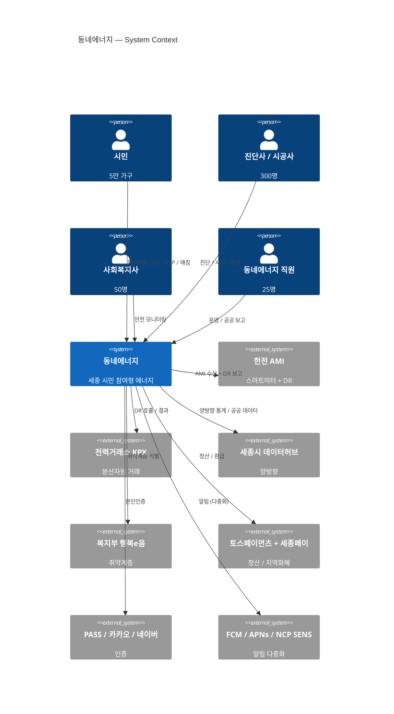
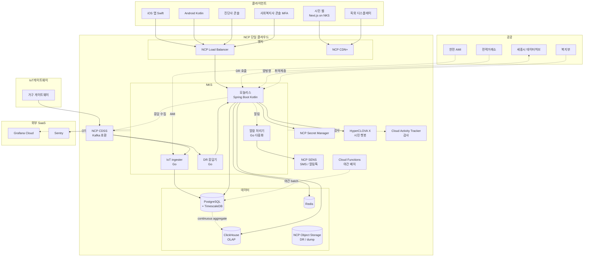
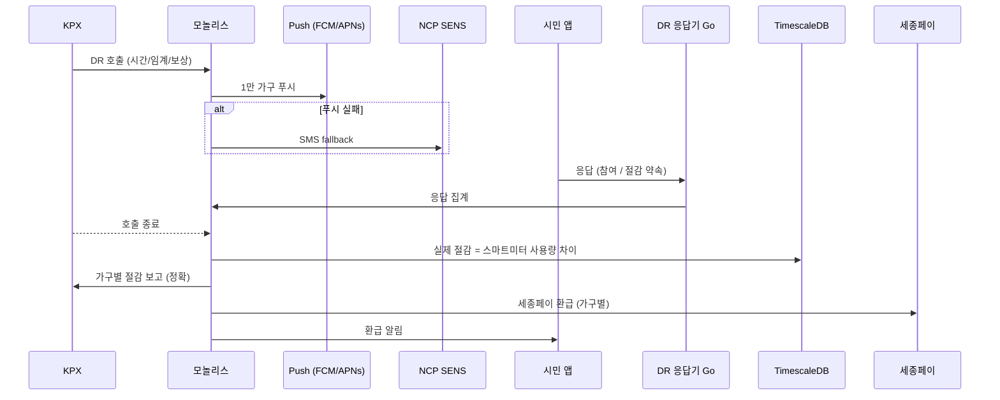

# 8장. 종합 케이스 스터디 — 동네에너지 전체 + 1권과의 결정 비교

> 1권의 결정이 2권 환경에서 어떻게 다르게 내려졌는가 — 본 책의 가장 큰 학습 가치.

## 이 장에서 답하는 질문

- 1~7장의 결정이 동네에너지에서 어떻게 묶이는가?
- 1권의 같은 결정과 어디서 갈라졌고, 왜?
- 25명 조직 / 공공 협력 / 시계열 IoT 가 의사결정 패턴을 어떻게 바꾸는가?
- 자기 환경 (15명·100명·500명 / 공공·민간) 으로 가져갈 때 무엇을 바꿔야 하는가?

## 1. 한 장으로 보는 동네에너지

## 2. Container View

## 3. 1~7장 결정 요약

| 영역 | 2권 (동네에너지) 결정 | 1권 (원픽) 결정 | 차이의 이유 |
|------|----------------------|----------------|-----------|
| 아키텍처 | 모놀리스 + 작업성격별 추출 3개 (IoT/DR/알람) | 모듈러 모놀리스 + 도메인 추출 (검색/추천/라이브) | **분리 기준이 부하 vs 도메인** |
| 클라우드 | **NCP 단일** | AWS + NCP 보조 | 25명 + 공공 사업 가점 |
| 컨테이너 | NKS (서비스 약 12개) | EKS (약 80개) | 규모 / 인력 |
| IaC | Terraform | Terraform + Atlantis + ArgoCD | 비슷 |
| 백엔드 언어 | Spring Boot/Kotlin + Go (IoT/DR/알람) | Spring/Kotlin + Go + Python | Python 없음 (ML 가벼움) |
| API | 내부 단순 / 외부 REST | 외부 REST + 내부 gRPC + BFF GraphQL | 조직 작아 BFF / gRPC 미도입 |
| DB | **단일 PostgreSQL + TimescaleDB + Redis + ClickHouse** | Aurora MySQL + PostgreSQL + Mongo + Redis + DynamoDB + OpenSearch | DB 다양성 ↓ |
| 트랜잭션 | Saga + Outbox + Idempotency (1권 동일) | Saga + Outbox + Idempotency | 패턴 공통 |
| 메시징 | NCP CDSS (Kafka 호환) | Kafka MSK + SQS | 단일 클라우드 |
| 모바일 | Native (Swift / Kotlin) + **접근성 강제** | Native (Swift / Kotlin) | 시니어 / 공공 사업 |
| 웹 | Next.js (NKS 호스팅) | Next.js (Vercel) | 단일 클라우드 / 데이터 주권 |
| BFF | **없음** (Next Server Action 만) | 모바일 GraphQL BFF | 조직 작음 |
| 데이터 | TimescaleDB + ClickHouse | S3 Iceberg + BigQuery + dbt + Flink | 시계열 vs 트랜잭션 + 비용 |
| 검색 | PostgreSQL FTS (없음과 다름없음) | OpenSearch + Nori + LTR | 검색 비중 낮음 |
| LLM | **HyperCLOVA X** (한국어 + 공공 가점) | AI Gateway + 외부 LLM 일반 | 한국 특화 |
| 보안 | + 분산에너지법 + 준 민감정보 + 공공 위탁 | ISMS-P + 전금법 + PG 위탁 | 도메인 |
| 인증 | PASS 우선 + Access 30분 (시니어) | 일반 + Access 15분 | 시니어 / 공공 |
| 운영 | 25명 / SRE 별도 없음 / IC 풀 5 | 220명 / SRE 8 / IC 풀 자동 | 규모 / 자율성 |
| 비용 | 매출 18~25% (sponsor 일부) | 10~14% | 규모 / sponsor |

> 19개 결정 중 **15개가 1권과 다르거나 강도가 다름**. "케이스가 바뀌면 결정이 바뀐다" 의 시연.

## 4. 핵심 시나리오 — DR 호출 흐름

## 5. 1년 로드맵 ([케이스 12.1](../case-study/README.md#12-향후-로드맵-가정) 인용)

| 분기 | 목표 |
|------|------|
| Q1 | DR 5,000 TPS 안정화 + 취약계층 알람 99.99% |
| Q2 | P2P 거래 시범사업 → 분산에너지법 정식 사업 |
| Q3 | HyperCLOVA X 챗봇 + 에너지 절약 팁 |
| Q4 | 인접 시 (대전·청주) 확장 검토 |

## 6. 3년 비전 ([케이스 12.1](../case-study/README.md#12-향후-로드맵-가정))

- 활성 가구 5만 → 15만 (충청권)
- 조직 25명 → 60명
- 한전 / KPX 정식 분산자원 사업자 라이선스
- 공공 협력 모델 다른 지자체 복제

## 7. "다시 시작한다면"

같은 결정:
- NCP 단일 (공공 가점)
- 모놀리스 시작 + IoT 만 분리
- TimescaleDB (PostgreSQL 통일)
- 시니어 접근성 처음부터

다르게 했을 결정:
- 공공 위탁 계약서 보안 조항 — 처음부터 변호사 자문 + 더 상세
- 시민 신뢰 점수 — 1년차부터 측정 (3년차 가서야 측정 시작했다고 가정)
- 알람 다중화 (푸시 → SMS → 전화) — 6개월차에야 도입 (사고 후) → 1주차부터

## 8. 자신의 프로젝트로 가져갈 때

| 자신의 환경 | 가져올 것 | 바꿀 것 |
|------------|---------|--------|
| 작은 스타트업 (10명) | 모놀리스 + 단일 DB / NCP 단일 / 매니지드 우선 | 공공 협력 부분은 빼고 / IoT 없으면 단순 |
| 큰 조직 (100명+) | 1권 (원픽) 결정으로 회귀 | 도메인팀 분리 / SRE 본부 / 멀티 DB |
| 핀테크 | 보안 정도만 가져옴 | 결제 / 전금법 직접 적용 |
| 다른 도시 / 다른 공공 | 공공 협력 패턴 가져옴 | 해당 지자체 / 부처 매핑 |
| 글로벌 진출 | (가져갈 거 적음) | 케이스 13 — 한국 단일 가정 외 |

원칙 (1권과 공통): **결정 자체보다 결정의 근거**.

## 9. 마지막 트레이드오프 — 두 책의 차이

> 두 책의 정체성:
> - 1권 — "한 명의 아키텍트가 전체를 조망"
> - 2권 — "같은 사고법이 작은 무대 / 공공 협력 / 시계열에서 어떻게 다르게 적용되는가"
>
> 한 권만 읽어도 좋다. 두 권 모두 읽으면 "케이스가 바뀌면 어디서 결정이 갈라지는가" 의 시연이 더해진다.

## 10. 정리 — 책 전체의 체크리스트

### 사고의 틀
- [ ] 자기 환경에 맞춰 1권 / 2권 결정을 모두 비교했는가
- [ ] NFR 우선순위가 자기 환경에 맞는가
- [ ] 작업 부하 vs 도메인 — 두 분리 기준 모두 검토했는가

### 시스템 설계
- [ ] IoT / 시계열이라면 TimescaleDB 같은 통합 DB 도 검토했는가
- [ ] 알람 다중화 (3채널 이상) 가 안전 SLA 영역에 있는가
- [ ] 단일 클라우드 락인이 의식적 결정인가

### 데이터 / AI
- [ ] 시계열 raw / 다운샘플링 / 분석 3층이 자동인가
- [ ] LLM 호출에 PII 마스킹 + Zero Retention 이 강제되는가
- [ ] 모델 설명 가능성이 정확도보다 우선될 영역 (취약계층 / 보상) 이 식별되었는가

### 보안 / 컴플라이언스
- [ ] 도메인 특수 법규 (전기사업법 / 분산에너지법 / 에너지법) 가 명시되었는가
- [ ] 공공 위탁 책임이 1권 PG 위탁과 다르게 운영되는가
- [ ] IoT 게이트웨이 mTLS / OTA 가 있는가

### 운영 / 조직
- [ ] 25명 / 220명 결정 차이를 자기 조직에 매핑했는가
- [ ] 공공 신뢰 KPI 가 회의 의제인가
- [ ] 아키텍트 본인의 모자 비중이 측정되는가

## 더 읽을거리

- [1권 8장 — 종합 케이스 스터디 (원픽)](../../manuscript/08-종합-케이스-스터디/README.md) — 1권의 결정 요약
- *Software Architecture: The Hard Parts* — Mark Richards, Neal Ford (O'Reilly, 2021) — 트레이드오프 사고

---

## 끝맺음

좋은 아키텍트는 "정답을 가진 사람" 이 아니라 "자기 무대의 트레이드오프를 깊이 이해하는 사람" 이다.

1권 (원픽) 의 결정도, 2권 (동네에너지) 의 결정도 — 자기 무대에서만 옳다.
당신의 무대는 또 다를 것이다. 두 책의 결정을 그대로 가져가지 말고, **두 책의 결정 사이가 왜 갈라졌는가** 를 가져가라.

좋은 아키텍처를 만드는 일에 행운을.
