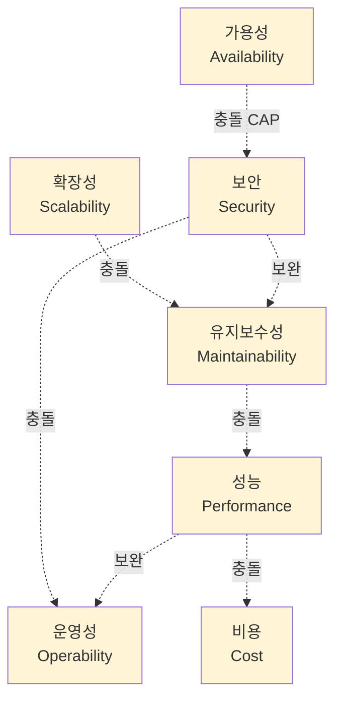
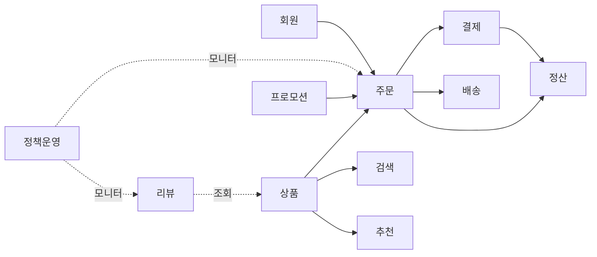
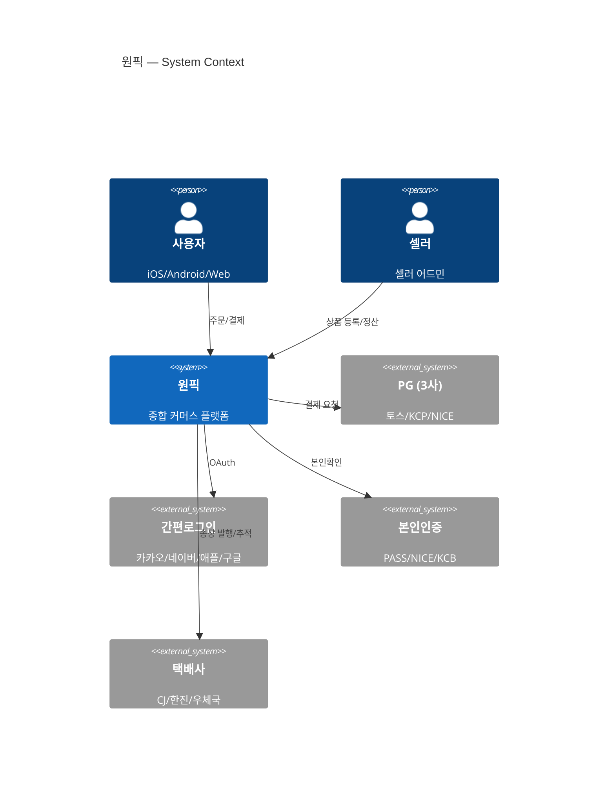

# 1장. 아키텍처 기초

> 아키텍처는 기술의 집합이 아니라 의사결정의 집합이다.

## 이 장에서 답하는 질문

- 아키텍트는 매일 무엇을 하는 사람인가?
- 좋은 의사결정과 나쁜 의사결정을 구분하는 기준은 무엇인가?
- 모놀리스 · 모듈러 모놀리스 · 마이크로서비스(MSA) 중 우리에게 맞는 것은 어떻게 고르는가?
- 의사결정을 어떻게 기록하고 다음 사람에게 전달하는가?

## 들어가며

"우리 서비스 어떻게 가야 할까요?" 라는 질문이 있다.
아키텍트는 이 질문에 곧장 "MSA 로 가시죠" 라고 답하는 사람이 아니다.

좋은 아키텍트는 먼저 되묻는다. "지금 어떤 문제가 있는가?", "그 문제는 얼마나 시급한가?", "팀 규모는 얼마인가?", "1년 뒤 트래픽은?", "팀이 감당 가능한 복잡도는 얼마인가?" — 이 질문들이 답을 결정한다.

기술은 도구이고, 트레이드오프는 본질이다.
이 장은 그 본질을 잡는 데서 시작한다.

## 1. 아키텍트는 무엇을 하는가

> 본 절은 책의 도입에 가까워, 절별 박스는 두지 않는다 ([ADR-0009](../../adr/0009-챕터-작성-표준.md) 룰 1 면제). 함정만 짧게 짚는다.

### 1.1 역할의 스펙트럼

"아키텍트" 라는 호칭은 회사마다 의미가 다르다. 대략 다음 스펙트럼 위 어딘가에 있다.

| 유형 | 시간 분배 (관찰 기반 추정, 회사마다 편차 큼) | 산출물 |
|------|----------|--------|
| **Solution Architect** (솔루션 아키텍트) | 외부 고객 / 영업 지원 60% | RFP(Request for Proposal) 응답, 솔루션 설계서 |
| **Enterprise Architect** (전사 아키텍트) | 전사 표준 / 거버넌스 50% | 표준 가이드라인, 기술 정책 |
| **Application Architect** (애플리케이션 아키텍트) | 특정 제품 설계 70% | 컴포넌트 설계, 데이터 모델 |
| **Technical Architect / Staff Engineer** | 코드 30% + 설계 50% | ADR(Architecture Decision Record), 핵심 컴포넌트 직접 구현 |
| **Platform Architect** | 사내 PaaS(Platform as a Service)·공통 인프라 80% | 사내 표준 라이브러리, 개발자 도구 |

> 위 시간 분배 % 는 정확한 통계가 아니라 역할 차이를 시각화하기 위한 대략적 비율이다.

**이 책이 가정하는 아키텍트**: Technical Architect / Staff Engineer 에 가깝다.
즉, 코드를 완전히 떠나지 않고, 의사결정을 직접 글로 남기며, 팀과 함께 구현까지 책임지는 사람.

### 1.2 매일의 일

관찰해 보면 보통 아키텍트의 한 주에서 코드 작성 시간이 30% 를 넘기 어렵다.

- 의사결정 (회의 · 1:1 · 메시지로 상충하는 요구를 조율)
- 글쓰기 (ADR, 설계 문서, 리뷰 코멘트)
- 위임 가능한 영역과 못 할 영역 분리
- 새로운 기술의 평가 — POC(Proof of Concept) 또는 RFC(Request for Comments)
- 장애 · 인시던트 회고 진행
- 다른 팀과의 인터페이스 (상품 ↔ 결제, 검색 ↔ 추천 등) 정의

이 활동들의 공통점은 **나중에 비싸지는 결정을 지금 싸게 내리는 것** 이다.

### 1.3 흔한 함정 — 호칭에 매달리지 말 것

> "내 직무는 'Solution Architect' 인데 왜 코드를 보고 있나" — 호칭이 일을 정의하지 않는다. 회사마다 다르다.
> 책의 나머지에서 "아키텍트" 는 호칭이 아니라 행동을 가리킨다 — 결정을 기록하고, 코드를 떠나지 않는 사람.

## 2. 비기능 요구사항(NFR) — 진짜 어려운 부분

기능 요구사항(FR, Functional Requirement) 은 PM 이 가져온다. "결제 화면에 토스페이를 추가해주세요." 같은 것이다.
비기능 요구사항(NFR, Non-Functional Requirement) 은 보통 누가 들고오지 않는다. 하지만 무너지면 가장 크게 무너진다.

### 2.1 NFR 7가지

다음 7가지를 정량적으로 정의할 수 있어야 한다.

| NFR | 정량 지표 예 | 깨졌을 때의 결과 |
|-----|-------------|----------------|
| **성능 (Performance)** | p95 응답 200ms, 처리량 5,000 RPS(Requests Per Second) | 사용자 이탈, 컨버전 하락 |
| **가용성 (Availability)** | 월 가동률 99.95% (월 약 21분 다운) | 매출 손실, 평판 손상 |
| **확장성 (Scalability)** | 수평 확장으로 10배 트래픽 수용 가능 | 이벤트 시 장애 |
| **보안 (Security)** | OWASP(Open Web Application Security Project) Top 10 정기 점검, 침투 테스트 분기 1회 | 사고 · 배상 · 과징금 |
| **운영성 (Operability)** | MTTR(Mean Time To Recovery) 30분 이내, 모든 컴포넌트 SLO(Service Level Objective) 정의 | 장애 장기화, 팀 번아웃 |
| **유지보수성 (Maintainability)** | 신규 입사자 2주 안에 기능 1개 배포 | 속도 저하, 인력 이탈 |
| **비용 (Cost)** | 매출의 8% 이내 인프라 비용 | 적자 확대, 잘못된 우선순위 |

### 2.2 NFR 끌어내기

PM 은 NFR 을 잘 모른다. 끌어내야 한다. 다음 질문이 효과적이다.

- "이 화면이 5초 걸리면 사용자는 어떻게 반응할까요?"
- "한 시간 내려가면 어떤 일이 일어나나요? 매출 추정으로요."
- "얼마나 빨리 트래픽이 늘 거라고 보세요? 1년 후, 3년 후."
- "내년에 팀이 두 배 커지면 코드가 그 속도를 따라갈 수 있을까요?"

### NFR 끼리의 충돌 — 거미줄



> "NFR 거미줄" — 한 가닥을 당기면 다른 가닥이 함께 흔들린다. 한 NFR 만 극단으로 끌어올리는 결정은 거의 항상 다른 NFR 을 부순다.

### 트레이드오프 — NFR 끼리도 충돌한다

| 충돌 | 결정 방향 |
|------|----------|
| 성능 ↔ 비용 | 성능 SLO 를 명확히 정하고 그 안에서 가장 싼 옵션 |
| 가용성 ↔ 일관성 (CAP 정리, Consistency-Availability-Partition tolerance) | 도메인별 분리 — 결제는 일관성, 추천은 가용성 |
| 보안 ↔ 운영성 | 자동화된 보안 게이트, 수동 절차는 최소화 |
| 유지보수성 ↔ 성능 | 성능 임계점을 측정으로 정의, 그 전엔 가독성 우선 |
| 확장성 ↔ 단순성 | 현재 + 12개월 트래픽까지만 대비, 그 이상은 미루기 |

## 3. 아키텍처 스타일의 선택

### 3.1 다섯 가지 스타일

| 스타일 | 핵심 특징 | 적합한 시점 |
|--------|----------|-------------|
| **Monolith (모놀리스)** | 한 코드베이스, 한 배포 단위 | 0~1년차, 팀 < 10명 |
| **Modular Monolith (모듈러 모놀리스)** | 한 배포 단위, 모듈 경계 강제 | 1~3년차, 팀 10~30명 |
| **Microservices (마이크로서비스, MSA)** | 서비스별 독립 배포, 독립 데이터 | 3년+, 팀 30명+, 도메인 분리 명확 |
| **Event-Driven (이벤트 주도)** | 비동기 메시지 중심, 약결합 | 트래픽 폭주·순서 무관 처리 많음 |
| **Serverless (서버리스)** | 함수 단위 실행, 사용량 과금 | 트래픽 변동 큼·단순 작업 위주 |

### 3.2 흔한 함정 — "MSA 가 정답" 환상

> 우리는 빨리 MSA 로 가야 합니다. 모놀리스로는 확장이 안 됩니다.

이 문장은 거의 항상 틀린 채로 출발한다. 마이크로서비스 아키텍처(MSA, Microservices Architecture) 가 해결해주는 문제는 "기술적 확장" 이 아니라 "조직적 확장" 이기 때문이다.

MSA 가 정말 가져다주는 것:
- **독립 배포**: 팀 A 의 변경이 팀 B 의 배포를 막지 않음 → 팀이 많을 때 가치
- **독립 기술 선택**: 팀별 언어 · DB 선택 자유 → 팀이 자율일 때 가치
- **장애 격리**: 한 서비스 죽어도 나머지 살아남음 → 도메인 분리 명확할 때 가치

MSA 가 가져오는 비용:
- 분산 트랜잭션 / 데이터 일관성
- 서비스 간 호출의 디버깅 (분산 추적 필수)
- 중복 코드 (인증·로깅·모니터링)
- 테스트 환경 복잡도 (한 시나리오에 N개 서비스 띄워야)
- 운영 복잡도 (N개 서비스의 배포·모니터링·온콜)

### 3.3 결정 매트릭스

| 질문 | Yes 면 | No 면 |
|------|-------|-------|
| 팀이 30명 이상? | MSA 검토 | 모놀리스 / 모듈러 |
| 서로 다른 도메인이 명확히 분리됨? | MSA 검토 | 모듈러 모놀리스 |
| 팀별로 배포 주기가 다름? | MSA 검토 | 모놀리스 |
| 운영 인력 충분 (DevOps / SRE(Site Reliability Engineering))? | MSA 가능 | 모놀리스 우선 |
| 분산 시스템 디버깅 경험 있음? | MSA 가능 | 모놀리스 우선 |

세 개 이상 No 면 모놀리스 / 모듈러 모놀리스 가 거의 항상 옳다.

### 3.4 운영 환경의 영향 — 한국 시장 메모

스타일 선택은 코드 구조뿐 아니라 운영 환경(클라우드 · 망 구성 · SRE 인력) 과 함께 평가된다.

- **단일 클라우드 종속을 피해야 하는가**: 멀티 클라우드 또는 클라우드+IDC(Internet Data Center) 가 전제라면 MSA 추출 시 서비스별 배포 환경의 일관성 · 관측성 표준이 추가 비용으로 들어온다.
- **국내 망 환경**: 공공·금융 입찰, 망분리 강제, 국내 클라우드(NCP · KT · NHN) 우선 가점이 있는 영역에서는 사용 가능한 매니지드 서비스의 폭이 좁아져 MSA 의 운영 복잡도가 커진다.
- **SRE / 플랫폼 인력**: 매니지드 PaaS 위에서 모놀리스를 운영하는 비용 ≪ MSA 80개를 자체 EKS 위에서 운영하는 비용. 인력이 부족하면 모듈러 모놀리스가 거의 항상 옳다.

자세한 인프라 결정은 [2장 클라우드와 인프라](../02-클라우드와-인프라/) 에서 다룬다.

### 트레이드오프 — Monolith vs Modular Monolith vs MSA

| 측면 | Monolith | Modular Monolith | MSA |
|------|----------|-------------------|-----|
| 시작 비용 | 매우 낮음 | 낮음 | 높음 |
| 배포 단위 | 전체 | 전체 | 서비스별 |
| 데이터 일관성 | 트랜잭션 1개 | 트랜잭션 1개 | Saga · Outbox (분산 트랜잭션 패턴, 3장에서 다룸) |
| 장애 격리 | 없음 | 없음 (프로세스 동일) | 강함 |
| 팀 자율성 | 낮음 | 중간 (모듈 오너십) | 높음 |
| 운영 복잡도 | 낮음 | 낮음 | 높음 |
| 적합 팀 규모 | < 10명 | 10~30명 | 30명+ |
| 전환 난이도 | — | Monolith 에서 쉬움 | Modular 에서 점진적 |

## 4. 도메인 주도 설계(DDD)와 컴포넌트 경계

### 4.1 왜 도메인이 먼저인가

도메인 경계가 잘못 그어지면 어떤 아키텍처 스타일을 골라도 고통스럽다.
"주문" 모듈이 "결제" 도메인 데이터를 직접 만지면, 모놀리스든 MSA 든 한쪽 변경이 다른 쪽을 부순다.

도메인 주도 설계(DDD, Domain-Driven Design) 는 이 경계를 도메인의 "언어" 부터 그으라고 권한다.

### 4.2 Bounded Context (한정된 맥락)

DDD 의 가장 실용적 개념이다.
"주문" 이라는 단어가 영업팀과 물류팀에서 서로 다른 의미를 가진다면, 둘은 다른 컨텍스트로 둔다.
같은 단어를 같은 의미로 쓰는 사람들의 묶음 — 그것이 Bounded Context 다.

원픽의 Bounded Context (1차 안):



### 4.3 컨텍스트 매핑

컨텍스트 사이의 관계를 명시한다.

| 패턴 | 의미 | 원픽 적용 예 |
|------|------|------------|
| **Customer-Supplier** (고객-공급자) | 한 쪽이 다른 쪽의 요구를 따름 | 주문(Customer) ← 결제(Supplier) |
| **Conformist** (순응자) | 약자가 강자를 그대로 따름 | 자체 회원 (Conformist) ← 카카오 로그인 |
| **Anti-Corruption Layer (부패 방지 계층)** | 외부 모델을 내부 모델로 번역 | PG (Payment Gateway, 결제 대행) 응답 → 결제 도메인 모델 |
| **Open Host Service** (개방된 호스트 서비스) | 표준화된 API 로 모두에게 동일 제공 | 상품 조회 API |
| **Published Language** (공표된 언어) | 공통 이벤트 스키마 | 주문 도메인 이벤트 (`OrderCreated` 등) |

### 체크리스트 — Bounded Context 를 그릴 때

- [ ] 컨텍스트 경계의 기준이 "용어의 의미가 같은가" 인가 (조직도가 아니라)
- [ ] 한 컨텍스트 안에서 같은 단어가 두 의미로 쓰이지 않는가
- [ ] 컨텍스트 간 관계가 5가지 매핑 중 하나로 명시되었는가
- [ ] 외부 시스템(카카오·PG·택배사)에 대해 ACL(부패 방지 계층) 이 있는가

## 5. 의사결정의 기록 — ADR

### 5.1 왜 ADR 이 필요한가

3개월 후의 본인은 오늘 자신이 왜 그렇게 결정했는지 기억하지 못한다.
새 입사자는 더더욱 모른다.

대화나 슬랙 스레드는 검색되지 않는다. 위키는 갱신이 안 된다.
**ADR(Architecture Decision Record) 은 코드와 함께 사는 의사결정 기록** 이다. 변경되지 않고 누적된다 (변경이 필요하면 새 ADR 로 대체).

### 5.2 ADR 의 형식

```markdown
# NNNN. (제목 — 결정 자체)

- Date, Status, Deciders

## Context
어떤 문제·제약 위에서 결정하는가

## Decision
무엇을 결정했는가 (간결하게)

## Considered Alternatives
어떤 대안을 보았고 왜 떨어뜨렸는가

## Consequences
긍정 / 부정 / 중립 결과
```

본 책 자체의 의사결정도 [adr/](../../adr/) 에 같은 형식으로 누적된다.

### 5.3 좋은 ADR 의 특징

- **하나의 결정만 다룬다** (여러 개면 분리)
- **번호는 영구**: 폐기되어도 번호 재사용 안 함
- **변경하지 않는다**: 새 ADR 로 대체 (Status: Superseded by NNNN)
- **Context 가 충실**: 후임자가 "왜 그랬는지" 다시 묻지 않게

### 흔한 함정 — ADR 이 형식적이 되는 이유

> - **결정 후 사후 작성**: 의사결정 과정의 대안이 사라짐 — Considered Alternatives 가 텅 빔
> - **위원회 합의문**: 누구도 책임지지 않는 모호한 표현 — "필요 시 검토" 류
> - **위키와 분리**: 코드 저장소 밖에 두면 결국 잊힘
> - **갱신 시 덮어쓰기**: ADR 은 누적이다. 새 결정은 새 번호로

## 6. C4 모델 — 그림으로 말하기

### 6.1 4단계 (Context · Container · Component · Code)

| 단계 | 보여주는 것 | 청중 |
|------|------------|------|
| **Context** | 시스템과 외부 사용자·시스템의 관계 | 비기술 stakeholder |
| **Container** | 시스템 내부의 배포 단위 (앱·DB·큐) | 기술팀 전체 |
| **Component** | 컨테이너 안의 주요 컴포넌트 | 해당 컨테이너 담당 팀 |
| **Code** | 클래스·함수 수준 | 코드 작성자 (보통 생략) |

### 6.2 Mermaid 로 그리기



이 한 장이 PM · CFO · 신입 모두에게 통한다.
세부는 다음 단계 다이어그램으로 내려간다.

### 트레이드오프 — 어디까지 그릴 것인가

| 단계 | 그리는 가치 | 그리는 비용 | 추천 |
|------|------------|-------------|------|
| Context | 매우 높음 (외부 청중에 1장으로 통함) | 매우 낮음 | **항상 그린다** |
| Container | 높음 (팀 간 공통 그림) | 낮음 | **거의 항상 그린다** |
| Component | 중간 (해당 컨테이너 팀에만 가치) | 중간 | 컨테이너 복잡도 큰 곳만 |
| Code | 낮음 (코드가 곧 그림) | 높음 (자동 생성 외엔 유지비) | 보통 생략 |

## 7. 케이스 — 원픽의 아키텍처 스타일 선택

### 7.1 현 상황

5년차 모놀리스 (단일 Spring Boot 애플리케이션, Aurora MySQL 1셋) 위에서 케이스 스터디 [10.1 구체 신호](../case-study/README.md#101-구체-신호-수치-기준) 의 모든 항목이 동시에 발생 중이다.

- 조직 5년간 60명 → 220명 (3.7배)
- 배포 충돌 주 평균 5건, 빌드/배포 사이클 12분 + 25분
- 검색·추천 쿼리가 메인 DB CPU 의 50% 점유
- 결제 트랜잭션 락이 월 1~2회 주문 처리량을 5분 이상 정체
- 결제 SLO(99.99%) 에러버짓(Error Budget) 분기 평균 70% 소진 — 빠듯함

위 신호는 본 책의 모든 챕터에서 동일한 출처(케이스 10.1)에서 인용된다 ([ADR-0008](../../adr/0008-케이스-단일-출처-원칙.md)).

### 7.2 결정 — 모듈러 모놀리스 + 부분 추출 MSA 점진 이행


각 단계의 진입 / 끝나는 조건 / 측정 지표:

| 단계 | 진입 조건 | 끝나는 조건 | 측정 지표 |
|------|----------|-------------|----------|
| 1 | (지금) 모놀리스 한 코드베이스 | 도메인별 빌드 모듈 분리, 모듈 간 직접 의존 0 | 모듈 간 import 위반 = 0 |
| 2 | 1단계 완료 | 검색·추천 별도 서비스, OS(OpenSearch)·Redis 직접 호출 | 메인 DB CPU 점유 < 30% |
| 3 | 2단계 완료 + 결제 트랜잭션 격리 가능 | 결제 별도 서비스, NCP 비동기 복제 (RPO 1분 / RTO 5분, 분기 1회 fail-over drill) — [케이스 6](../case-study/README.md#6-운영-sla) | 결제 SLO 99.99% 분기 1회 달성 |
| 4 | 3단계 안정화 (3분기 이상) | (분리 여부 평가) | 도메인팀 자율 배포 빈도 |

### 7.3 왜 이 결정인가

- 220명이지만 그중 도메인팀 단위로는 5~10명 → MSA 의 "팀별 자율" 가치가 부분적
- 결제 · 주문 · 정산이 강하게 묶여있음 → 무리한 분리는 분산 트랜잭션 비용 폭발
- 검색 · 추천은 데이터 흐름이 단방향 → MSA 추출이 가장 안전한 시작점

### 트레이드오프 — 점진 이행 vs 전면 재작성

| 측면 | 점진 이행 | 전면 재작성 |
|------|----------|------------|
| 비즈니스 영향 | 작음 | 매우 큼 |
| 기간 | 12~36개월 | 6~12개월 (현실은 더 김) |
| 리스크 | 낮음 · 분산 | 높음 · 집중 |
| 결과 일관성 | 중간 (구·신 공존) | 높음 |
| 흔한 실패 | 미완성 상태로 동결 | 일정 초과 → 폐기 |

원픽은 "사업이 멈추면 안 됨" 제약이 강해 점진 이행이 거의 강제된다.

## 8. 정리 — 체크리스트

다음 영역의 결정을 내리기 전에 점검.

- [ ] 비기능 요구사항 7가지를 **정량적으로** 정의했는가
- [ ] 도메인 경계 (Bounded Context) 를 그렸는가
- [ ] 아키텍처 스타일을 선택한 이유가 "조직적 확장" 또는 "장애 격리" 같은 구체적 가치에 연결되는가
- [ ] "MSA 로 가자" 가 아닌, **다음 한 단계** 의 결정인가
- [ ] 결정을 ADR 로 남겼는가
- [ ] 다이어그램이 1장 이상 있는가 (최소 C4 Context)
- [ ] 결정이 깨졌을 때 되돌릴 비용을 추정했는가

## 더 읽을거리

> 형식: 책 = `*제목*, N판 — 저자명 (출판사, 연도) — 한 줄 요약` / 공식 문서 = `이름 — 발행처 (URL — 확인된 것만)` / 온라인 = `제목 — 저자, 발행처 (연도) (URL — 확인된 것만)` ([ADR-0009](../../adr/0009-챕터-작성-표준.md) 룰 4)

- *Software Architecture: The Hard Parts* — Mark Richards, Neal Ford (O'Reilly, 2021) — 트레이드오프 사고의 깊이
- *Building Microservices*, 2nd ed. — Sam Newman (O'Reilly, 2021) — MSA 패턴의 표준
- *Domain-Driven Design Distilled* — Vaughn Vernon (Addison-Wesley, 2016) — DDD 입문서 중 가장 가벼움
- "Documenting Architecture Decisions" — Michael Nygard, 개인 블로그 (2011) — ADR 의 원조 글 (URL 확인 필요)
- C4 Model for Software Architecture — Simon Brown 공식 사이트 (URL 확인 필요) — C4 모델 공식 자료
