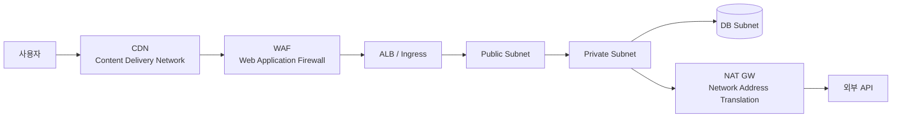
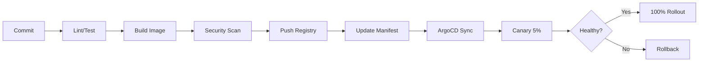
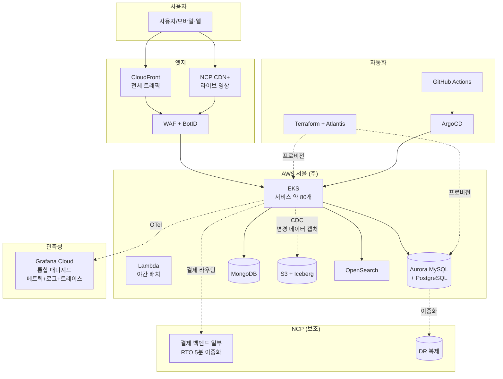

# 2장. 클라우드와 인프라

> 한국에서 클라우드를 고른다는 것은 단지 AWS · GCP · Azure 중 하나를 고르는 일이 아니다.

## 이 장에서 답하는 질문

- 한국 시장에서 어떤 클라우드를 어떻게 조합해야 하는가?
- 컨테이너 · 쿠버네티스를 언제 도입하고, 언제 미루어야 하는가?
- 인프라를 코드로 다루기(IaC, Infrastructure as Code) 와 GitOps 도입의 함정은 무엇인가?
- 관측성(Observability) 의 우선순위는?
- 비용을 통제하는 구조는 어떻게 만드는가?

## 들어가며

해외 베스트 프랙티스는 보통 "AWS 멀티 리전" 으로 시작한다.
한국 시장에서는 그게 항상 옳지 않다.

- 개인정보 핵심 데이터는 국내 리전에 있어야 안심하는 보수적 산업이 많다
- 공공·금융 입찰은 국내 클라우드(NCP·KT·NHN) 우선 가점이 있다
- 망분리·폐쇄망(Closed Network) 이 강제되는 영역에서는 글로벌 클라우드의 일부 서비스를 못 쓴다
- 비용 협상력은 단일 클라우드 종속이 깊을수록 떨어진다

이 장은 한국적 맥락 위에서 클라우드·컨테이너·관측성·비용을 다룬다.

## 1. 클라우드 선택 — 글로벌 vs 국내

### 1.1 옵션의 풍경

| 분류 | 사업자 | 장점 | 약점 |
|------|--------|------|------|
| 글로벌 | AWS | 서비스 폭·생태계 최대 | 비용 통제 어려움, 한국어 지원 한계 |
| 글로벌 | GCP (Google Cloud Platform) | 데이터·AI 강점 | 한국 영업·지원 상대적 약함 |
| 글로벌 | Azure | 엔터프라이즈·MS 생태계 | 한국 시장 점유 낮음 |
| 국내 | NCP (Naver Cloud Platform) | 한국어 지원·결제 편의·한국 리전 다양 | 글로벌 대비 서비스 깊이 얕음 |
| 국내 | KT Cloud | 공공·금융 강세, 망분리 옵션 | 일반 IT 서비스 사용자 적음 |
| 국내 | NHN Cloud | 게임·미디어 강세 | 외부 사용자 풀 작음 |

### 1.2 결정 매트릭스

| 질문 | 답이 강하게 영향 |
|------|---------------|
| 공공·금융 사업 비중이 큰가? | 국내 클라우드 우선 |
| 한국어 24/7 기술 지원이 필수인가? | 국내 또는 AWS Korea Premier Support |
| AI/ML 워크로드가 핵심인가? | GCP 또는 AWS |
| 글로벌 진출이 1~2년 안에 있는가? | AWS / GCP |
| 망분리·격리망 요구가 있는가? | KT Cloud / 자체 IDC(Internet Data Center) + 일부 클라우드 |
| 비용 협상력을 우선하는가? | 멀티 클라우드 / 두 사업자 분산 |

### 1.3 멀티클라우드의 현실

"멀티클라우드" 는 종종 "포트폴리오 분산" 으로 미화되지만, 운영 비용은 실제로 **곱하기** 다.
다음 중 하나에 해당할 때만 권장한다.

- **DR(Disaster Recovery, 재해복구) 목적**: 핵심 데이터의 보조 복제만 다른 클라우드에
- **워크로드 특화**: AI 는 GCP, 결제 백엔드는 NCP 같은 명확한 분담
- **벤더 락인 회피의 협상 카드**: 실제 이전 가능성이 있을 때만 의미

### 트레이드오프 — 단일 vs 멀티 클라우드

| 측면 | 단일 클라우드 | 멀티 클라우드 |
|------|-------------|--------------|
| 운영 단순성 | 높음 | 낮음 |
| 비용 협상력 | 낮음 | 높음 |
| 종속 위험 | 높음 | 낮음 |
| 인프라 표준화 | 쉬움 | 어려움 |
| 인력 학습 비용 | 1배 | 1.5~2배 |
| DR 안전성 | 같은 클라우드 장애엔 취약 | 클라우드 단위 장애에 강함 |

## 2. 컨테이너와 쿠버네티스

### 2.1 도입 결정 신호

쿠버네티스(Kubernetes, k8s) 는 도입과 동시에 운영팀의 한 사람을 통째로 가져간다.
다음 중 3개 이상이 No 면 대부분 **도입 미루기** 가 옳다.

- 서비스 인스턴스가 20개 이상인가?
- 배포 빈도가 일 5회 이상인가?
- 팀이 자율적으로 인프라를 설정해야 하는가?
- 전담 인프라 / SRE(Site Reliability Engineering) 가 2명 이상 있는가?
- 이미 컨테이너로 모든 서비스를 패키징하고 있는가?

### 2.2 단계적 도입

```
0단계: VM 직접 + Ansible          → 시작점. 팀 < 10명, 서비스 < 10개
1단계: Docker + docker-compose     → 개발 환경 통일, 단일 호스트 배포
2단계: Managed PaaS(Platform as a Service, 서비스형 플랫폼 — ECS / Cloud Run / GAE) → 컨테이너 효과 빠르게, k8s 회피
3단계: Managed Kubernetes          → 진짜 필요할 때만 (위 신호 충족)
4단계: 자체 운영 Kubernetes         → 전담팀 5명+ 필요. 거의 권장 안 함
```

원픽은 현재 3단계 (Managed Kubernetes — EKS / NKS) 에 있다 ([케이스 11.1](../case-study/README.md#111-인프라--클라우드-2장)).

### 2.3 쿠버네티스 위에 무엇을 얹을까

| 영역 | 일반적 선택 | 원픽 선택 ([케이스 11.1](../case-study/README.md#111-인프라--클라우드-2장)) | 이유 |
|------|------------|----------|------|
| 패키징 | Helm vs Kustomize | Helm | 공식 차트 풍부 |
| GitOps | ArgoCD vs Flux | ArgoCD | UI 강점 · 운영팀 친화 |
| 서비스 메시 | Istio vs Linkerd vs (없음) | **없음 (k8s 기본 networking 만)** | 한국 인력 풀이 작음, 추가 운영 부담 회피. 향후 Istio 검토 |
| Ingress | Nginx vs ALB(Application Load Balancer) vs Traefik | ALB Ingress | AWS 통합 |
| 스토리지 | EBS(Elastic Block Storage, 블록 스토리지) / EFS(Elastic File System, 파일 시스템) / Object | EBS+EFS+S3 | 워크로드별 분리 |
| 시크릿 | k8s Secret + KMS / Vault | AWS Secrets Manager + External Secrets | 운영 단순 |

### 트레이드오프 — Managed Kubernetes vs Managed PaaS

| 측면 | Managed K8s (EKS/NKS) | Managed PaaS (Cloud Run / ECS Fargate) |
|------|----------------------|------------------------------------|
| 학습 비용 | 큼 | 작음 |
| 표현력 | 거의 무한 | 제한적 |
| 운영 부담 | 큼 | 작음 |
| 비용 (소규모) | 높음 (관리비 + 마스터 비용) | 낮음 |
| 비용 (대규모) | 낮음 | 높음 |
| 벤더 종속 | 낮음 (k8s 표준) | 높음 (벤더 종속 API) |

## 3. 인프라 자동화 — IaC

### 3.1 왜 IaC 인가

콘솔에서 클릭으로 만든 자원은 6개월 후 누가 만들었는지·왜 만들었는지 아무도 모른다.
인프라를 코드로 다루기(IaC, Infrastructure as Code) 는 인프라 변경을 코드 리뷰 가능한 형태로 둔다. 더 중요하게는 **재현성** 을 준다.

### 3.2 도구 선택

| 도구 | 강점 | 약점 |
|------|------|------|
| **Terraform** | 멀티 클라우드 표준, 생태계 가장 넓음 | HCL(HashiCorp Configuration Language) 표현력 한계, state 관리 부담 |
| **OpenTofu** | Terraform fork (오픈소스) | 라이선스 변경 후 분기 — 안정성 시간 필요 |
| **Pulumi** | TypeScript / Python / Go 등 일반 언어 | 팀이 Terraform 에 익숙하면 학습 비용 |
| **AWS CDK / CDKTF** (Cloud Development Kit) | TypeScript / Python, 추상화 강함 | AWS 외 적용 어려움 (CDK), 디버깅 어려움 |
| **클라우드별 native** | (CloudFormation, NCP IaC) | 멀티 클라우드 못 함 |

원픽은 **Terraform** + **Atlantis** (PR 기반 자동화). 일반화된 선택.

### 3.3 IaC 함정

> - **state 분리 부재**: 모든 환경 / 모든 컴포넌트가 한 state — 한 변경이 전체 잠금
> - **secret 평문 저장**: state 파일에 secret 이 평문으로 들어감 → 암호화 · 접근 통제 필수
> - **수동 변경 허용**: 콘솔에서 수정한 자원이 다음 apply 에 덮어씌워짐
> - **모듈 과다 추상화**: 모든 걸 모듈화 → 한 변경이 모든 모듈 수정 필요

### 3.4 GitOps 와 결합 — 함정

GitOps 는 "Git 저장소의 상태가 곧 클러스터 상태" 를 보장하는 방식이다.

- **인프라 IaC**: Terraform → Atlantis (PR 머지 시 apply)
- **앱 IaC**: Helm / Kustomize → ArgoCD (Git 상태 = 클러스터 상태)
- 두 영역의 경계 명확히. 서로 침범 안 함.

> **GitOps 의 흔한 함정**:
> - **자동 sync 의 위험**: prod 환경의 자동 동기화는 사람의 승인 게이트와 함께 가야 한다.
> - **drift 감지 부재**: 누군가 콘솔에서 손댄 자원이 Git 과 어긋나도 알람이 없으면 반복 발생.
> - **시크릿 관리 분리 누락**: ArgoCD 가 시크릿까지 동기화하면 Git 에 평문 시크릿 위험. External Secrets / Sealed Secrets 로 분리.
> - **rollback 단위 모호**: 한 PR 머지에 여러 서비스 매니페스트가 섞이면 부분 롤백이 어렵다.

### 트레이드오프 — Terraform vs Pulumi vs CDK

| 측면 | Terraform | Pulumi | AWS CDK |
|------|-----------|--------|---------|
| 다중 클라우드 | 강함 | 강함 | 약함 (AWS 중심) |
| 일반 언어 사용 | 약함 (HCL) | 강함 | 강함 |
| 학습 자료 | 가장 풍부 | 적음 | 보통 |
| 디버깅 | 명확 (Plan) | 일반 언어 디버거 | 합성 후 추적 어려움 |
| 추상화 | 모듈 | 함수 · 클래스 | Construct 트리 |

## 4. 네트워킹 — 한국 망 환경의 특수성

### 4.1 일반적 구성



### 4.2 한국 환경 추가 고려

- **CDN**: 국내 우선 망 응답 시간이 중요할 때 NCP CDN+ / KT CDN 도 후보. CloudFront 만으로는 일부 ISP(Internet Service Provider) 우회로가 길 수 있음.
- **PoP(Point of Presence) 위치**: 핵심 정적 자원은 KT / SKB / LGU+ 망에 가까운 노드에 캐시되도록 CDN 설정
- **공인 IP / 회선**: PG · 은행 연동 시 화이트리스트가 필요한 경우가 많음 → NAT Gateway 의 IP 고정
- **모바일 캐리어 망**: 5G / LTE 환경 변동성 큼. 클라이언트 측 재시도 / 백오프 정책 필수
- **한반도 외부 트래픽**: 국제 회선 비용 · 지연. 글로벌 SaaS 의존이 클수록 비용 · 지연 증가

### 4.3 망분리

공공·금융 사업이 있다면 망분리(인터넷망 / 업무망 / DB망 분리) 가 강제될 수 있다.

- 클라우드에서는 VPC(Virtual Private Cloud) 분리 + Private Link 로 부분 구현
- 완전한 망분리는 별도 IDC + 점프 호스트 + DLP(Data Loss Prevention, 정보 유출 방지) 가 필요할 때 많음
- "ISMS-P (정보보호 및 개인정보보호 관리체계 인증) 망분리 요건" 은 시점에 따라 갱신됨 — **확인 필요**

### 체크리스트 — 한국 망 환경 점검

- [ ] CDN 이 국내 ISP 망에 친화적인가 (특히 라이브 / 대용량 정적 자원)
- [ ] PG · 은행 연동에 필요한 NAT GW 의 공인 IP 가 고정되어 있는가
- [ ] 모바일 클라이언트의 재시도 / 백오프 정책이 5G / LTE 변동에 견디는가
- [ ] 망분리 의무 사업이라면 VPC 분리 + Private Link / 별도 IDC 옵션을 평가했는가
- [ ] ISMS-P 망분리 요건의 최신 가이드라인을 확인했는가

## 5. 관측성 (Observability)

### 5.1 세 기둥

| 영역 | 무엇 | 예 |
|------|------|----|
| **Metrics** (메트릭, 시계열 숫자) | 숫자, 시계열 | RPS(Requests Per Second), p95, 에러율, JVM(Java Virtual Machine) heap |
| **Logs** (로그, 텍스트 이벤트) | 텍스트, 이벤트 | 액세스 로그, 애플리케이션 로그 |
| **Traces** (트레이스, 분산 요청 흐름) | 요청 흐름 | A → B → C 호출 시각·지연 |

### 5.2 도구

| 영역 | 오픈소스 조합 | 매니지드 | 원픽 선택 ([케이스 11.1](../case-study/README.md#111-인프라--클라우드-2장)) |
|------|------------|---------|----------|
| Metrics + Logs + Traces (통합) | Prometheus + Loki + Tempo (self-host) | **Grafana Cloud (통합 매니지드)**, Datadog | **Grafana Cloud — 메트릭·로그·트레이스 통합** (self-host 부담 회피, SRE 8명 기준) |
| 표준 | OpenTelemetry (OTel) | (대부분 OTel 호환) | OTel SDK 강제 |

### 5.3 SLO 부터 시작하기

도메인별 SLO(Service Level Objective, 서비스 수준 목표) 를 정의하지 않으면 알람이 의미 없다. SLO 가 있으면:

- 알람의 임계는 SLO 위반 추세
- 운영 우선순위는 SLO 가까이 떨어진 도메인부터
- **에러 버짓(Error Budget)**: SLO 의 여유분. 다 쓰면 신규 배포 중단

### 트레이드오프 — Self-host vs Managed (관측성)

| 측면 | 오픈소스 self-host | Managed (Datadog 등) |
|------|------------------|---------------------|
| 라이선스 비용 | 무료 | 데이터 · 호스트 단위 과금 (대규모에 비쌈) |
| 운영 부담 | 큼 (Loki · Tempo 자체 운영) | 작음 |
| 데이터 위치 | 자사 통제 | 외부 (KISA 권고 검토 필요) |
| 통합 깊이 | 부분적 | 깊음 (자동 dashboard 등) |
| 락인 위험 | 낮음 (OTel 표준) | 높음 |

## 6. CI/CD

### 6.1 파이프라인 구성



### 6.2 흔한 함정

> - **모든 PR 이 prod 까지 자동 배포**: 위험. 사람의 승인 게이트 필요.
> - **테스트 없이 빠른 배포**: 빠른 롤백이 가능해도, 사용자가 본 영향은 되돌릴 수 없음.
> - **Canary(점진 배포) 없이 전체 배포**: 트래픽 큰 서비스에서는 거의 항상 잘못된 선택.
> - **빌드와 배포의 결합**: 빌드 성공 ≠ 배포 가능. Image promotion (이미지를 환경 사이로 승격) 으로 분리.

### 6.3 도구

- 한국 환경에서 가장 흔함: GitHub Actions + ArgoCD
- 보안 강한 환경: GitLab CI (self-host) + ArgoCD
- 모놀리식 빌드: Jenkins (레거시지만 여전히 다수)

### 체크리스트 — CI/CD 안전 게이트

- [ ] PR 머지 → prod 배포 사이에 사람의 승인 게이트가 있는가
- [ ] Canary / Blue-Green 등 점진 배포가 트래픽 큰 서비스에 적용되는가
- [ ] Image promotion 으로 빌드와 배포가 분리되는가
- [ ] 보안 스캔 (SAST — Static Application Security Testing, 정적 분석 / SCA — Software Composition Analysis, 의존성 분석 / 시크릿 스캔) 이 게이트에 포함되는가
- [ ] 롤백 절차가 정의되고 5분 이내 실행 가능한가

## 7. 비용 통제 (FinOps, Financial Operations)

### 7.1 시작점

- **태그 정책**: 모든 자원에 `service`, `team`, `env` 태그 강제. 태그 없으면 자동 종료.
- **계정 분리**: prod / staging / sandbox 가 같은 계정이면 비용 추적 불가능.
- **Reserved Instance / Savings Plan(예약 인스턴스 / 약정 할인)**: 안정적 워크로드는 약정 결제 옵션·인스턴스 종류에 따라 유의한 절감 (AWS 기준 30~60% 수준 — 실제 절감률은 약정 기간·결제 옵션에 따라 편차 — 공식 안내 확인 필요)
- **Spot / Preemptible(스팟 / 일시 중단 가능 인스턴스)**: 무상태 워커는 spot 으로. 단 graceful shutdown 필수.

### 7.2 자주 새는 곳

| 영역 | 흔한 누수 |
|------|----------|
| EBS (Elastic Block Storage) | 사용 안 하는 볼륨, 스냅샷 무한 누적 |
| NAT GW | egress (외부로 나가는) 트래픽이 큰데 alternative 미고려 |
| 데이터 전송 | 같은 리전이라도 AZ(Availability Zone, 가용 영역) 간 트래픽 과금 |
| Idle 인스턴스 | dev / sandbox 의 24/7 가동 |
| 로그 | 잘못된 로그 레벨로 PB 단위 적재 |
| GPU | 학습 끝났는데 인스턴스 살아있음 |

### 7.3 조직 차원

- **월간 비용 리뷰**: 도메인팀별 비용 보고
- **알람**: 예산의 80% / 100% 도달 시 자동 알림
- **kill switch**: 비용이 급증하는 자원을 자동 차단 (안전한 것만)

### 체크리스트 — FinOps 시작 점검

- [ ] 모든 자원이 `service` / `team` / `env` 태그를 강제로 받는가
- [ ] prod / staging / sandbox 계정이 분리되어 비용이 추적되는가
- [ ] 안정 워크로드의 RI / Savings Plan 적용률이 측정되는가
- [ ] dev / sandbox 의 24/7 가동 자원이 정기적으로 정리되는가
- [ ] 비용이 도메인팀의 KPI 에 포함되는가 (관제팀 단독 책임이면 안 줄어듦)

## 8. 케이스 — 원픽의 인프라 구성

### 8.1 현재 구성 다이어그램 ([케이스 11.1](../case-study/README.md#111-인프라--클라우드-2장) 인용)



### 8.2 결정의 근거

- **AWS 메인**: 서비스 깊이 · 인력 시장 모두 두꺼움
- **NCP 보조**: 결제 · 정산 백엔드 일부를 국내에 둠 → 비상시 결제 단독 가용 + 비용 협상 카드
- **EKS**: 서비스 80개 · 도메인팀 자율 — Managed PaaS 한계
- **Lambda**: 야간 배치만 — 항상 켜둘 가치 없음
- **멀티 CDN**: 라이브는 ISP 망 친화도가 화질 · 지연에 직접적

### 8.3 1년 로드맵 (사고실험)

> 본 절은 본 장의 논의를 위한 사고실험이다. 케이스 차원의 공식 로드맵은 [케이스 12.1](../case-study/README.md#121-1년-분기별) 참조.

- **단기**: 결제 도메인 NCP 100% 이중화 (결제 RTO(Recovery Time Objective, 복구 목표 시간) 5분 충족)
- **중기**: AI / 추천 워크로드는 GPU 풍부한 GCP 로 일부 이전 검토
- **장기**: 자체 IDC 검토 — 대용량 정적 트래픽(상품 이미지 origin) 에 한정

### 트레이드오프 — 원픽의 멀티 클라우드 결정

| 측면 | 단일(AWS) 유지 | 현 멀티 (AWS + NCP) | 풀 멀티 (3사+) |
|------|----------------|-------------------|----------------|
| 운영 단순성 | 높음 | 중간 | 낮음 |
| 비용 협상력 | 낮음 | 중간 | 높음 |
| DR 안전성 | 낮음 | 높음 | 매우 높음 |
| 인력 학습 | 낮음 | 중간 | 높음 |
| 결정 적합성 | 위험 (락인) | **현 시점 적합** | 과잉 |

## 9. 정리 — 체크리스트

- [ ] 클라우드 선택의 근거가 "AWS 가 표준이라" 가 아닌, **자사 제약 · 비즈니스** 에 연결되어 있는가
- [ ] 쿠버네티스 도입을 도입 신호 5개 중 3개 이상으로 정당화했는가 (아니면 도입 미루기 검토)
- [ ] 모든 인프라가 IaC 로 관리되는가 (콘솔 변경 금지가 정착됐는가)
- [ ] 도메인별 SLO 가 정의되어 있고, 알람이 SLO 기반인가
- [ ] 월간 비용 리뷰 자리가 있는가 (대화 없이 알림만 가는 건 의미 없음)
- [ ] 단일 클라우드 종속이 80% 를 넘는다면, 의식적으로 그 결정을 내렸는가
- [ ] CDN 이 한국 ISP 망에 적합한가 (특히 라이브 · 대용량 정적)

## 더 읽을거리

> 형식: 책 = `*제목*, N판 — 저자명 (출판사, 연도) — 한 줄 요약` / 공식 문서 = `이름 — 발행처 (URL — 확인된 것만)` ([ADR-0009](../../adr/0009-챕터-작성-표준.md) 룰 4)

- *Site Reliability Engineering* — Betsy Beyer 외 (Google / O'Reilly, 2016) — SLO · 에러 버짓의 원조 (URL 확인 필요)
- *The Phoenix Project* — Gene Kim 외 (IT Revolution Press, 2013) — DevOps 문화 소설
- *The DevOps Handbook* — Gene Kim 외 (IT Revolution Press, 2016) — DevOps 실천서
- *Cloud Native Patterns* — Cornelia Davis (Manning, 2019) — 클라우드 네이티브 설계 패턴
- AWS / GCP / Azure / NCP Well-Architected Framework — 각 클라우드 발행처 (URL 확인 필요, 연 1회 갱신)
- 「클라우드 보안 가이드」 — KISA(한국인터넷진흥원) (URL 확인 필요, 시점·법규 변동)
