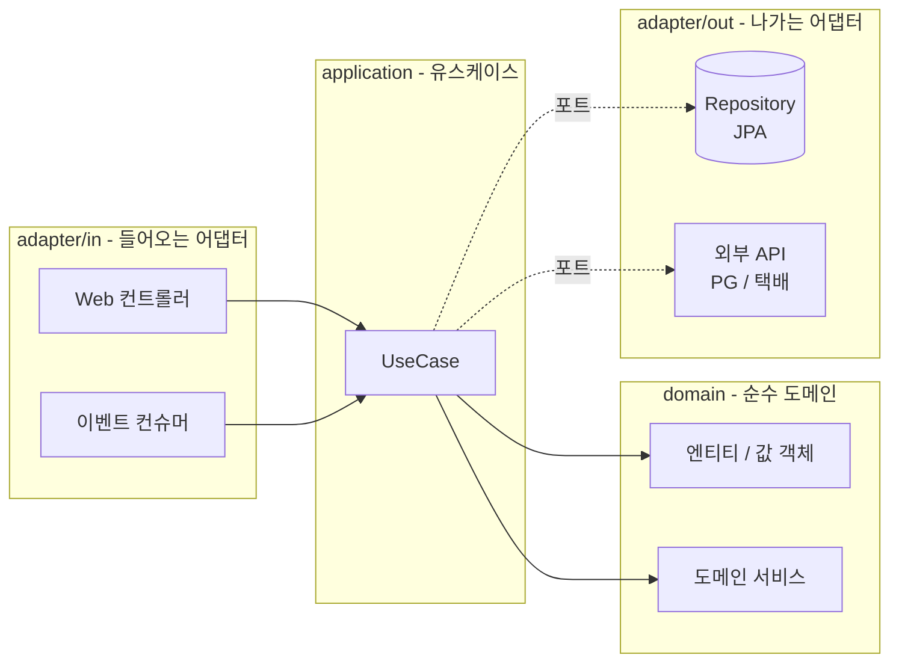
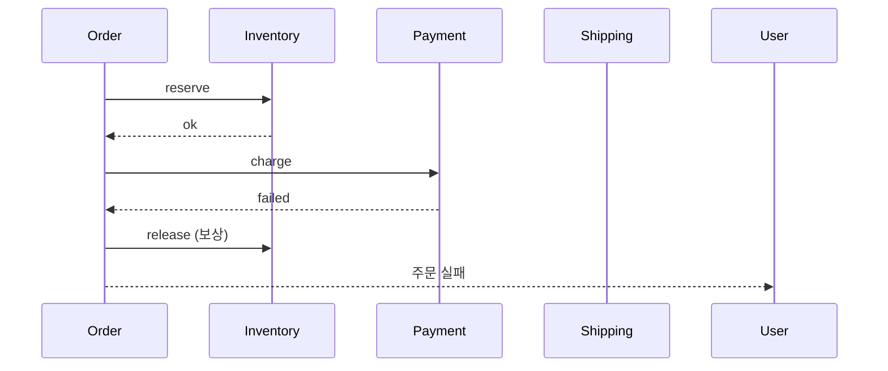
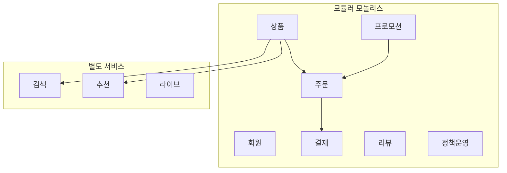
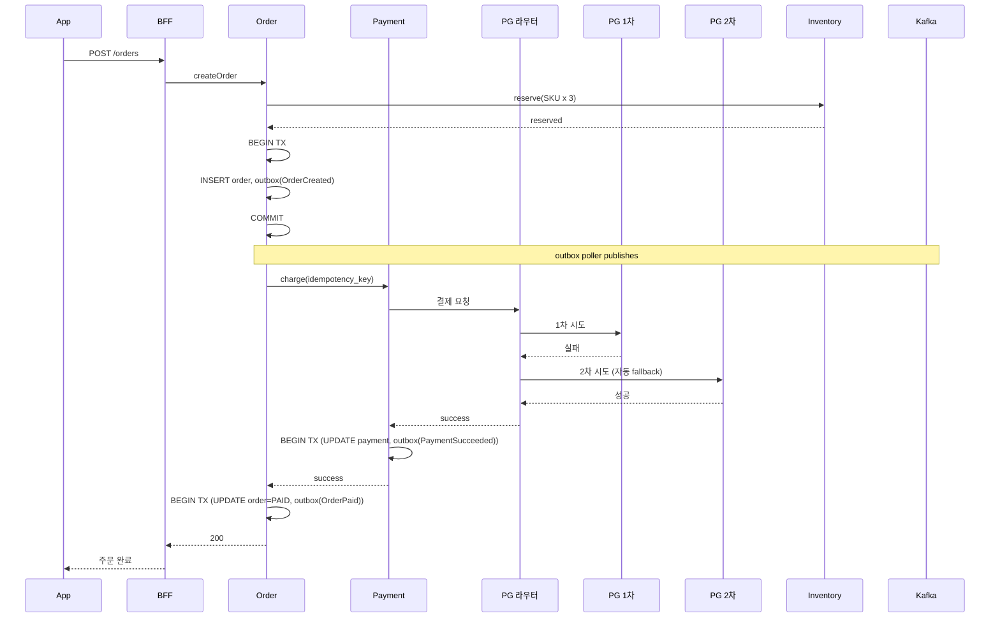

# 3장. 백엔드

> 백엔드 아키텍처의 본질은 "데이터 일관성과 가용성을 어디서·어떻게 양보하는가" 다.

## 이 장에서 답하는 질문

- 도메인 모델을 어떻게 코드 구조에 반영하는가?
- API 스타일(REST · GraphQL · gRPC) 을 어떻게 선택하는가?
- 데이터베이스 — 한 개로 시작해서 언제 쪼개는가?
- 분산 트랜잭션을 정말 피할 수 없을 때 어떻게 다루는가?
- 동시성 · 캐시 · 메시징의 설계 함정은?

## 들어가며

백엔드는 보통 책의 절반을 차지한다. 이 장은 의도적으로 압축한다.
넓이보다 **결정의 골격** 에 집중한다 — 깊이는 외부 책(*DDIA*, *Building Microservices*, *Software Architecture: The Hard Parts*) 으로 보완한다.

원픽의 백엔드는 모듈러 모놀리스 + 부분 추출 MSA(Microservices Architecture, 마이크로서비스 아키텍처) 다 ([1장](../01-아키텍처-기초/) 결정). 구체 스택은 [케이스 11.2 백엔드](../case-study/README.md#112-백엔드-3장) 에 있다.
이 장은 그 위에서 도메인 · API · 데이터 · 트랜잭션 · 캐시 · 메시징 · 인증을 차례로 본다.

## 1. 도메인 모델과 코드 구조

### 1.1 패키지 구조의 두 흐름

| 스타일 | 구조 | 적합한 시점 |
|--------|------|-------------|
| **레이어드(Layered)** (`controller / service / repository / dto`) | 기술 관심사 별 | 단순 CRUD(Create-Read-Update-Delete), 도메인 얇음 |
| **도메인 (Domain-driven)** (`order / payment / catalog / ...`) | 비즈니스 관심사 별 | 도메인 두꺼움, 모듈러 모놀리스 |

원픽은 도메인 우선 구조 + 도메인 내부에서 클린 아키텍처(Clean Architecture) 의 포트와 어댑터(ports / adapters, 헥사고날(Hexagonal)) 패턴.

```
order/
├── domain/           # 엔티티, 값 객체, 도메인 서비스 (외부 의존 0)
├── application/      # 유스케이스 (트랜잭션 경계)
├── port/
│   ├── in/           # 유스케이스 인터페이스
│   └── out/          # repository, 외부 API 인터페이스
├── adapter/
│   ├── in/web/       # HTTP 컨트롤러
│   ├── in/event/     # 이벤트 컨슈머
│   ├── out/persistence/  # JPA, MyBatis 구현
│   └── out/client/   # PG·배송사 등 외부 API 구현
└── config/
```



핵심: `domain` 은 외부 의존이 0개. 어댑터(adapter) 가 외부와 도메인을 잇는다.

### 1.2 클린 / 헥사고날 — 정말 필요한가

소규모 프로젝트에서는 과잉이다. 다음 중 둘 이상이면 도입 고려:

- 도메인 로직이 컨트롤러 · 리포지토리 양쪽에 흩뿌려져 있다
- 외부 API 변경 시 도메인 코드가 같이 변한다
- 단위 테스트에서 DB 가 자주 mock 되어 의미 없는 테스트가 된다

### 1.3 엔티티 vs 값 객체 vs DTO

| 구분 | 식별성 | 가변성 | 예 |
|------|--------|--------|----|
| 엔티티 (Entity) | 식별자로 동일성 | 가변 | `Order(id=1)` |
| 값 객체 (Value Object) | 값으로 동일성 | 불변 | `Money(1000, KRW)`, `Address(...)` |
| DTO (Data Transfer Object) | — | 가변 (필드 노출) | `OrderResponse` |

원칙: **도메인 모델에 DTO 가 들어오지 않는다**. 컨트롤러 / 어댑터 경계에서 변환.

### 체크리스트 — 도메인 코드 구조

- [ ] `domain` 패키지에 외부 의존(JPA, HTTP 라이브러리 등) import 가 0인가
- [ ] DTO 가 도메인 메서드 시그니처에 등장하지 않는가
- [ ] 한 도메인의 트랜잭션 경계가 `application` 유스케이스 단위로 정해져 있는가
- [ ] 어댑터 변경(예: JPA → MyBatis) 이 도메인 코드 수정 없이 가능한가

## 2. API 스타일

### 2.1 비교

| 측면 | REST | GraphQL | gRPC (Google Remote Procedure Call) |
|------|------|---------|------|
| 캐싱 | HTTP 캐시로 강력 | 어려움 | 어려움 |
| 스키마 | OpenAPI (선택) | 강제 | 강제 (Protobuf, Protocol Buffers) |
| 클라이언트 자유도 | 정해진 응답 | 필요한 필드만 | 정해진 응답 |
| 양방향 / 스트림 | SSE(Server-Sent Events) / WS(WebSocket) 별도 | Subscription | 1급 |
| 외부 노출 | 자연스러움 | 가능 | 거의 불가능 (브라우저) |
| 디버깅 | 가장 쉬움 | 중간 | 어려움 (binary) |
| 학습 비용 | 낮음 | 중간 | 높음 |

### 2.2 어디에 무엇을

- **외부 공개 API** (셀러 / 파트너): REST + OpenAPI
- **모바일 / 웹 클라이언트 → BFF(Backend for Frontend, 4장)**: GraphQL 또는 REST. **모바일 화면 데이터 양 변동 큼** 이면 GraphQL 가치
- **서비스 간 내부 호출**: gRPC. 강타입 + 성능
- **외부 → 우리 push**: Webhook (REST POST)
- **실시간 양방향**: WebSocket / SSE

### 트레이드오프 — REST vs GraphQL

| 상황 | REST | GraphQL |
|------|------|---------|
| 단일 화면 = 단일 엔드포인트 | 좋음 | 과잉 |
| 화면별 데이터 형태가 다양 | N+1 우려 | 좋음 |
| 캐싱 / CDN 활용 필요 | 좋음 | 어려움 |
| 외부 파트너 공개 | 표준화 쉬움 | 학습 비용 부담 |
| 모니터링 (rate limit, alarm) | 쉬움 | 쿼리 복잡도 분석 필요 |

### 2.3 API 설계 원칙 (REST 기준)

- 동사 대신 자원 (`/orders/{id}/cancel` 보다 `/orders/{id}` PATCH 가 더 RESTful 이지만, 실무에선 `cancel` action 이 더 명확하면 그쪽이 낫다)
- HTTP 상태 코드 정직하게 (200 만 쓰지 말 것)
- 페이지네이션은 cursor 우선 (offset 은 큰 데이터에서 느림)
- 응답에 `_links` (HATEOAS, Hypermedia as the Engine of Application State) 는 대부분 과잉. 안 써도 됨.
- 버전: URL (`/v1/`) vs Header — URL 이 운영적으로 단순

## 3. 데이터베이스

### 3.1 관계형 vs NoSQL — 일반론

기본은 관계형. NoSQL 은 다음 중 하나가 명확할 때:

| NoSQL 유형 | 적합한 경우 |
|-----------|-----------|
| Key-Value (Redis) | 캐시, 세션, 카운터, 리더보드 |
| Document (MongoDB) | 스키마 변동 잦고 join 거의 없음 |
| Wide-Column (Cassandra) | 쓰기 처리량 매우 큼, eventual consistency (최종 일관성) OK |
| Time-Series (TimescaleDB) | IoT, 메트릭, 시계열 분석 |
| Graph (Neo4j) | 다단계 관계 탐색 (소셜 · 추천) |

### 3.2 단일 DB 에서 시작

서비스 초기에 도메인별 DB 분리는 거의 항상 과잉이다.
하나의 PostgreSQL / MySQL 에 도메인별 스키마(또는 테이블 prefix) 로 분리하는 것이 정답에 가깝다.

분리는 **명확한 신호** 가 올 때:

- 한 도메인의 스키마 변경이 다른 도메인 배포를 막는다
- 한 도메인의 부하(예: 검색) 가 전체 DB 를 멈춘다
- 데이터 증가 속도가 도메인 별로 너무 다르다 (주문은 일 5만 건, 로그는 일 5억 건)

### 3.3 읽기 / 쓰기 분리

- **Read Replica (읽기 전용 복제본)**: 가장 안전한 첫 단계. 읽기 부하의 70% 까지 어렵지 않음.
- **Cache (Redis)**: hot key 처리. 단 **무효화 정책** 이 본질.
- **CQRS (Command-Query Responsibility Segregation, 명령-조회 분리)**: 읽기 / 쓰기 모델 자체 분리. 도메인 복잡도가 높을 때만.

### 3.4 한국 환경 메모

- **MySQL vs PostgreSQL**: 국내는 여전히 MySQL / MariaDB 점유 큼. 신규 프로젝트는 PostgreSQL 권장(트랜잭션 · 확장성 · JSONB · 생태계).
- **AWS RDS vs Aurora**: 트래픽이 큰 신규 워크로드는 Aurora. 관리비 vs 성능 트레이드오프 확인.
- **국내 클라우드**: NCP `Cloud DB`, KT `DBaaS` 모두 Managed RDB 제공. 단 일부 고급 옵션(plug-in, replica 토폴로지) 은 제한.

### 트레이드오프 — 단일 DB vs 도메인별 DB

| 측면 | 단일 DB | 도메인별 DB |
|------|---------|-----------|
| 트랜잭션 | 자연스러움 (1개) | 분산 (Saga · Outbox) |
| 조인 | 자유 | 어려움 (서비스 호출) |
| 배포 영향 | 큼 (스키마 변경 충돌) | 작음 (도메인 격리) |
| 운영 부담 | 낮음 | 높음 (백업 · 모니터링 · 튜닝 N배) |
| 데이터 일관성 | 강 | 약 (최종 일관성, eventual consistency) |

## 4. 트랜잭션과 일관성

### 4.1 단일 DB 트랜잭션의 함정

> - **긴 트랜잭션**: 외부 API 호출이 트랜잭션 안에 있으면 lock 이 길어짐 → 처리량 급감
> - **잘못된 격리수준**: 기본값(Read Committed) 이 적절한지 확인. Serializable 로 올리면 deadlock 폭증
> - **N+1 쿼리**: 한 트랜잭션 안에서 1+N 쿼리. JPA(Java Persistence API) 에서 가장 흔함
> - **낙관적 락(Optimistic Lock) 미사용**: 동시 업데이트가 있는 자원에 락 없이 update → lost update (덮어쓰기 손실)

### 4.2 분산 트랜잭션의 두 패턴

#### Saga (분산 트랜잭션 패턴)

각 단계가 자체 트랜잭션. 실패 시 보상 트랜잭션 (compensating transaction).



- **Choreography (안무, 분산 협동)**: 각 서비스가 이벤트로 다음 단계 트리거. 결합도 낮음. 흐름 추적 어려움.
- **Orchestration (오케스트레이션, 중앙 지휘)**: 중앙 오케스트레이터(주로 Order 서비스)가 단계 호출. 흐름 명확. 단 오케스트레이터 책임 비대.

#### Outbox + Event (DB-이벤트 원자성 패턴)

DB 트랜잭션 안에 "outbox 테이블" 에 이벤트를 같이 INSERT.
별도 프로세스가 outbox 를 읽어 메시지 브로커에 발행. **DB 변경과 이벤트 발행의 원자성** 보장.

```sql
BEGIN;
UPDATE orders SET status='PAID' WHERE id=1;
INSERT INTO outbox(
  id,                  -- UUID, idempotency 키
  aggregate_id,        -- order_id 등 — 같은 aggregate 의 순서 보장에 사용
  aggregate_type,      -- 'Order' / 'Payment' / 'Refund' …
  topic,
  partition_key,       -- Kafka partition 라우팅 (보통 aggregate_id)
  payload,             -- JSON
  trace_id,            -- 분산 추적 — 컨슈머까지 전파
  created_at
) VALUES (...);
COMMIT;
```

→ outbox poller 또는 **Debezium-CDC(Change Data Capture, 변경 데이터 캡처) 기반 outbox** 가 발행 (poller 부담 vs CDC 운영 부담 트레이드오프).
발행 후 삭제 또는 `published_at` 표시.

#### 보상의 보상 — Saga 가 깨질 때

Saga 보상(예: 결제 환불) 자체가 실패하면 어떻게 되는가? 3계층 처리가 필요:

| 계층 | 처리 |
|------|------|
| 1. **DLQ (Dead Letter Queue)** | 보상 실패 메시지 격리 + 알람 |
| 2. **수동 reconciliation** | 운영팀이 콘솔로 강제 환불 / 재고 회복 (감사 로그 필수) |
| 3. **일 단위 reconciler** | 야간 배치로 "주문 vs PG 결제 vs 재고" 3자 정합 검증 → 어긋난 건 알람·티켓 |

**RPO 1분** ([케이스 6](../case-study/README.md#6-운영-sla)) 의 결제 도메인은 위 3계층 모두 운영 필수.

### 4.3 멱등성 (Idempotency)

분산 시스템에서 "한 번만 실행" 은 거의 불가능하다. **여러 번 실행해도 같은 결과** 를 보장한다.

- 결제 요청에 `idempotency_key` 헤더 (UUID, Universally Unique Identifier)
- 같은 키로 반복 호출 → 첫 결과 그대로 반환
- TTL(Time To Live) — 도메인별 차등:
  - 일반 API: 24시간
  - **결제 / 환불: 분쟁 윈도우 (90일+) 까지 보존** — 사용자 분쟁 / 카드사 chargeback 시점까지
  - 알림 / 푸시: 1시간
- 결제뿐 아니라 outbox 컨슈머·웹훅 수신·재고 예약 등 외부와 닿는 모든 경로에 같은 패턴 적용

### 트레이드오프 — Saga vs 분산 트랜잭션 (2PC)

| 측면 | Saga | 2PC (Two-Phase Commit, XA) |
|------|------|----------|
| 일관성 | 최종 일관성 | 강 일관성 |
| 가용성 | 높음 | 낮음 (한 노드 장애에 약함) |
| 운영 복잡도 | 보상 로직 작성 부담 | XA 코디네이터 운영 부담 |
| 성능 | 좋음 | 매우 나쁨 (lock 길게) |
| 현실 채택 | 사실상 표준 | 거의 사용 안 함 (레거시 외) |

## 5. 캐시

### 5.1 캐시는 거의 항상 도움이 된다, 그러나

캐시 도입 직후 흔한 사고:

> - **무효화 누락**: 데이터 바뀌었는데 캐시는 옛날 값
> - **동시 갱신**: 같은 키에 stale 한 값이 동시에 들어가 race
> - **캐시 쇄도(Cache Stampede)**: 키 만료 순간 N개 요청이 동시에 DB 직격
> - **캐시 의존**: 캐시 다운 = 서비스 다운 (캐시 없으면 DB 가 못 견디게 설계해서)

### 5.2 패턴

| 패턴 | 동작 | 적합 |
|------|------|------|
| **Cache-aside** (앱 직접 관리) | 앱이 직접 read / write | 가장 일반 |
| **Read-through** (읽기 자동) | 캐시 라이브러리가 miss 시 자동 fetch | 추상화 깔끔 |
| **Write-through** (쓰기 동기) | 쓰기 시 DB + 캐시 동시 | 일관성 쉬움 |
| **Write-back** (쓰기 지연) | 캐시에 쓰고 나중에 DB | 데이터 손실 위험 — 극히 제한적 |

### 5.3 한국 환경 메모

- 명절 · 이벤트 트래픽 대비 — **로컬 캐시(Caffeine) + 분산 캐시(Redis) 2단** 권장
- 핵심 hot key (메인 화면 배너) 는 **TTL 짧게 + jitter (변동)** 로 stampede 회피
- Redis Cluster 운영 부담 → Managed Redis (ElastiCache, NCP Cloud DB for Redis)

### 체크리스트 — 캐시 도입

- [ ] 무효화 정책이 명시적으로 정의되었는가 (TTL · 이벤트 기반 · 둘 다 중)
- [ ] hot key 의 TTL 에 jitter 가 들어가 stampede 를 방지하는가
- [ ] 캐시 다운 시 DB 가 견딜 수 있는가 (또는 회로 차단으로 보호되는가)
- [ ] 로컬 + 분산 2단 구조의 일관성 정책이 정해졌는가

## 6. 메시징

### 6.1 도구 비교

| 도구 | 메시지 모델 | 강점 | 약점 |
|------|-----------|------|------|
| **Kafka** | 로그 기반, 영속 | 처리량 · 재처리 · 이벤트 소싱 | 운영 복잡 |
| **RabbitMQ** | 큐 기반 | 라우팅 유연 · 작업 큐 적합 | 처리량 한계 |
| **NATS / NATS JetStream** | pub-sub + 영속(JetStream) | 가벼움 · 낮은 지연 | 생태계 작음 |
| **AWS SQS / SNS** | 큐 + pub-sub | 운영 zero | 순서 · 재처리 제한 |
| **Pulsar** | Kafka + RabbitMQ 의 결합 | 멀티테넌시 강함 | 인지도 낮음 |
| **NCP Cloud Data Streaming Service** | Kafka 호환 (국내) | 한국 리전 · 한국어 지원 | 글로벌 사용 사례 적음 |

### 6.2 흔한 함정

> - **At-least-once 인데 idempotency 없음** → 중복 처리
> - **순서 보장 가정** (Kafka 는 파티션 내에서만 순서)
> - **메시지 크기 제한 무시** (Kafka 1MB 기본)
> - **DLQ (Dead Letter Queue, 실패 메시지 격리 큐) 미설정** → 실패 메시지 무한 재시도
> - **컨슈머 group rebalance 시 처리 중단** → 운영 시 인지 필수

### 6.3 이벤트 vs 명령

같은 메시지가 두 의미를 가지면 안 된다.

- **명령 (Command)**: "이걸 해라". 한 컨슈머가 수신. (예: `ChargePayment`)
- **이벤트 (Event)**: "이게 일어났다". 여러 컨슈머가 수신. (예: `OrderPaid`)

### 체크리스트 — 메시징 안전 점검

- [ ] 모든 컨슈머가 idempotency 키를 갖는가
- [ ] 순서 보장이 정말 필요한 토픽에 파티션 키가 적절한가
- [ ] DLQ 와 알람이 설정되어 있는가
- [ ] 큰 페이로드는 외부 저장소(S3 등) 의 포인터로 전달되는가

## 7. 인증 / 인가

### 7.1 인증

원픽의 인증 정책은 [케이스 11.2.5](../case-study/README.md#1125-인증--토큰) 에 정의. 본 절은 일반 패턴.

- 자체 회원: bcrypt / Argon2id + salt + pepper. 비밀번호 정책은 NIST(National Institute of Standards and Technology) SP 800-63B 권고 (URL 확인 필요)
- 간편로그인: 카카오 / 네이버 / 구글 / 애플 — OAuth2 (Open Authorization 2) / OIDC (OpenID Connect). 각 사 콘솔에서 redirect_uri 등록.
- 본인인증: PASS · NICE · KCB. 보통 결제 직전 또는 회원가입 시.
- 다중 인증 — MFA (Multi-Factor Authentication, 멀티팩터 인증): 셀러 어드민 · 관리자 콘솔은 TOTP(Time-based One-Time Password, 시간 기반 일회용 비밀번호) 강제.

### 7.2 토큰 전략

| 전략 | 보관 위치 | 장단 |
|------|----------|------|
| Session Cookie | 서버 세션 | 유효성 즉시 무효화 가능, 분산 환경엔 sticky 또는 공유 세션 |
| JWT (JSON Web Token, Access) | 클라이언트 | 무상태 · 확장 쉬움. 무효화 어려움 |
| Refresh Token | 서버 보관 | 짧은 access + 긴 refresh + rotate + **reuse detection** |

원픽: [케이스 11.2.5](../case-study/README.md#1125-인증--토큰) 에 따라 모바일은 Access(15분) + Refresh(30일, rotate). 웹은 HttpOnly Cookie 세션 + CSRF(Cross-Site Request Forgery, 사이트 간 요청 위조) 토큰.

**Refresh token reuse detection** (탈취 회복 — 6장 3.3 참조): 같은 refresh token 이 두 번 사용되면 family 전체 무효화. 탈취자가 한 번이라도 사용하면 정상 사용자도 강제 재로그인되지만 탈취 chain 은 끊긴다. 30일 rotate 의 핵심 안전선.

### 7.3 인가

- **RBAC (Role-Based Access Control, 역할 기반 접근 통제)**: 작은 팀 · 정해진 역할에 적합
- **ABAC (Attribute-Based Access Control, 속성 기반 접근 통제)**: 셀러 권한 같은 속성 조합에 적합
- **Policy as Code** (OPA — Open Policy Agent, Cedar): 정책이 코드 외부에 — 변경에 유연. 학습 비용.

원칙: 인가 결정은 **한 곳** 에서. 컨트롤러 · 서비스 · DB 모두에서 권한 체크하면 결국 어긋남.

### 체크리스트 — 인증 / 인가 점검

- [ ] 비밀번호가 bcrypt cost ≥ 12 또는 Argon2id 로 저장되는가
- [ ] 어드민 / 셀러 콘솔에 MFA(TOTP / WebAuthn) 가 강제되는가
- [ ] 인가 결정이 한 레이어에서 일관되게 내려지는가
- [ ] OAuth2 redirect_uri 가 화이트리스트로 엄격히 통제되는가
- [ ] 토큰 만료 / rotate 정책이 케이스에 정의된 값과 일치하는가

## 8. 케이스 — 원픽 백엔드 설계

> 이하의 구체 스택은 [케이스 11.2 백엔드](../case-study/README.md#112-백엔드-3장) 에서 정의됐다. 본 절은 그 스택의 도메인 분할과 시나리오를 보여준다.

### 8.1 도메인 분할



### 8.2 데이터 분리 ([케이스 11.2.3](../case-study/README.md#1123-db-토폴로지) 인용)

| 도메인 | DB | 비고 |
|--------|----|----|
| 회원 · 주문 · 결제 · 프로모션 · 리뷰 · 정책 | Aurora MySQL (Writer 1, Reader 3) | 모놀리스 공유. PII(Personally Identifiable Information, 개인 식별 정보) 컬럼은 분리 스키마 + 마스킹 ([6장](../06-보안과-컴플라이언스/) 참조) |
| 셀러 정산 | Aurora PostgreSQL (별도) | 트랜잭션 분리 + RLS 적용 |
| 상품 (Catalog) | MongoDB (옵션 변동 큼) + Redis 캐시 | 검색은 OpenSearch 인덱스로 |
| 검색 | OpenSearch | 카탈로그에서 CDC(Change Data Capture, 변경 데이터 캡처) 로 색인 |
| 추천 | Feature Store (Redis + Parquet) | ML 별도 (5장) |
| 라이브 메타 | DynamoDB | TTL 짧음 |

> **DB 6종 운영 비용 — 트레이드오프**: 케이스 220명 조직에서 6종 DB 운영은 **잠재적 안티패턴**. 각 DB 마다 백업 / 모니터링 / 튜닝 / 장애 대응 인력이 0.5~1명씩 누적된다. 도메인별 격리의 가치 vs 운영 비용을 분기 단위로 재평가:
> - Aurora MySQL + PostgreSQL **둘 다 필요한가** — 정산 PG 의 RLS / JSONB 가 결정적이지 않으면 MySQL 로 통합 검토
> - Feature Store 의 Redis vs DynamoDB 의 라이브 메타 — TTL 짧은 워크로드끼리 통합 가능성
> - MongoDB → 상품 도메인이 정형화되면 Aurora MySQL 의 JSON 컬럼으로 통합 가능
>
> 단순화 결정은 [7장 7.2 비용 리뷰](../07-운영과-조직/) 의 분기 워크숍 의제.

### 8.3 메시징 ([케이스 11.2.4](../case-study/README.md#1124-메시징) 인용)

- **Kafka (MSK, Managed Streaming for Kafka)**: 도메인 이벤트 (`OrderCreated`, `OrderPaid`, `RefundRequested` 등)
- **SQS (Simple Queue Service)**: 외부 webhook · 알림 발송 (FCM, SMS, 알림톡) — 단순 작업 큐
- **Outbox 패턴**: 주문 / 결제 트랜잭션과 이벤트 발행의 원자성

### 8.4 대표 시나리오 — "주문 결제" 흐름



### 8.5 실패 시나리오

| 단계 실패 | 처리 |
|----------|------|
| Inventory 예약 실패 | 주문 생성 자체 안 함 |
| **PG 1차 실패** | **자동으로 2차 PG 시도. 3사 모두 실패 시 결제 실패** |
| Payment 실패 (3사 모두) | Inventory 해제 (보상), 주문 취소 |
| Payment 성공 후 Order COMMIT 실패 (네트워크) | 결제 환불 트리거 (보상) |
| outbox 발행 실패 | poller 재시도 (DB 에 남아있음) |
| 컨슈머 처리 실패 | DLQ 로 이동 + 알람 |

### 8.6 백엔드 관측성 — Saga / Outbox / 결제의 운영 시야

분산 흐름은 운영 시 **trace · metric · log 3종 모두** 가 도메인 모델과 1:1 매핑되어야 한다. 그렇지 않으면 사고 시 MTTR (Mean Time To Recovery, 평균 복구 시간) 이 폭발한다.

#### Trace — 분산 추적 (OpenTelemetry)

- 모든 외부 진입에서 `trace_id` 생성 (BFF / webhook / Kafka 컨슈머)
- Saga 단계별 span (`OrderCreated.reserveInventory`, `OrderCreated.charge`, `OrderCreated.persistOrderPaid`)
- Outbox 발행 / 컨슈머 처리에 `trace_id` 전파 (헤더 또는 payload 메타)
- Pay → PG → Pay webhook 까지 한 trace 로 묶이도록 PG 호출에 `idempotency_key` + `trace_id` 헤더

#### Metric — Saga / Outbox 핵심 지표

| 메트릭 | 의미 | 알람 임계 |
|--------|------|----------|
| `outbox_lag_seconds` | outbox INSERT → 발행까지 지연 | p99 > 5s |
| `saga_duration_seconds{step}` | 단계별 지연 | p95 > 2s (결제) |
| `saga_compensation_total{reason}` | 보상 발생 빈도·사유별 | 일 평균 + 3σ 초과 |
| `idempotency_dedup_total` | 중복 webhook 차단 횟수 | 정상 — 기준선 모니터링 |
| `dlq_size` | DLQ 적체 | > 0 즉시 (자동 ticket) |
| `reconciler_mismatch_total` | 일 단위 정합 검증 불일치 | > 0 즉시 |

#### Log — 도메인 키 grep 가능

- 모든 로그에 `order_id` / `payment_id` / `seller_id` 컬럼 강제
- 일 단위 reconciler 결과는 별도 테이블 + Slack 채널
- PII 절대 로그에 출력 금지 (감사용은 별도 [6장 2.4](../06-보안과-컴플라이언스/))

#### 함정

> - **Saga span 누락** → "결제는 됐는데 주문이 안 됐다" 류 장애에서 어느 단계에서 끊겼는지 추적 불가
> - **outbox_lag 미측정** → poller 죽음을 30분 후 알아챔
> - **trace_id 단절** (BFF → 모놀리스 → PG webhook) → 사용자 문의 시점부터 역추적 불가능
> - **PII 로그 출력** → ISMS-P 감사 시점에 통째로 사고

## 9. 정리 — 체크리스트

- [ ] 도메인 경계가 패키지 / 모듈 구조에 강제되는가
- [ ] API 스타일이 클라이언트 · 내부 · 외부 별로 합리적으로 선택되었는가
- [ ] 단일 DB 로 시작했는가 (또는 분리에 명확한 신호가 있었는가)
- [ ] 분산 트랜잭션이 필요한 곳에 Saga + Outbox + Idempotency 가 모두 갖춰졌는가
- [ ] 캐시 무효화 전략이 명시적으로 정의되었는가
- [ ] 메시지가 명령 / 이벤트로 명확히 구분되는가
- [ ] 인증 · 인가의 결정이 한 곳에서 내려지는가

## 더 읽을거리

> 형식: 책 = `*제목*, N판 — 저자명 (출판사, 연도) — 한 줄 요약` ([ADR-0009](../../adr/0009-챕터-작성-표준.md) 룰 4)

- *Designing Data-Intensive Applications* — Martin Kleppmann (O'Reilly, 2017) — 본 장의 거의 모든 주제의 깊이
- *Microservices Patterns* — Chris Richardson (Manning, 2018) — Saga · Outbox · CQRS 의 구체적 구현
- *Software Architecture: The Hard Parts* — Mark Richards, Neal Ford (O'Reilly, 2021) — 분리 결정의 트레이드오프
- *Release It!*, 2nd ed. — Michael Nygard (Pragmatic Bookshelf, 2018) — 실패 패턴 · Circuit Breaker (회로 차단기)
- NIST SP 800-63B — National Institute of Standards and Technology (URL 확인 필요)
- Spring 공식 docs — VMware / Spring Team (URL 확인 필요, 버전 변동 큼)
