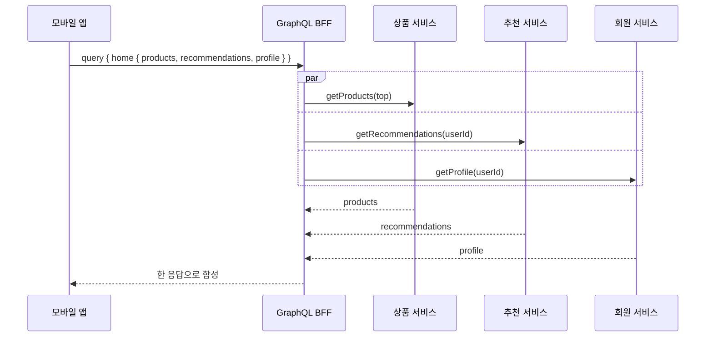
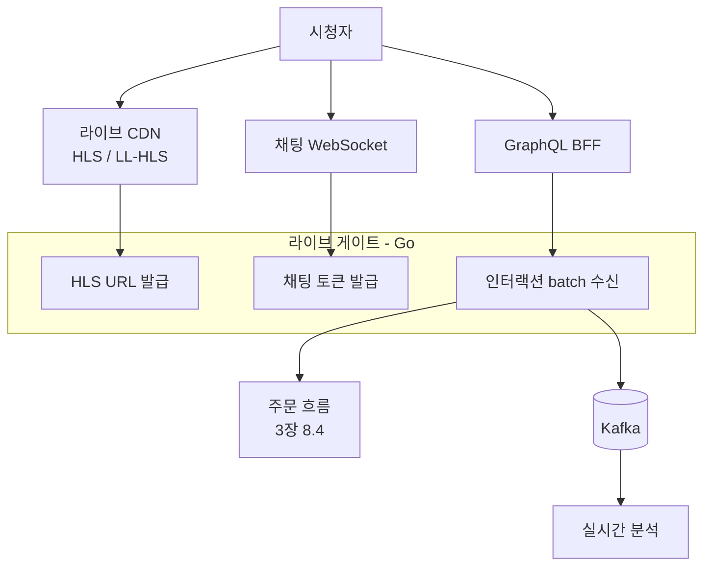

# 4장. 프론트엔드

> 프론트엔드는 단순히 화면을 그리는 일이 아니다. 사용자가 서비스를 인지하는 면 전체다.

## 이 장에서 답하는 질문

- 웹 / iOS / Android 의 코드와 디자인을 어떻게 통합하는가?
- 렌더링 전략 — SSR(서버 측 렌더링) / SSG(정적 사이트 생성) / ISR(증분 정적 재생성) / PPR(부분 사전 렌더링) / CSR(클라이언트 측 렌더링) — 을 어떻게 고르는가?
- 백엔드와 클라이언트 사이의 BFF(Backend for Frontend) 와 마이크로프론트엔드(MFE) 는 언제 가치 있는가?
- 한국 환경(저사양 단말 · 5G/LTE 변동 · 결제 webview) 의 현실을 어떻게 다루는가?
- 디자인 시스템과 접근성을 어떻게 강제하는가?

## 들어가며

프론트엔드는 백엔드 아키텍트가 "내 영역이 아니다" 라고 가장 자주 말하는 부분이다.
그러나 사용자에게 "원픽이 좋다 / 나쁘다" 의 1차 판단은 거의 프론트에서 일어난다.

아키텍트가 프론트의 **결정 골격** 을 알아야 하는 이유:
- 백엔드 API 설계가 프론트 렌더링 전략을 좌우
- 디자인 시스템이 일관되지 않으면 도메인팀별 UI 가 갈라짐
- 결제 · 로그인 화면의 webview / 외부 SDK 통합은 보안 · 성능 모두에 영향

## 1. 채널 구성

원픽의 채널 비중은 [케이스 3](../case-study/README.md#3-사용자--디바이스), 채널별 기술 스택은 [케이스 11.3.1](../case-study/README.md#1131-채널별-기술-스택) 에 정의.

| 채널 | 비중 | 기술 |
|------|------|------|
| iOS 앱 | 35% | Swift / SwiftUI + UIKit |
| Android 앱 | 45% | Kotlin / Jetpack Compose + 일부 View |
| 모바일 웹 | 12% | Next.js + React |
| PC 웹 | 8% | Next.js + React |
| 셀러 어드민 | (내부) | Next.js + React |

두 가지 큰 결정이 있다.

### 1.1 결정 1 — Native vs Cross-platform (네이티브 vs 크로스플랫폼)

| 옵션 | 장점 | 단점 |
|------|------|------|
| **Native (Swift / Kotlin)** | 성능 · OS 통합 · 결제 / 카메라 / 푸시 SDK 안정 | 코드 2벌 · 인력 2배 |
| **React Native (RN)** | 코드 공유 70%, JavaScript 생태계 | OS API 깊은 통합 · 신규 OS 대응 지연 |
| **Flutter** | 단일 언어 (Dart) · 렌더링 일관 | PG 사 · 본인인증 SDK 의 공식 Flutter 모듈이 제한적 — 직접 채널 구현 필요 (확인 필요) |
| **PWA (Progressive Web App, 점진적 웹 앱)** | 설치 부담 없음 | iOS 푸시 · 결제 한계 |

원픽 결정: **Native 2벌 (iOS / Android)**. 결제 · 라이브 영상 · 푸시 안정성 · 국내 SDK 호환성에서 Native 의 가치가 명확.

### 1.2 결정 2 — 웹 / 앱의 코드 공유

- **로직 공유**: TypeScript 패키지 (디자인 토큰 · 이벤트 스키마 · API 타입). monorepo 또는 npm internal package.
- **UI 공유는 시도 안 함**: 디바이스별 인터랙션이 다름.
- **API 스키마 공유**: GraphQL 스키마 또는 OpenAPI 로 자동 생성 SDK(Software Development Kit).

### 트레이드오프 — Native 2벌 vs RN 통합

| 측면 | Native 2벌 | React Native |
|------|-----------|--------------|
| 인력 | 많이 필요 (iOS · Android 각각) | 한 팀이 양쪽 |
| 성능 | 좋음 | 일반 화면은 차이 없음, 라이브·복잡 애니는 차이 큼 |
| OS 신규 기능 | 즉시 | 라이브러리 대응 후 |
| 결제 SDK 호환 | 모든 SDK 안정 | 공식 RN 모듈 없으면 직접 bridge |
| 코드 양 | 2배 | 1배 + 일부 native module |

## 2. 웹 — 렌더링 전략

### 2.1 다섯 가지 패턴

| 패턴 | 적합 |
|------|------|
| **CSR (Client-Side Rendering, 클라이언트 측 렌더링)** | 어드민 · 로그인 후 화면 |
| **SSR (Server-Side Rendering, 서버 측 렌더링)** | SEO(Search Engine Optimization, 검색엔진 최적화) · 로그인 안 한 첫 화면 |
| **SSG (Static Site Generation, 정적 사이트 생성)** | 자주 변하지 않는 마케팅 · 블로그 |
| **ISR (Incremental Static Regeneration, 증분 정적 재생성)** | 상품 상세 같은 "거의 정적, 가끔 변경" |
| **PPR (Partial Prerendering, 부분 사전 렌더링, Next 16+)** | 한 화면 안에 정적 + 동적 섞임 |

### 2.2 원픽의 화면별 전략

| 화면 | 전략 | 근거 |
|------|------|------|
| 메인 (오늘의 추천) | SSR + 캐시 5초 | 개인화, 신선도 |
| 카테고리 | ISR (5분) | 자주 바뀌지 않음, SEO |
| 상품 상세 — **Top 인기 N개** | ISR + on-demand revalidate | 가격 / 재고 변경 시 즉시 갱신 |
| 상품 상세 — **나머지 (lazy build)** | SSR + SWR 캐시 (60s) | 800만 SKU 전부 ISR 빌드 비현실적 |
| 검색 결과 | SSR | SEO, 쿼리별 동적 |
| 장바구니 | CSR | 로그인 후, SEO 무관 |
| 주문 / 결제 | CSR + 서버 액션 | 폼 · webview 호출 |
| 셀러 어드민 | CSR | 내부 도구, SEO 무관 |

> **800만 SKU ISR 비용 — 함정**: Vercel 같은 매니지드 ISR 은 약 150만 path 부근에서 빌드 / cache invalidation 비용이 폭증한다. 800만 전체 ISR 은 비현실적. **2단계 전략** — 인기 Top N (예: 30만) 만 ISR, 나머지는 SSR + SWR (Stale-While-Revalidate, 클라이언트 캐시 갱신) 조합. 인기 갱신은 일 단위 배치.

### 2.3 Next.js (App Router) 가정

[ADR-0005](../../adr/0005-코드-예제-기본-언어.md) 에 따라 웹은 Next.js + TypeScript.

```
app/
├── (storefront)/
│   ├── page.tsx              # 메인 (SSR)
│   ├── category/[slug]/page.tsx  # ISR
│   └── product/[id]/page.tsx     # ISR + revalidateTag
├── (account)/
│   ├── cart/page.tsx         # CSR
│   └── orders/page.tsx       # SSR (로그인 필요)
└── api/                      # API Route (BFF)
```

### 트레이드오프 — SSR vs CSR vs ISR

| 측면 | SSR | CSR | ISR |
|------|-----|-----|-----|
| 첫 페인트 | 빠름 | 느림 (JS 다운로드 후) |  매우 빠름 (CDN) |
| 서버 부하 | 큼 | 작음 | 작음 (캐시) |
| SEO | 강함 | 약함 (CSR 봇 한계) | 강함 |
| 데이터 신선도 | 높음 | 높음 (요청 시) | 캐시 만료에 의존 |
| 인터랙티브 | 클라이언트 부트 후 | 빠름 | 빠름 |

## 3. 모바일 — 한국 환경 메모

### 3.1 저사양 단말 비중

원픽은 Android 저사양 단말 30% 가정 ([케이스 3](../case-study/README.md#3-사용자--디바이스)).

- 첫 화면 < 200KB (위젯 · 이미지 lazy load)
- 콜드 스타트 < 2.5s — Baseline Profile · R8 (Android 의 코드 축소 도구) 최적화 필수
- ANR (Application Not Responding, 응답 없음) / Crash 모니터링 필수 (Crashlytics + 자체)

### 3.2 5G / LTE 변동성

- 클라이언트 측 재시도 + exponential backoff (지수적 백오프 — 재시도 간격을 점진적으로 늘림)
- 이미지: AVIF (AOMedia Video 1 Image File Format) / WebP 우선, 화면 크기에 맞는 변형 (CDN 에서 동적 변환)
- 배터리 · 데이터 절약: 동영상 자동재생 옵션 / Wi-Fi 한정

### 3.3 결제 / 본인인증 웹뷰(webview)

- PG 결제, 카드 인증, PASS 본인인증은 **웹뷰(webview)** 로 띄우는 경우가 다수
- App ↔ webview 간 메시지 (`window.postMessage` 또는 native bridge) 의 보안: origin (출처) 검증 필수
- 구버전 안드로이드 webview 의 보안 패치 누락 주의

### 3.4 푸시

- Android: FCM (Firebase Cloud Messaging)
- iOS: APNs (Apple Push Notification service)
- **알림톡(카카오)**: 비즈니스 메시지로 푸시보다 도달률 높음. 단 KakaoBiz 콘솔 별도 운영
- 동의 관리: 마케팅 푸시는 명시 동의 필요 — 「정보통신망법」 제50조 (영리목적 광고성 정보 전송 제한) — **확인 필요**

### 체크리스트 — 한국 모바일 환경 점검

- [ ] Android 저사양 단말에서 콜드 스타트 < 2.5s 가 측정되는가
- [ ] 5G / LTE 끊김 상황의 재시도 + 백오프 정책이 정의되었는가
- [ ] webview 메시지의 origin 검증과 native bridge 보안이 구현됐는가
- [ ] 마케팅 푸시 동의가 별도로 분리되어 수집·기록되는가

## 4. BFF (Backend for Frontend)

### 4.1 BFF 가 푸는 문제

- 모바일은 데이터 적게, 웹은 많이 — 같은 API 가 둘 모두에 부적합
- 외부 API 여러 개를 한 화면에서 호출 — 클라이언트가 N번 호출하면 느림
- 도메인 API (백엔드) 의 변경이 클라이언트에 직결되지 않게 layering (계층화)



위 그림이 보여주는 것 — 클라이언트는 한 번 호출, BFF 가 백엔드 N개를 병렬로 부른다.

### 4.2 BFF 의 위험

> - BFF 가 비즈니스 로직을 흡수하기 시작 → 또 하나의 모놀리스
> - 채널마다 BFF → 코드 중복
> - BFF 운영팀 부재 → 누가 책임지는지 모호

### 4.3 원픽의 BFF ([케이스 11.3.2](../case-study/README.md#1132-bff) 인용)

- **모바일**: GraphQL BFF (Node.js / Apollo) — 화면별 쿼리 자유
- **웹**: Next.js Server Actions / Route Handlers — 별도 BFF 없이 Next 가 BFF 역할
- **셀러 어드민**: 백엔드 REST 직접 호출 (단순)

### 트레이드오프 — BFF 두기 vs 두지 않기

| 측면 | BFF 둠 | 백엔드 직접 호출 |
|------|--------|----------------|
| 클라이언트 단순성 | 좋음 | 나쁨 |
| 백엔드 변경 자유도 | 높음 (BFF 가 흡수) | 낮음 |
| 운영 컴포넌트 수 | +1 | 0 |
| 응답 합성 | 쉬움 | 어려움 |
| 채널별 최적화 | 쉬움 | 어려움 |

## 5. 마이크로프론트엔드 (MFE, Micro Frontend)

### 5.1 언제 가치 있나

- 도메인팀이 자율적으로 화면을 배포해야 함
- 화면별 기술 스택이 달라야 할 정당한 이유 (M&A — Mergers & Acquisitions, 인수합병 통합 등)
- 일부 페이지의 빌드 / 배포가 다른 페이지를 막고 있음

### 5.2 위험

- 디자인 일관성 깨짐
- 인증 / 글로벌 상태 / 라우팅 공유의 복잡도
- 번들 사이즈 폭증 (각 MFE 가 React 따로 가져오면)

### 5.3 원픽의 결정 ([케이스 4 클라이언트 본부 50명 — 웹 10명](../case-study/README.md#4-팀-구조))

**도입하지 않음**. 대신 모노레포(Turborepo) + 공유 디자인 시스템 + 단일 Next.js 앱.

근거: 220명 엔지니어지만 케이스 4 의 클라이언트 본부 분해에서 웹 전담은 10명 → MFE 의 운영 비용을 정당화할 만큼 팀이 분리되지 않음.

### 트레이드오프 — MFE 도입 vs 단일 앱

| 측면 | MFE 도입 | 단일 앱 (Turborepo) |
|------|---------|--------------------|
| 팀 자율 배포 | 강함 | 약함 |
| 디자인 일관성 | 깨지기 쉬움 | 강함 |
| 번들 사이즈 | 커짐 | 최적화 가능 |
| 인증 / 라우팅 공유 | 어려움 | 자연스러움 |
| 적합 팀 규모 | 웹 30명+ | 웹 < 30명 |

## 6. 디자인 시스템

### 6.1 구성 요소

| 층 | 내용 |
|----|------|
| **토큰** | 색 · 타이포 · 간격 · radius · motion (정의: JSON / Style Dictionary) |
| **프리미티브** | Button, Input, Modal 등 (Radix UI / Headless UI 위에 토큰 적용) |
| **패턴** | Search Box, Product Card, Cart Item |
| **템플릿** | 상품 상세 페이지, 결제 페이지 |
| **가이드** | 사용 규칙 · 접근성 (Storybook) |

### 6.2 한국 환경 메모

- **타이포**: Pretendard / Spoqa Han Sans / Noto Sans KR — 라이선스 · 웹 폰트 용량 확인
- **글자 너비**: 한글은 영문보다 가로 픽셀 1.5~2배 → 버튼 · 라벨 최소 너비
- **줄바꿈**: `word-break: keep-all` 권장 (한글 단어 중간 끊김 방지)
- **숫자 표기**: 만 / 억 단위 (1,000,000 → 100만), 통화는 ₩ + 천단위 콤마

### 6.3 강제 방법

- Lint: 디자인 토큰 외 색상 / 폰트 사용 시 ESLint 에러
- Storybook: 모든 컴포넌트 문서화 + Visual regression (Chromatic)
- PR 체크: Storybook 변경 없이 새 컴포넌트 추가 시 fail

### 체크리스트 — 디자인 시스템 강제 점검

- [ ] 토큰 외 색상 / 폰트 사용이 lint 로 막히는가
- [ ] 모든 프리미티브가 Storybook 에 문서화되어 있는가
- [ ] Visual regression (Chromatic) 이 PR 마다 실행되는가
- [ ] 한글 줄바꿈 / 글자 너비 룰이 토큰에 반영됐는가

## 7. 접근성 / 국제화

### 7.1 접근성 (a11y, accessibility)

- WCAG (Web Content Accessibility Guidelines, 웹 콘텐츠 접근성 지침) 2.1 AA 준수 목표
- 키보드 네비게이션 (Tab / Enter / Esc) 모든 인터랙션
- ARIA (Accessible Rich Internet Applications) 라벨 / 스크린리더 (NVDA / VoiceOver) 테스트
- 색상 대비 4.5:1 (정상 텍스트), 3:1 (큰 텍스트)
- **국내 법규**: 「장애인차별금지법」 시행령 — 종합 커머스는 단계적 적용 완료로 **의무 대상**. 미준수 시 차별 시정 명령 가능

### 7.2 국제화 (i18n, internationalization)

원픽은 한국 단일이지만, 다음은 미리 구조화:

- 문구는 코드에 하드코딩 금지 (i18n 키)
- 날짜 / 통화 / 숫자 포맷 라이브러리 (Intl API)

### 체크리스트 — 접근성 / i18n 점검

- [ ] WCAG 2.1 AA 자동 점검이 CI 게이트에 있는가
- [ ] 키보드만으로 모든 핵심 흐름(검색 → 주문 → 결제) 이 완주 가능한가
- [ ] 색상 대비가 토큰 단위로 검증되는가
- [ ] 문구가 코드 외부의 i18n 키로 관리되어 향후 다국어 전환에 열려 있는가

## 8. 성능 최적화

### 8.1 핵심 지표 (Core Web Vitals — 핵심 웹 지표)

| 지표 | 좋음 | 의미 |
|------|------|------|
| LCP (Largest Contentful Paint, 최대 콘텐츠풀 페인트) | < 2.5s | 가장 큰 콘텐츠가 보일 때까지 |
| INP (Interaction to Next Paint, 다음 페인트까지의 상호작용) | < 200ms | 인터랙션 응답. 2024년 FID 를 공식 대체 |
| CLS (Cumulative Layout Shift, 누적 레이아웃 이동) | < 0.1 | 레이아웃 흔들림 |

### 8.2 한국 환경에서의 최적화

- **이미지**: 가장 큰 비용. CDN 동적 변환 (WebP / AVIF, 화면 크기 매칭) 필수
- **폰트**: 한글 폰트는 용량 큼. Subset (한글 부분집합 — KS X 1001 만) + WOFF2(Web Open Font Format 2) + preload
- **JS 번들**: 200KB 이하 (gzip). 벤더 분리 + lazy load
  - (참고: [케이스 5.3](../case-study/README.md#53-기술-제약) 의 "첫 화면 < 200KB" 는 페이지 페이로드 전체 예산. 본 절의 "JS 번들 200KB" 는 그중 JS 파트 — 사실상 페이지 1개당 매우 빠듯한 한도다.)
- **3rd party (외부 SDK)**: 광고 · 분석 SDK 가 LCP 의 가장 큰 적 — async / defer / facade 패턴

### 8.3 측정

- RUM (Real User Monitoring, 실 사용자 모니터링): SpeedCurve / Datadog RUM / Vercel Analytics
- Lab: Lighthouse CI (PR 마다 실행, 점수 임계 강제)

### 체크리스트 — 성능 점검

- [ ] LCP / INP / CLS 가 RUM 으로 도메인별 측정되는가
- [ ] 이미지 / 폰트 / JS 번들의 첫 화면 예산이 정의되었는가
- [ ] 외부 SDK (광고 · 분석) 가 LCP 에 영향을 주지 않게 격리되는가
- [ ] Lighthouse 점수 임계가 PR 게이트에 강제되는가

## 9. 케이스 — 원픽 프론트 구성

### 9.1 모노레포 구조 ([케이스 11.3.3](../case-study/README.md#1133-모노레포-구조-turborepo) 인용)

```
apps/
├── web/             # Next.js (메인 사이트)
├── seller-admin/    # Next.js (셀러)
└── ops-console/     # Next.js (사내)
packages/
├── design-tokens/   # JSON, Style Dictionary
├── ui/              # 디자인 시스템 (Radix + 토큰)
├── api-client/      # GraphQL/REST 자동 생성 SDK
├── analytics/       # 이벤트 추적
└── utils/           # 공통 유틸
```

### 9.2 라이브커머스 화면 — 데이터 플로우



라이브 화면은 일반 화면과 다음이 다르다:

- **HLS (HTTP Live Streaming) / LL-HLS (Low-Latency HLS) / WebRTC (Web Real-Time Communication)** — 지연 vs 안정성
- **채팅** — WebSocket. 단일 노드는 보통 시청자 약 5천 전후에서 GC (Garbage Collection, 가비지 컬렉션) / FD (File Descriptor, 파일 디스크립터) 한계 도달. **시청자 5천+ 부터 채팅 fanout proxy** (다수 구독자에 메시지를 분배하는 중계 서버) 필요. 라이브 인기 방송(시청자 5만+) 은 fanout 노드 자체를 다중화
- **좋아요 · 구매 인터랙션** — 클라이언트가 일정 시간 일괄 batch 후 서버 전송 (초당 N회 호출 폭증 방지)
- **멀티 스트림 동시** — 네트워크 / 배터리 영향 큼

### 9.3 SSR / ISR 결정 근거

- 메인은 SSR — 개인화 + SEO 둘 다
- 상품 상세는 ISR — [케이스 2.2](../case-study/README.md#22-데이터) 의 800만 SKU 를 매 요청마다 SSR 하면 비용 폭발
- 카테고리도 ISR — 캐시 적중률 높음

### 트레이드오프 — 케이스 적용 정리

| 결정 | 선택 | 가져온 가치 | 감수한 비용 |
|------|------|-----------|------------|
| 모바일 = Native 2벌 | iOS · Android 별도 | 결제 SDK 안정 · OS 신규 즉시 | 인력 2배 |
| 웹 = Next.js 단일 앱 (MFE 미도입) | 모노레포 + 단일 앱 | 디자인 일관성 · 운영 단순 | 도메인팀 자율 배포 약함 |
| 모바일 BFF = GraphQL | 화면별 쿼리 | 채널별 최적화 쉬움 | 캐싱 · 모니터링 추가 비용 |
| 라이브 = LL-HLS + WebSocket | 자체 스튜디오 + ISP 친화 CDN | 화질 / 지연 / 도달 균형 | 채널 운영 부담 |

## 10. 정리 — 체크리스트

- [ ] 채널별(웹·앱·어드민) 코드 공유 정책이 명확한가
- [ ] 화면별 렌더링 전략이 SEO · 신선도 · 비용 기준으로 선택되었는가
- [ ] BFF 의 책임 경계가 정의되어 있는가 (또는 의식적으로 두지 않았는가)
- [ ] 디자인 시스템이 lint / Storybook / PR 체크로 강제되는가
- [ ] 한글 타이포 · 줄바꿈 규칙이 토큰에 반영됐는가
- [ ] Core Web Vitals 가 RUM 으로 측정되고 임계가 정의됐는가
- [ ] 결제 · 본인인증 webview 의 origin 검증이 있는가

## 더 읽을거리

> 형식: 책 = `*제목*, N판 — 저자명 (출판사, 연도) — 한 줄 요약` / 공식 문서 = `이름 — 발행처 (URL — 확인된 것만)` ([ADR-0009](../../adr/0009-챕터-작성-표준.md) 룰 4)

- *Refactoring UI* — Adam Wathan, Steve Schoger (자체 출판, 2018) — 디자인 직관
- *Inclusive Components* — Heydon Pickering (자체 출판, 2018) — 접근성 컴포넌트 설계
- Next.js 공식 문서 (App Router) — Vercel (URL 확인 필요, 버전 변동 큼)
- web.dev — Google (URL 확인 필요) — Core Web Vitals 가이드
- Pretendard 폰트 — 길형진 (GitHub) (URL 확인 필요) — 한글 웹 폰트
