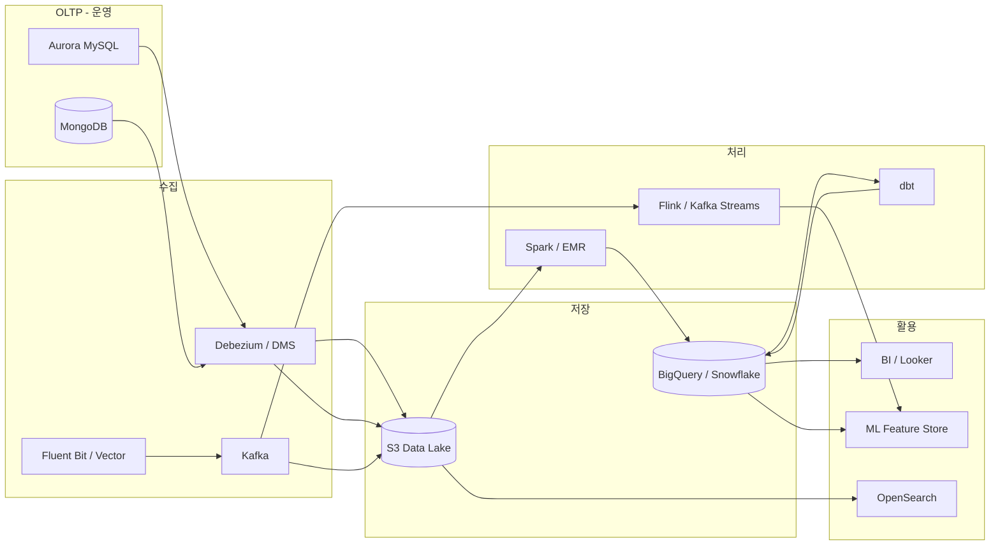
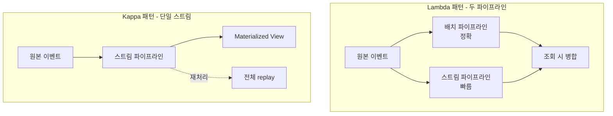
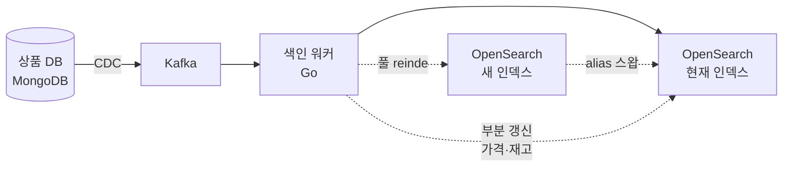
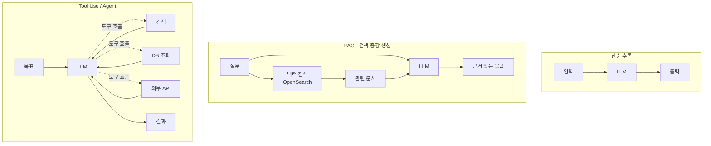

# 5장. 데이터와 AI

> 데이터는 한 번 쌓이면 거의 영원히 산다. 처음 결정이 가장 비싸다.

## 이 장에서 답하는 질문

- 운영(OLTP) 와 분석(OLAP) 데이터를 어떻게 분리하고 어떻게 흘리는가?
- 배치와 스트림은 언제 쓰는가? 두 개가 동시에 필요한가 (Lambda / Kappa 패턴)?
- 검색 · 추천을 어떻게 시작하고 어떻게 키우는가?
- 거대 언어 모델(LLM, Large Language Model) 기반 AI 기능을 서비스에 어떻게 통합하는가?
- 데이터 거버넌스(개인정보 · 접근 통제 · 품질) 는 누가 책임지는가?

## 들어가며

데이터 영역은 백엔드 / 프론트와 다른 시간 단위로 움직인다. 한 번 만든 파이프라인은 5년을 산다.
잘못 쌓은 스키마는 6개월 후 분석팀의 시간을 매주 갉아먹기 시작한다.

원픽의 데이터 규모 ([케이스 2.2](../case-study/README.md#22-데이터)):
- 회원 1,500만, 상품 800만 SKU(Stock Keeping Unit, 재고 관리 단위), 주문 누적 6,000만 건
- 리뷰 1.2억, 이미지 800TB
- 로그 일 2~5TB

또한 케이스 10번에 따르면 분석/추천의 실시간성 한계와 [10.1](../case-study/README.md#101-구체-신호-수치-기준) 의 "메인 Aurora MySQL CPU 의 50% 가 검색·추천 관련 쿼리" 가 본 장 결정의 출발점이다.
구체 스택은 [케이스 11.4 데이터 / AI](../case-study/README.md#114-데이터--ai-5장) 에 있다.

이 장은 데이터 플랫폼 · 검색 · 추천 · AI 의 결정 골격을 본다.

## 1. 데이터 플랫폼 구조

### 1.1 흐름의 큰 그림

용어:
- **OLTP (Online Transaction Processing, 온라인 트랜잭션 처리)**: 운영 데이터베이스. 짧은 트랜잭션 다수.
- **OLAP (Online Analytical Processing, 온라인 분석 처리)**: 분석 워크로드. 긴 쿼리 / 큰 데이터 스캔.
- **CDC (Change Data Capture, 변경 데이터 캡처)**: DB 의 변경 이벤트를 추출.
- **DMS (Database Migration Service)**: AWS 의 DB 이전 / CDC 서비스.
- **DW (Data Warehouse)**: 분석 전용 저장소.
- **BI (Business Intelligence)**: 비즈니스 의사결정용 시각화 / 보고.
- **ML (Machine Learning)**: 기계 학습.

### 1.2 핵심 결정 4가지

1. **OLTP → OLAP 이전 방식**: CDC vs 배치 dump
2. **저장 매체**: Lake (S3 / Iceberg) vs Warehouse (BigQuery / Snowflake) vs Lakehouse
3. **스케줄러**: Airflow vs Argo Workflows vs 클라우드 native
4. **변환 도구**: dbt vs 직접 Spark / SQL 스크립트

### 트레이드오프 — Lake vs Warehouse vs Lakehouse

| 측면 | Lake (S3 + Parquet) | Warehouse (BigQuery 등) | Lakehouse (Iceberg / Delta on S3) |
|------|--------------------|------------------------|---|
| 저장 비용 | 가장 낮음 | 비교적 높음 | 낮음 (S3) |
| 쿼리 성능 | 약함 (외부 엔진) | 매우 강함 | 강함 |
| 스키마 거버넌스 | 약함 | 강함 | 강함 (테이블 포맷) |
| ML 학습 데이터 접근 | 자연스러움 | 제한 (export 비용) | 자연스러움 |
| 도구 성숙도 | 가장 높음 | 가장 높음 | 빠르게 성숙 중 |

## 2. OLTP → 분석 데이터로

### 2.1 CDC vs 야간 dump

| 측면 | CDC | 야간 dump |
|------|-----|----------|
| 신선도 | 분 단위 | 일 단위 |
| 운영 부담 | 큼 (Debezium / Kafka 운영) | 작음 |
| 정합성 | 이벤트 단위 | 스냅샷 단위 |
| 부하 | OLTP 에 binlog (변경 로그) 부하 | 야간 일시 부하 (peak 회피) |
| 적합 | 추천 · 검색 같은 실시간 필요 | 보고서 · BI |

원픽: **둘 다 사용** ([케이스 11.4.1](../case-study/README.md#1141-데이터-플랫폼)).
도메인 변경(상품 · 주문 · 결제) 은 CDC, 매출 · 정산 보고서는 야간 dump.

### 2.2 데이터 레이크 vs 웨어하우스 vs 레이크하우스

| 형태 | 강점 | 약점 |
|------|------|------|
| **Lake** (S3 + Parquet) | 비용 저렴, 모든 데이터 | 쿼리 성능, 거버넌스 |
| **Warehouse** (BigQuery, Snowflake, Redshift) | 빠른 분석, SQL 친화 | 비용 · 벤더 종속 |
| **Lakehouse** (Iceberg / Delta on S3) | Lake 의 비용 + Warehouse 의 거버넌스 | 도구 성숙도 |

원픽 ([케이스 11.4.1](../case-study/README.md#1141-데이터-플랫폼)): 원본은 S3 Iceberg, 가공 후 BigQuery (BI / 대시보드) 또는 그대로 S3 (ML 학습).

### 2.3 dbt — 변환의 표준

- SQL 기반 모델 정의
- 의존성 그래프 자동 관리
- 테스트 (unique · not null · 관계 무결성) 강제
- 문서 자동 생성 (lineage, 데이터 계보)

선택지: **dbt Core** (오픈소스) vs **dbt Cloud** (호스팅).
원픽은 dbt Core + 사내 Airflow 트리거 ([케이스 11.4.1](../case-study/README.md#1141-데이터-플랫폼)).

### 체크리스트 — OLTP → 분석 파이프라인

- [ ] CDC / 야간 dump 의 선택이 도메인별 신선도 요구에 맞춰져 있는가
- [ ] OLTP DB 의 binlog / replication 부하가 측정되는가
- [ ] 변환(dbt) 모델에 unique / not null / 관계 테스트가 강제되는가
- [ ] 실패 알람이 분석팀과 도메인팀 양쪽에 가는가

## 3. 배치 vs 스트림

### 3.1 배치

- Spark / EMR — 큰 데이터, 시간 단위 / 일 단위
- 비용 효율 좋음
- 복잡한 조인 · 집계에 강함

### 3.2 스트림

- Kafka Streams / Flink / Spark Structured Streaming
- 분 단위 / 초 단위 신선도
- 운영 복잡도 큼 (state 관리, 재처리 어려움)

### 3.3 둘 다 필요할 때 — Lambda 패턴 vs Kappa 패턴

| 패턴 | 의미 |
|------|------|
| **Lambda** | 배치 (정확한 결과) + 스트림 (빠른 결과) 두 파이프라인 운영. 정합성 책임 사용자 |
| **Kappa** | 스트림 단일 파이프라인. 재처리도 스트림으로 |

운영 부담은 Lambda 가 크다. 단 스트림 단독으로 정확성을 보장하기 어려운 영역(매출 정산 등) 에서는 Lambda 가 현실적.

### 트레이드오프 — 배치 vs 스트림

| 측면 | 배치 | 스트림 |
|------|------|-------|
| 신선도 | 시간 / 일 | 초 / 분 |
| 운영 | 단순 | 복잡 |
| 비용 | 낮음 | 높음 (24/7 가동) |
| 정확성 | 쉬움 (재처리 자유) | 어려움 (state · exactly-once 보장) |
| 적합 | 보고서 · 정산 | 추천 · 이상 탐지 · 실시간 알림 |

> **exactly-once (정확히 한 번 처리)**: 분산 환경에서 메시지가 중복도 누락도 없이 정확히 한 번 처리됨을 보장. 본질적으로 매우 어려우며 보통 "사실상 exactly-once" (idempotency 와 결합) 로 달성.

## 4. 검색

### 4.1 도구

| 도구 | 강점 | 약점 |
|------|------|------|
| **OpenSearch / Elasticsearch** | 풀텍스트 · 집계 · 확장성 | 운영 부담, 비용 |
| **Algolia** | SaaS(Software as a Service, 서비스형 소프트웨어), 빠른 도입 | 비용 · 데이터 외부 |
| **Typesense / Meilisearch** | 가벼움, 빠름 | 대규모 운영 사례 적음 |
| **DB native (PG full-text)** | 운영 편함 | 한국어 형태소 · 고급 기능 한계 |

### 4.2 한국어 검색의 함정

- **형태소 분석**: 영문은 공백 split 으로 충분, 한국어는 형태소 분석기(은전한닢 / Nori / Khaiii) 필수
- **이형어 처리**: "삼성" / "samsung" / "Samsung" 동등 취급
- **오타 / 자모**: "샴성", "ㅅㅏ삼성" 같은 입력. 한글 자모 분해 + edit distance (편집 거리)
- **숫자 / 단위**: "1.5L 우유" → ["1.5L", "우유"], "1L 우유" 도 매치되어야 하는가?

### 4.3 색인 전략

- OLTP 변경 → CDC → Kafka → 색인 워커 → OpenSearch
- 풀 reindex 는 별도 인덱스 생성 후 alias 스왑
- 부분 업데이트(가격 · 재고) vs 전체 reindex 의 분리

### 4.4 랭킹

- 1단계 — **재현율(Recall)**: 매치되는 문서 충분히
- 2단계 — **재정렬(Rerank)**: 학습 모델로 순서 결정 — LTR (Learning to Rank, 학습 기반 랭킹)
- A/B 테스트로 개선

### 트레이드오프 — 자체 운영 OpenSearch vs SaaS (Algolia)

| 측면 | OpenSearch (자체) | Algolia (SaaS) |
|------|------------------|---------------|
| 초기 도입 | 어려움 | 쉬움 (분 단위 시작) |
| 한국어 형태소 | Nori 등 자유 | 영문 우선, 한국어 한계 |
| 데이터 위치 | 자사 통제 | 외부 |
| 비용 (대규모) | 인프라 + 운영 인력 | 검색 호출 단위 (대규모에 비쌈) |
| 운영 부담 | 큼 (튜닝 · 노드 운영) | 매우 작음 |
| 적합 | 수백만 SKU · 한국어 중심 | 빠른 시작 · 글로벌 |

## 5. 추천

### 5.1 단계별

| 단계 | 방식 | 근거 |
|------|------|------|
| 0단계 | 베스트셀러 · 신상 (룰) | 데이터 적음. 모델 무용 |
| 1단계 | 협업 필터링 (item-item) | 행동 데이터 충분 |
| 2단계 | Matrix Factorization (행렬 분해) | 정확도 향상 |
| 3단계 | Sequence model (RNN / Transformer) | 실시간 행동 반영 |
| 4단계 | Two-tower (양방향 인코더) / Multi-task | 후보 생성 + 랭킹 분리 |

원픽은 2~3단계 중간 ([케이스 11.4.2](../case-study/README.md#1142-검색추천)). 4단계는 라이브 시청 데이터 누적 후 검토 (이 절의 논의를 위한 가정).

### 5.2 Feature Store (학습-서빙 일관성을 보장하는 피처 저장소)

- 모델 학습 시 feature 와 추론 시 feature 가 같아야 함 — **학습-서빙 불일치(training-serving skew)** 방지
- 도구: Feast (오픈소스), Tecton, 자체 구현
- 원픽: Redis (online, 추론용) + Parquet (offline, 학습용) 페어, 사내 라이브러리 ([케이스 11.4.2](../case-study/README.md#1142-검색추천))

### 5.3 추천의 비기능

- **응답 시간**: 200ms 이내 (메인 화면 LCP — Largest Contentful Paint, 최대 콘텐츠풀 페인트 — 의 일부)
- **콜드 스타트(Cold Start)**: 신규 사용자 · 신규 상품의 추천 fallback
- **다양성 · 공정성**: 같은 셀러 상품만 노출되지 않도록 다양성 강제

### 체크리스트 — 추천 도입

- [ ] 현재 데이터 양에 맞는 단계(0~4) 가 선택되었는가
- [ ] 학습 시 feature 와 추론 시 feature 의 일관성이 Feature Store 로 보장되는가
- [ ] 콜드 스타트 (신규 사용자 / 상품) fallback 이 정의됐는가
- [ ] A/B 테스트 인프라가 있고 모델 변경이 측정되는가
- [ ] 다양성 / 공정성 제약(셀러 편중 방지 등)이 랭킹에 반영되는가

## 6. AI / LLM 통합

### 6.1 어디에 쓰는가 (커머스 관점)

| 영역 | 적용 |
|------|------|
| 검색 자동완성 · 의도 파악 | LLM 으로 쿼리 확장 |
| 상품 설명 생성 | 셀러 입력 → LLM 정제 |
| 리뷰 요약 | 1상품 N리뷰 → 핵심 요약 |
| 챗봇 CS | RAG 로 사내 지식 기반 응답 |
| 추천 보완 | "왜 이 상품을 추천했는지" 설명 생성 |
| 어뷰징 탐지 | 가품 · 허위 리뷰 분류 |

### 6.2 패턴

- **단순 추론**: 입력 → LLM → 출력. 가장 흔함.
- **RAG (Retrieval Augmented Generation, 검색 증강 생성)**: 사내 데이터를 벡터 DB 에서 검색 → LLM 컨텍스트로
- **Tool Use / Agent (도구 사용 / 에이전트)**: LLM 이 도구(검색 · DB · 외부 API) 호출
- **MCP (Model Context Protocol, 모델 컨텍스트 프로토콜)**: 표준화된 도구 인터페이스. 도구를 모델 / 호스트에서 분리.

### 6.3 모델 / 게이트웨이

- 직접 호출: OpenAI / Anthropic / Google 각각 SDK
- **AI Gateway** (Vercel AI Gateway 등): 단일 인터페이스, 모델 폴백, 비용 추적
- 한국어 / 한국 데이터 보호: HyperCLOVA X (네이버), 자체 호스팅 오픈모델 검토

### 6.4 비용 · 지연 제어

- **캐시**: 동일 입력에 동일 응답이면 LLM 호출 안 함
- **모델 라우팅**: 단순 작업은 작은 모델, 복잡한 추론만 큰 모델
- **토큰 제한**: 입력 · 출력 모두 cap
- **스트리밍**: 사용자가 첫 토큰을 빨리 봐야 하는 UX (Time To First Token)

### 6.5 평가

- **Eval set (평가 세트)**: 골든 데이터셋. 모델 변경 시 회귀 측정
- **LLM-as-judge**: 다른 LLM 으로 응답 품질 평가 (편향 주의)
- **사용자 피드백**: thumbs up / down → 다음 라운드 학습

### 트레이드오프 — 외부 LLM API vs 자체 호스팅

| 측면 | 외부 API | 자체 호스팅 |
|------|----------|-----------|
| 초기 비용 | 낮음 (사용량) | 높음 (GPU 인프라) |
| 단위 비용 (대규모) | 높음 | 낮음 |
| 데이터 외부 전송 | 있음 (Zero Retention 옵션 확인) | 없음 |
| 모델 업데이트 | 자동 | 수동 |
| 운영 부담 | 낮음 | 높음 |
| 한국어 품질 | 모델 따라 다름 | 한국어 특화 모델 가능 |

## 7. 데이터 거버넌스

### 7.1 카탈로그 · 계보 (Lineage)

- 어떤 테이블이 어디서 와서 어디로 가는지 자동 추적
- 도구: DataHub, OpenMetadata, Atlan (SaaS)
- dbt 의 docs / lineage 가 출발점

### 7.2 개인정보

- **분리 저장**: PII (Personally Identifiable Information, 개인 식별 정보 — 이름·전화·이메일) 와 행동 데이터 분리
- **가명 · 익명 처리**: 분석용 데이터셋은 hash / k-익명성(k-anonymity, 같은 속성을 가진 사람이 k명 이상이도록 일반화)
- **접근 통제**: 컬럼 단위 마스킹, 역할 기반 접근(RBAC)
- **감사 로그**: 누가 언제 어떤 PII 를 조회했는지 기록 (의무)

### 7.3 데이터 품질

- 도구: Great Expectations, Soda, dbt tests
- 기본 룰: not null, unique, 외래키 매칭, 값 범위
- 도메인 룰: "주문 금액 > 0", "결제 일자 ≤ 현재"
- 실패 시 알람 + 대시보드 경고 표시

### 7.4 책임 모델 — 누가 책임지는가

[케이스 4 팀 구조](../case-study/README.md#4-팀-구조) 의 본부 분해를 따른다.

| 책임 | 주체 |
|------|------|
| 스키마 변경 권한 | 도메인팀 (해당 도메인 DB 의 변경) |
| 카탈로그 / 데이터 품질 게이트 | 데이터 본부 |
| PII 마스킹 / 감사 / 정책 | 플랫폼 본부 (보안 6명 + 데이터플랫폼 9명) |
| 분석 모델 (BI / ML) 의 정확성 | 데이터 본부 |
| 실시간 추천 / 검색 모델 | 검색·추천 본부 |

### 체크리스트 — 거버넌스

- [ ] 모든 분석 테이블이 카탈로그에 등록되어 lineage 가 추적되는가
- [ ] PII 가 별도 스키마로 분리되어 있고 컬럼 단위 마스킹이 강제되는가
- [ ] PII 접근이 모두 감사 로그로 남는가
- [ ] dbt tests / Great Expectations 가 매일 실행되고 실패 시 차단되는가
- [ ] 책임 모델이 명문화되어 있고 팀 간 분쟁이 발생할 때 참조되는가

## 8. 케이스 — 원픽 데이터 / AI

> 본 절의 구체 스택은 [케이스 11.4](../case-study/README.md#114-데이터--ai-5장) 에서 정의됐다. 본 절은 그 스택의 도메인 적용을 보여준다.

### 8.1 데이터 플랫폼 ([케이스 11.4.1](../case-study/README.md#1141-데이터-플랫폼) 인용)

- OLTP: Aurora MySQL / MongoDB / DynamoDB ([케이스 11.2.3](../case-study/README.md#1123-db-토폴로지))
- 수집: Debezium (CDC) → Kafka, 로그는 Fluent Bit → Kafka → S3
- Lake: S3 + Iceberg
- Warehouse: BigQuery (BI), 대용량 ML 은 S3 Parquet 직접
- 변환: dbt Core + Airflow
- 스트림: Flink — 케이스 10번 "분석/추천의 실시간성 한계" 해결을 위한 핵심 컴포넌트

### 8.2 검색 ([케이스 11.4.2](../case-study/README.md#1142-검색추천) 인용)

- OpenSearch (Managed by AWS)
- Nori 형태소 분석기 + 사용자 사전 (트렌드 키워드 일 단위 갱신)
- 자동완성 별도 인덱스 (n-gram + 인기 보정)
- LTR rerank (XGBoost 모델)

### 8.3 추천 ([케이스 11.4.2](../case-study/README.md#1142-검색추천) 인용)

- 후보 생성: 협업 필터링 (Spark) — 일 단위
- 랭킹: Two-tower (TensorFlow) — 일 단위 학습
- 실시간 보정: Flink 로 최근 1시간 행동 반영
- Feature Store: Redis (online) + Parquet (offline) — 사내 라이브러리

### 8.4 AI 활용 ([케이스 11.4.3](../case-study/README.md#1143-ai--llm) 인용)

> 모델명·가격은 시점에 따라 빠르게 변하므로 가이드라인만 명시. 본문에서 "외부 소형 LLM" / "외부 중대형 LLM" 으로 추상 표기.

| 용도 | 가이드라인 | 패턴 |
|------|-----------|------|
| 리뷰 요약 | 외부 소형 LLM, 일 단위 배치, 캐시 | 단순 추론 |
| 셀러 상품 설명 정제 | 외부 소형 LLM, 셀러 입력 시 실시간 | 단순 추론 |
| CS 챗봇 | 외부 중대형 LLM + RAG | RAG (자체 FAQ + OpenSearch 벡터) |
| 검색 의도 파악 | 사내 학습 모델 (작은 BERT 계열) | 분류 모델 |

### 8.5 거버넌스

- Catalog: OpenMetadata
- 개인정보: 별도 스키마 (`pii_*`) + 컬럼 마스킹
- 감사: BigQuery Audit Log + 사내 SIEM (Security Information and Event Management, 보안 정보·이벤트 관리)
- 품질: dbt tests + Great Expectations 일 단위 실행

### 함정 — 케이스 적용 시 흔한 실수

> - **Iceberg 도입 시 dbt 와의 호환성 가정 오류** — Iceberg 의 SQL 방언과 dbt 의 모델 매크로 호환성을 사전 검증
> - **Two-tower 학습 데이터의 라벨 누수** — 학습/평가 분리에서 동일 사용자의 미래 행동이 학습 셋에 흘러들어가지 않도록
> - **CDC 부하 과소 추정** — 큰 트랜잭션이 동시 발생하면 binlog 지연 폭증, OLTP 가용성에도 영향
> - **PII 마스킹의 미커버 컬럼** — 신규 컬럼 추가 시 마스킹 룰 자동 적용되는지 점검

## 9. 정리 — 체크리스트

- [ ] OLTP 와 OLAP 가 분리되어 있는가 (분석 쿼리가 운영 DB 를 치지 않는가)
- [ ] 데이터 신선도 요구가 도메인별로 정의되어 있는가
- [ ] 배치 / 스트림 선택의 근거가 신선도 · 정합성 요구에 연결되는가
- [ ] 검색이 한국어 형태소 · 이형어 · 오타를 다루는가
- [ ] 추천이 콜드 스타트 / 다양성을 다루는가
- [ ] LLM 호출이 캐시 · 라우팅 · 토큰 제한 · 평가 게이트를 거치는가
- [ ] PII 분리 / 마스킹 / 감사 로그가 모두 구현되어 있는가
- [ ] dbt / 데이터 품질 테스트가 CI 와 결합되어 있는가
- [ ] 책임 모델이 명문화되어 있고 팀 간 분쟁이 발생할 때 참조되는가

## 더 읽을거리

> 형식: 책 = `*제목*, N판 — 저자명 (출판사, 연도) — 한 줄 요약` / 공식 문서 = `이름 — 발행처 (URL — 확인된 것만)` ([ADR-0009](../../adr/0009-챕터-작성-표준.md) 룰 4)

- *Designing Data-Intensive Applications* — Martin Kleppmann (O'Reilly, 2017) — 데이터 시스템 보편 이론
- *Fundamentals of Data Engineering* — Joe Reis, Matt Housley (O'Reilly, 2022) — 데이터 엔지니어링 입문서
- *AI Engineering* — Chip Huyen (O'Reilly, 2025) — AI 시스템 설계
- dbt 공식 docs — dbt Labs (URL 확인 필요, 빠른 갱신)
- HyperCLOVA X 문서 — NAVER Cloud (URL 확인 필요)
- Vercel AI SDK 문서 — Vercel (URL 확인 필요)
