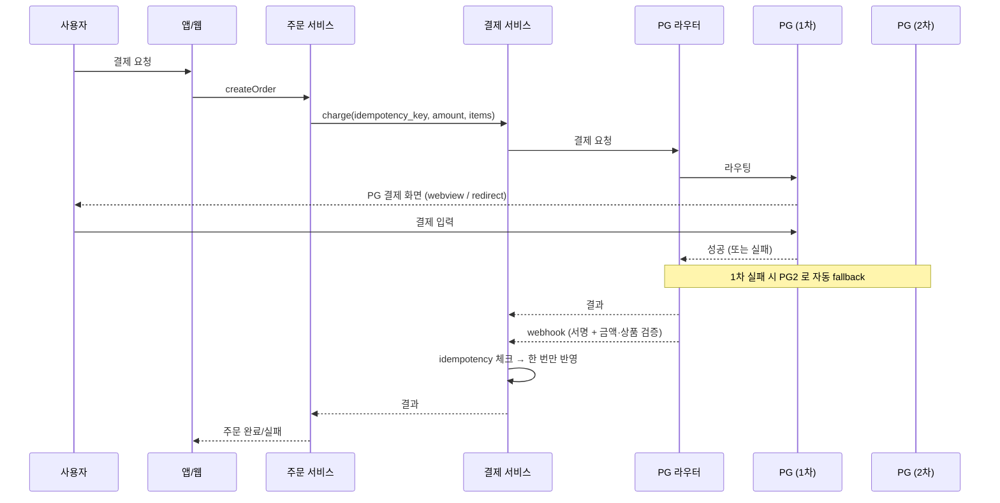
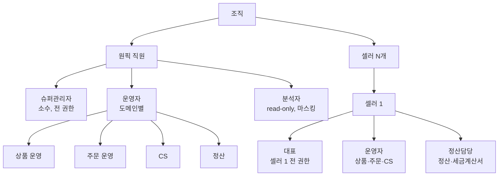
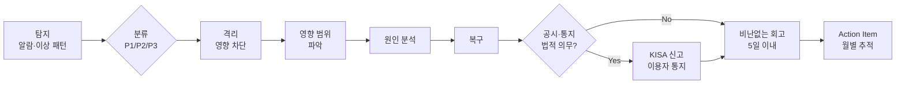

# 6장. 보안과 컴플라이언스

> 한국에서 서비스를 만든다는 것은, 한국 법규 위에서 서비스를 만든다는 뜻이다.

## 이 장에서 답하는 질문

- 한국 법규(개인정보보호법 · 정보통신망법 · 전자금융감독규정 등) 의 핵심을 어디서 챙겨야 하는가?
- 정보보호 관리체계(ISMS-P) 와 망분리, 우리 서비스에 적용되는가?
- 결제 · 본인인증 · 간편로그인의 보안 설계는?
- OWASP Top 10 을 실서비스에 어떻게 강제하는가?
- 어뷰징 · 사기 탐지(Trust & Safety, 신뢰·안전) 는 어떻게 시작하는가?

> ⚠️ **법규 인용 주의**: 이 장은 책 집필 시점(2026년 상반기) 기준의 일반론이다.
> 모든 실제 적용은 시행령 · 고시 · 해석례를 직접 확인할 것. 본문에 "확인 필요" 라고 명시한 부분은 특히 갱신 가능성이 높다.

## 들어가며

보안은 사고가 나기 전엔 비용으로 보이고, 사고가 나면 회사를 흔든다.
한국 시장에서는 추가로 **법규 위반 자체가 직접적 페널티** 가 된다 (과징금 · 서비스 정지 명령).

이 장은 글로벌 보안의 표준(OWASP · CIS(Center for Internet Security) · NIST(National Institute of Standards and Technology)) 위에 한국 법규의 추가 요구를 얹는다.

## 1. 한국 법규의 지형도

### 1.1 핵심 법령

| 법령 | 핵심 | 주관 |
|------|------|------|
| **개인정보보호법** | 개인정보 수집 · 이용 · 제공 · 파기 전반 | 개인정보보호위원회 |
| **정보통신망법** | 정보통신서비스의 이용자 보호 | 방통위 / 과기정통부 |
| **전자상거래법** | B2C 거래 · 표시 · 청약철회 · 기록 보존 | 공정거래위원회 |
| **전자금융거래법 / 전자금융감독규정** | 결제 · 송금 등 전자금융 | 금융위 / 금감원 |
| **신용정보법** | 신용정보 · CB(Credit Bureau, 신용평가기관) | 금융위 |
| **위치정보법** | 위치 기반 서비스 | 방통위 |
| **표시광고법** | 부당광고 · 가격 표시 | 공정거래위원회 |

### 1.2 인증 / 인증제도

| 인증 | 의미 | 의무 여부 |
|------|------|---------|
| **ISMS** (Information Security Management System, 정보보호 관리체계) | 정보보호 전반 관리 체계 | 매출 / 이용자 일정 이상 의무 — **확인 필요** |
| **ISMS-P** (개인정보 + ISMS) | ISMS + 개인정보 관리체계 | 위와 동일 + 개인정보 처리량 |
| **PIMS** (Personal Information Management System) | 2018년 이후 ISMS-P 로 통합 | — |
| **PCI-DSS** (Payment Card Industry Data Security Standard) | 카드 정보 처리 | 카드 정보를 자체 저장할 때. 보통 PG(Payment Gateway, 결제 대행) 위탁으로 회피 |
| **KCMVP** (Korea Cryptographic Module Validation Program) | 암호 모듈 검증 | 공공 · 금융 일부 |
| **CC 인증** (Common Criteria, 공통평가기준) | 보안 제품 평가 | 보안 솔루션 도입 시 |

원픽 케이스 ([케이스 5.1](../case-study/README.md#51-법규-대한민국)): **ISMS-P 의무 대상**. 매출 100억 이상 또는 일평균 이용자 일정 이상 기준 — **확인 필요**.

### 1.3 전자금융감독규정 — 결제 직접 처리 회피

자체 결제 처리는 전자금융거래법(전금법) 의 직접 적용을 받아 매우 무겁다.
원픽은 **PG 위탁 전제** 로 이 부담을 회피한다 ([ADR-0001](../../adr/0001-케이스-스터디-서비스-정의.md)).
단 PG 위탁이라도 다음은 본인 책임:

- PG 응답 · webhook 검증
- 결제 정보의 우리 측 저장 (저장 안 하는 게 원칙)
- 환불 · 취소 · 정산의 정확성

### 1.4 ISMS-P 의 실제 영향 (요약)

- 망분리 / 망구성 / 접근 통제 문서화
- 개인정보 처리 시스템의 별도 관리 · 접근 통제 · 암호화
- 분기 / 연간 점검 · 외부 모의해킹
- 최고책임자 — **CISO** (Chief Information Security Officer, 최고정보보호책임자) / **CPO** (Chief Privacy Officer, 개인정보보호책임자) 지정 (회사 규모에 따라 의무)
- 이용자 동의 / 통지 / 위탁 · 이전 고지
- 사고 통지 — 일정 시한 이내 (개인정보 유출 시 「개인정보 보호법」 제34조 등) — **확인 필요** (구체 시한 · 신고처는 8.2 와 함께 갱신)

### 체크리스트 — 법규 의무 점검

- [ ] 적용 법규 / 인증 의무 대상인지 명시적으로 확인했는가
- [ ] CISO / CPO 지정이 의무라면 임명되어 있는가
- [ ] PG 위탁 vs 자체 처리 경계가 명확하고 문서화되었는가
- [ ] 망분리 의무가 있다면 구현 방식이 정해졌는가
- [ ] 사고 통지 시한 / 신고처가 플레이북에 적혀 있는가

## 2. 개인정보 보호의 실무

### 2.1 분류

원픽이 처리하는 개인정보의 위험도 분류:

| 등급 | 항목 | 처리 |
|------|------|-----|
| 일반 | 이메일 · 닉네임 · 생년월일 | 암호화 저장 권장 |
| 민감 | 주민등록번호 (저장 금지 원칙) | 본인인증 외엔 저장 안 함, 해시 · CI(Connecting Information, 연계정보) 만 |
| 신용 | 카드 정보 | 자체 저장 금지, PG 토큰화 |
| 위치 | GPS · 접속 IP | 별도 동의 · 최소 수집 |

### 2.2 라이프사이클

- **수집**: 동의 항목 분리 (필수 / 선택), 마케팅 별도
- **이용**: 목적 외 이용 금지
- **제공**: 제3자 제공 시 별도 동의 · 고지
- **위탁**: 위탁 처리(클라우드 포함) 사실 공개
- **국외 이전**: 별도 동의 — **확인 필요**
- **파기**: 보유 기간 만료 시 또는 회원 탈퇴 시 즉시. 자동화 필요.

### 2.3 가명 / 익명 처리

- **가명 처리**: 추가 정보 없이는 특정 개인을 알아볼 수 없게 (재식별 가능). 추가 정보는 분리 저장.
- **익명 처리**: 시간 · 비용 · 기술 고려해도 특정 불가. 더 이상 개인정보 아님.
- 분석 · AI 학습에는 가명 / 익명 처리 데이터 사용 권장.

### 2.4 접근 통제

- 인사 정보 변경 시 접근 권한 즉시 변경 (퇴사 · 이동)
- 운영 DB 직접 접근 최소화 (보통 readonly + 마스킹)
- 모든 PII (Personally Identifiable Information, 개인 식별 정보) 접근 — 누가 · 언제 · 왜 — 감사 로그
- 다운로드는 별도 승인 + 알림

### 2.5 암호화

| 영역 | 알고리즘 | 비고 |
|------|---------|------|
| 비밀번호 | bcrypt / Argon2id | salt 16바이트+ |
| PII at rest (저장 시) | AES-256-GCM | KMS (Key Management Service, 키 관리 서비스) 또는 HSM (Hardware Security Module, 하드웨어 보안 모듈) 으로 키 관리 |
| 통신 (in transit) | TLS (Transport Layer Security) 1.2+ (1.3 권장) | 약한 cipher 비활성 |
| 주민번호 등 식별번호 | 해시 + CI | 본인 동일성만 확인 |

KCMVP 검증된 모듈은 공공 / 금융에서 의무. 일반 IT 서비스는 보통 표준 OpenSSL 등 사용 가능.

### 체크리스트 — 개인정보 라이프사이클

- [ ] PII 가 등급별로 분류되어 저장되는가
- [ ] 동의 항목이 필수 / 선택으로 분리되고 마케팅 동의가 별도인가
- [ ] 보유 기간 만료 / 회원 탈퇴 시 자동 파기 파이프라인이 있는가
- [ ] 모든 PII 접근이 감사 로그로 남고 SIEM (Security Information and Event Management, 보안 정보·이벤트 관리) 으로 흐르는가
- [ ] 분석 / AI 학습용 데이터는 가명 또는 익명 처리되는가

## 3. 인증과 세션의 보안

### 3.1 회원 / 로그인

- bcrypt cost ≥ 12, Argon2id 권장
- 시도 횟수 제한 (rate limit + 계정 잠금)
- 비밀번호 변경 강제 주기 — NIST SP 800-63B 는 **주기 강제 비권장** (URL 확인 필요). 누출 신호가 있을 때만.
- 의심 로그인 — 위치 / 디바이스 변경 시 추가 인증

### 3.2 멀티팩터 인증 (MFA, Multi-Factor Authentication)

- 셀러 어드민 / 사내 어드민 — TOTP (Time-based One-Time Password, 시간 기반 일회용 비밀번호) 강제
- 일반 사용자 — 결제 · 고가 거래 시 추가 인증 (PASS / SMS / 카카오 인증)
- WebAuthn (W3C 의 강력 인증 표준) / Passkey (패스키, 비밀번호 없는 인증) — 점진 도입 검토

### 3.3 세션 / 토큰

- 쿠키: HttpOnly, Secure, SameSite=Lax (또는 Strict)
- CSRF (Cross-Site Request Forgery, 사이트 간 요청 위조) 방어: SameSite + 토큰 이중 방어
- JWT (JSON Web Token): 짧은 access + 긴 refresh + rotate. blacklist 보다는 짧은 만료 + revocation 키 우선.
- 세션 고정 (Session Fixation) — 로그인 직후 세션 재발급

### 3.4 본인인증

- PASS (이통3사) / NICE / KCB
- 보통 결제 · 계정 회복 · 민감 정보 변경 시
- 다중화 — 한 사 장애 시 다른 사로 fallback ([케이스 7](../case-study/README.md#7-외부-의존성))

### 3.5 간편로그인

- 카카오 / 네이버 / 구글 / 애플
- 표준 OAuth2 (Open Authorization 2) / OIDC (OpenID Connect, OAuth2 기반 인증 표준), redirect_uri 화이트리스트 엄격
- 우리 측에서는 **소셜 ID 와 자체 회원의 매핑 테이블** 운영
- 애플 — 이메일 가리기(Hide My Email) 처리

### 체크리스트 — 인증 / 세션 점검

- [ ] 비밀번호 저장이 bcrypt cost ≥ 12 또는 Argon2id 인가
- [ ] 어드민 콘솔에 MFA(TOTP / WebAuthn) 가 강제되는가
- [ ] HttpOnly + Secure + SameSite 쿠키 + CSRF 토큰이 모두 설정됐는가
- [ ] 로그인 직후 세션 ID 가 재발급되는가 (Session Fixation 방지)
- [ ] OAuth2 redirect_uri 화이트리스트가 엄격한가

## 4. 결제 보안

### 4.1 PG 연동의 기본 — 시퀀스

- **결제 요청** → PG 화면 → PG 결과 → 우리 webhook
- **webhook 검증**: 서명 · IP 화이트리스트 · idempotency
- **재처리 안전**: 같은 결제 결과가 여러 번 와도 한 번만 반영
- **금액 · 상품 검증**: 결과 금액이 우리 주문 금액과 일치하는가

### 4.2 결제 가용성 / 다중화

원픽 SLA: 결제 가용성 99.99% ([케이스 6](../case-study/README.md#6-운영-sla)).

- PG 3사 라우팅 — 토스페이먼츠 / KCP / NICE페이먼츠 ([케이스 7](../case-study/README.md#7-외부-의존성))
- 1차 실패 시 다음 PG 자동 시도 (사용자에게는 한 번의 재시도로 보임)
- 카드사 일시 장애 → 다른 카드사로 유도

### 4.3 간편결제

- 카카오페이 / 네이버페이 / 토스페이 — 각각 별도 연동
- 자체 적립금 · 쿠폰 적용 후 잔액 결제
- 정기결제 (구독) — 빌링키 보관 · 갱신

### 체크리스트 — 결제 보안 점검

- [ ] webhook 서명 검증이 모든 PG 에 대해 구현됐는가
- [ ] 결제 결과 금액이 주문 금액과 일치 검증되는가
- [ ] idempotency 키로 중복 webhook 이 한 번만 반영되는가
- [ ] PG 다중화 + 자동 fallback 이 분기 1회 drill 되는가
- [ ] 카드 정보가 우리 측에 전혀 저장되지 않는가 (PG 토큰만)

## 5. OWASP Top 10 — 실서비스 적용

### 5.1 핵심 10가지 (요약)

| 항목 | 우리 영역 적용 |
|------|---------------|
| Broken Access Control (인가 결함) | 인가는 한 곳에서, 객체 단위 권한 검사 |
| Cryptographic Failures (암호 실패) | 위 2.5 절 |
| Injection (SQL / NoSQL / Command) | ORM (Object-Relational Mapping, 객체-관계 매핑) · prepared statement, 입력 검증 |
| Insecure Design (불안전 설계) | 위협 모델링 (Threat Modeling) 정기 |
| Security Misconfiguration (보안 설정 결함) | IaC 표준화, 기본 secret 변경 |
| Vulnerable Components (취약 컴포넌트) | SBOM (Software Bill of Materials, 소프트웨어 자재 명세), Dependabot / Renovate |
| Identification & Authentication Failures | 위 3절 |
| Software / Data Integrity (무결성 실패) | 서명된 빌드, 의존성 무결성 |
| Logging & Monitoring (로깅 · 모니터링 실패) | SIEM (Security Information and Event Management, 보안 정보 · 이벤트 관리) · 이상 탐지 |
| SSRF (Server-Side Request Forgery, 서버 측 요청 위조) | URL 화이트리스트, 메타데이터 IP 차단 |

### 5.2 강제 방법

- **CI 게이트**:
  - SAST (Static Application Security Testing, 정적 분석): SonarQube / Semgrep
  - SCA (Software Composition Analysis, 의존성 분석): Dependabot / Renovate / OWASP Dependency-Check
  - IaC scan: Checkov / tfsec
  - Secret scan: Gitleaks / TruffleHog
- **운영**:
  - WAF (Web Application Firewall, 웹 애플리케이션 방화벽) — CloudFront + AWS WAF / 국내 사이버보안업체
  - Bot 보호 (Vercel BotID, Cloudflare Bot Management)
  - 분기 외부 모의해킹

### 체크리스트 — OWASP 강제 점검

- [ ] CI 에 SAST · SCA · IaC scan · Secret scan 4가지가 모두 게이트로 들어가 있는가
- [ ] WAF / Bot 보호가 운영 환경에서 작동 중인가
- [ ] SBOM 이 모든 빌드에서 자동 생성되는가
- [ ] 분기 1회 외부 모의해킹이 수행되고 결과가 추적되는가
- [ ] OWASP Top 10 + ASVS (Application Security Verification Standard) 가 보안 챔피언 교재로 활용되는가

## 6. 어드민 / 셀러 권한 모델

원픽 같은 입점 서비스의 가장 어려운 보안 영역.

### 6.1 권한 모델 — 트리

### 6.2 핵심 룰

- 셀러 운영자는 **자기 셀러의 데이터만** 볼 수 있음 (멀티테넌시 강제)
- 모든 어드민 액션 — 누가 · 언제 · 무엇을 — 감사 로그
- 권한 변경 — 별도 승인 워크플로
- 슈퍼관리자 작업은 항상 페어 — **4-eyes principle (4-eyes 원칙, 두 사람이 함께 승인)**

### 6.3 멀티테넌시 격리

- DB 쿼리에 `WHERE seller_id = ?` 강제 (애플리케이션 레이어)
- Row-Level Security (RLS, 행 단위 보안 — PostgreSQL 의 정책 기반 행 접근 통제) 추가 방어선 (defense in depth, 심층 방어)
- 셀러 ID 가 URL / 요청에 노출되지 않도록 — IDOR (Insecure Direct Object Reference, 직접 객체 참조 취약점) 방지

### 체크리스트 — 어드민 권한 / 멀티테넌시

- [ ] 셀러 데이터에 대한 모든 쿼리가 `seller_id` 필터를 강제하는가
- [ ] PostgreSQL RLS 또는 동등한 방어선이 추가로 있는가
- [ ] URL / 요청에 셀러 ID 가 노출되지 않는가 (IDOR 방지)
- [ ] 슈퍼관리자 작업이 4-eyes 원칙을 따르는가
- [ ] 권한 변경 워크플로가 감사 로그를 남기는가

## 7. 어뷰징 · 사기 탐지 (Trust & Safety)

### 7.1 흔한 어뷰징 유형

| 유형 | 설명 |
|------|------|
| 가품 | 위조 상품 등록 |
| 허위 리뷰 | 셀러 자체 리뷰 · 구매 |
| 가짜 주문 | 카드 도용 · 환불 사기 |
| 쿠폰 어뷰징 | 다중 계정으로 신규 쿠폰 반복 |
| 가격 조작 | 셀러간 가격 담합 · 덤핑 |
| 봇 트래픽 | 가격 크롤링 · 재고 매크로 |

### 7.2 단계별 접근 — MVP 부터

- **0단계 (MVP, Minimum Viable Product)** — 룰 3개부터 시작:
  1. "동일 디바이스 5계정 이상" → 신규 가입 차단
  2. "신규 가입 1시간 내 쿠폰 사용" → 사람 검토
  3. "단일 IP 에서 분당 N 회 이상 가격 조회" → rate limit
- **1단계 — 룰 확장**: 도메인 운영팀의 신고 데이터로 룰 추가
- **2단계 — 분류 모델**: 의심 거래 점수화 (XGBoost 등 가벼운 모델)
- **3단계 — 인간 리뷰**: 점수 임계 이상은 사람이 확인 후 조치
- **4단계 — 피드백 루프**: 인간 판단 → 모델 재학습

### 7.3 도구

- 자체 룰 엔진
- 외부: Sift, Riskified, 자체 개발
- 디바이스 핑거프린팅 (FingerprintJS 등)
- 봇 감지: Vercel BotID, hCaptcha, reCAPTCHA Enterprise

### 체크리스트 — Trust & Safety MVP

- [ ] 0단계 룰 3개가 운영 중이고 알람 · 대시보드가 있는가
- [ ] 의심 거래의 인간 리뷰 워크플로가 있고 SLA 가 정의됐는가
- [ ] 봇 감지 (BotID 등) 가 결제 · 쿠폰 경로에 적용됐는가
- [ ] 모델 변경 시 회귀 측정용 골든 데이터셋이 있는가

## 8. 사고 대응 / 침해 사고

### 8.1 사고 대응 절차

### 8.2 공시 의무

- 개인정보 유출: 「개인정보 보호법」 제34조 등 — 일정 시한 이내 KISA(한국인터넷진흥원) 신고 — **확인 필요** (조건 · 방법 · 시한 변동)
- 정보통신서비스 침해사고: KISA 신고 권장
- 자율 공시: 사용자 신뢰 회복 측면

### 8.3 사후 조치

- 포렌식 — 외부 전문 업체 활용
- 보험 — 사이버보험 검토
- 법무 검토 — 책임 한계 · 공시 표현

### 체크리스트 — 사고 대응 준비

- [ ] 사고 대응 플레이북이 문서화되어 있고 IC(Incident Commander, 인시던트 사령관) 풀이 있는가
- [ ] 분기 1회 사고 대응 drill (table-top exercise) 이 수행되는가
- [ ] 법적 통지 시한 / 신고처 / 외부 협력사 (포렌식 · 법무) 가 사전 정의되었는가
- [ ] 회고가 비난 없이 진행되고 Action Item 이 추적되는가

## 9. 사내 보안 운영

### 9.1 시크릿 관리

- 코드에 secret 절대 금지 (git secret scan 강제)
- 중앙 저장소: AWS Secrets Manager / HashiCorp Vault / 1Password
- 로테이션: 90일 자동 (가능한 한)
- 환경별 분리: dev / staging / prod 시크릿 절대 공유 금지

### 9.2 접근 권한

- 인사 변경 → 권한 변경 자동화 (HRIS, Human Resource Information System, 인사 정보 시스템 연동)
- Just-In-Time access (JIT, 적시 부여 권한): 평소엔 권한 없음, 필요 시 일시 부여 (Teleport / 자체)
- 관리자 콘솔 — VPN (Virtual Private Network, 가상 사설망) + MFA 필수

### 9.3 보안 문화

- 분기별 보안 교육 (의무)
- 보안 챔피언 — 도메인팀별 보안 책임자 1명
- 분기 모의해킹 (외부 + 내부 Red Team)
- Bug Bounty (선택) — 외부 제보자 보상

### 체크리스트 — 사내 보안 운영

- [ ] 시크릿이 코드 밖에서 관리되고 90일 로테이션이 작동하는가
- [ ] 인사 변경 → 권한 변경이 자동화됐는가 (퇴사자 권한 즉시 회수)
- [ ] 관리자 콘솔이 VPN + MFA 필수인가
- [ ] 보안 챔피언이 도메인팀마다 지정되어 있는가

## 10. 케이스 — 원픽 보안 우선순위

상시 우선순위 5가지 — 각 항목은 [케이스 10.1](../case-study/README.md#101-구체-신호-수치-기준) 또는 5절 비즈니스 제약과 연결:

1. **결제 webhook 검증 강화** (PG 3사 각각) ← 케이스 5.2 결제 실패율 0.5% 이하
2. **셀러 멀티테넌시 격리** (RLS + 애플리케이션 양 단) ← 케이스 10번 "셀러 권한 모델 정책 일관성"
3. **시크릿 관리 표준화** (Vault 도입) ← ISMS-P 의무 (1.4)
4. **PII 접근 감사 자동화** (모든 쿼리 로깅 → SIEM) ← 2.4 + ISMS-P
5. **분기 외부 모의해킹** (KISA 인증 업체) ← ISMS-P 정기 점검 의무

### 트레이드오프 — 보안 강화 vs 사용자 경험

| 측면 | 강한 보안 | 부드러운 UX |
|------|----------|------------|
| MFA 강제 | 침입 차단 | 이탈률 ↑ |
| 비밀번호 복잡도 | 무차별 대입 차단 | 유저 좌절 |
| 본인인증 빈도 | 사기 차단 | 결제 컨버전 ↓ |
| 권한 분리 | 내부 위험 차단 | 운영 속도 ↓ |

답: 도메인별로 다르게. 결제 · 정산 · 어드민은 강하게, 일반 조회는 부드럽게.

## 11. 정리 — 체크리스트

- [ ] 적용되는 법규 · 인증을 명시적으로 확인했는가 (ISMS-P 의무 여부 등)
- [ ] PII 가 분리 · 암호화 · 접근 통제 · 감사되는가
- [ ] 결제는 PG 위탁이고 webhook 이 검증되는가
- [ ] PG 다중화로 단일 PG 장애에 견딜 수 있는가
- [ ] CI 에 SAST · SCA · Secret scan 이 게이트로 들어가 있는가
- [ ] 셀러 / 어드민 권한 모델이 멀티테넌시 격리를 강제하는가
- [ ] 사고 대응 플레이북이 문서화되어 있고 분기 1회 drill 되는가
- [ ] 시크릿이 코드 밖에서 관리되고 로테이션되는가

## 더 읽을거리

> 형식: 책 = `*제목*, N판 — 저자명 (출판사, 연도) — 한 줄 요약` / 공식 문서 = `이름 — 발행처 (URL — 확인된 것만)` / 법규 = `「법령명」 (조문 또는 연도) — 발행처 (확인 필요)` ([ADR-0009](../../adr/0009-챕터-작성-표준.md) 룰 4)

- *The Web Application Hacker's Handbook*, 2nd ed. — Dafydd Stuttard, Marcus Pinto (Wiley, 2011) — 웹 보안 고전
- *Threat Modeling: Designing for Security* — Adam Shostack (Wiley, 2014) — 위협 모델링 표준서
- 「개인정보 보호법」 (제34조 사고 통지 등) / 「정보통신망법」 (제50조 광고성 정보 등) / 「전자금융거래법」 — 국가법령정보센터 (URL 확인 필요)
- 「정보보호 가이드라인」 — KISA(한국인터넷진흥원) (URL 확인 필요, 수시 갱신)
- 「개인정보 보호법 안내서」 — 개인정보보호위원회 (발행 연도 확인 필요) (URL 확인 필요)
- OWASP Top 10 / ASVS / API Security Top 10 — OWASP Foundation (URL 확인 필요)
- NIST SP 800-63B (Digital Identity Guidelines) — National Institute of Standards and Technology (URL 확인 필요)
