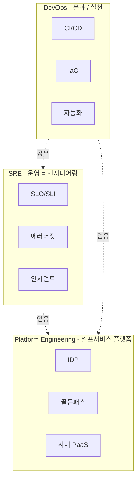
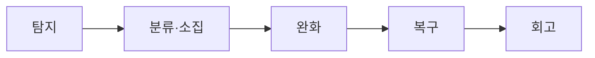
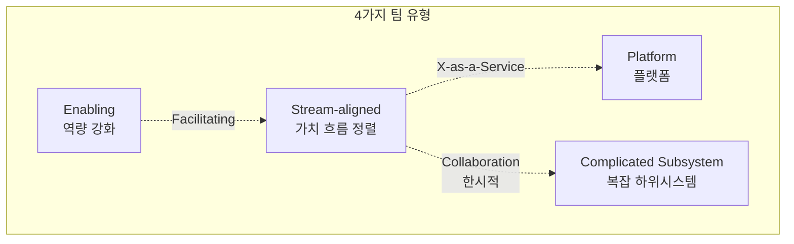

# 7장. 운영과 조직

> 같은 아키텍처도 어느 조직에 얹느냐에 따라 작동하는 시스템과 무너지는 시스템으로 갈린다.

## 이 장에서 답하는 질문

- SRE (Site Reliability Engineering, 사이트 신뢰성 엔지니어링) / DevOps / 플랫폼 엔지니어링은 어떻게 다르고 어떻게 도입하는가?
- 장애가 났을 때 무엇을 해야 하는가? 회고는 어떻게 굴리는가?
- 팀 토폴로지(Team Topologies) 를 어떻게 설계하는가? 콘웨이 법칙(Conway's Law) 은 정말 작동하는가?
- 비용을 누가 책임지는가? 재무 운영(FinOps, Financial Operations) 은 어떻게 시작하는가?
- 아키텍트의 자리는 어디인가?

## 들어가며

좋은 코드가 좋은 서비스를 만들지는 않는다. 좋은 사람들이 좋은 구조에서 일할 때 좋은 서비스가 만들어진다.
이 장은 코드 밖의 영역 — 사람 · 팀 · 운영 · 문화 — 을 다룬다.

## 1. SRE / DevOps / 플랫폼 — 무엇이 다른가

### 1.1 정의 (운영 가능한 수준으로)



| 분야 | 한 줄 정의 | 산출물 |
|------|----------|--------|
| **DevOps** | 개발과 운영을 한 흐름으로 통합하는 문화 · 실천 | CI/CD, IaC, 자동화 |
| **SRE** (Site Reliability Engineering, 사이트 신뢰성 엔지니어링) | 운영을 소프트웨어 엔지니어링 문제로 다룬다 | SLO / SLI / 에러버짓, 인시던트 관리 |
| **Platform Engineering** (플랫폼 엔지니어링) | 개발자에게 셀프서비스(self-service) 가능한 사내 플랫폼 제공 | IDP (Internal Developer Platform, 사내 개발자 플랫폼), 골든 패스(Golden Path), 사내 PaaS |

세 영역은 겹친다. 어느 호칭을 붙이든 본질은: **운영을 "사람의 끊임없는 노동" 이 아니라 "엔지니어링" 으로 다룬다**.

### 1.2 도입 단계

| 팀 규모 | 권장 |
|---------|------|
| < 10 | 별도 분리 X. 모두가 운영도 함 |
| 10~30 | DevOps 문화 · 자동화 정착, SRE 1~2명 검토 |
| 30~80 | SRE 팀 구성, 도메인팀 온콜 분담 |
| 80+ | 플랫폼 엔지니어링 도입, 사내 PaaS 시작 |

원픽 (220명): 플랫폼 본부 35명 ([케이스 4](../case-study/README.md#4-팀-구조)) — SRE + 플랫폼 + 보안 + 데이터플랫폼 통합 본부.

### 트레이드오프 — SRE 분리 vs 도메인팀 통합

| 측면 | SRE 별도 팀 | 도메인팀 내 SRE 흡수 |
|------|------------|---------------------|
| 도메인팀 인지 부하 | 작음 (전문 위임) | 큼 |
| SRE 표준 일관성 | 강함 | 갈라짐 |
| 결정 속도 | 약함 (협상 필요) | 빠름 (한 팀 안) |
| 적합 시점 | 80명+ | < 30명 |

## 2. SLO / SLI / 에러 버짓

### 2.1 정의

- **SLI (Service Level Indicator, 서비스 수준 지표)**: 측정 가능한 지표. 예: "주문 API 의 5xx 비율"
- **SLO (Service Level Objective, 서비스 수준 목표)**: 우리가 목표하는 SLI 의 값. 예: "월 에러율 < 0.1%"
- **에러 버짓(Error Budget)**: SLO 의 여유분. 예: 0.1% 가 SLO 면 0.05% 까지 발생해도 OK. 다 쓰면 새 배포 중단.

### 2.2 좋은 SLO 의 조건

- 사용자 관점에서 의미 있어야 함 (CPU 사용률은 사용자에게 의미 없음)
- 측정 가능
- 도전적이지만 달성 가능 (99.999% 는 비현실적)
- 도메인별 차등 (결제와 추천이 같을 수 없음)

### 2.3 원픽의 SLO ([케이스 6](../case-study/README.md#6-운영-sla) 인용)

| 도메인 | SLO | SLI |
|--------|-----|-----|
| 결제 | 가용성 99.99%, p95 2s | webhook 응답 성공률, p95 응답시간 |
| 주문 | 가용성 99.95%, p95 300ms | 주문 생성 API 성공률 · 지연 |
| 검색 | 가용성 99.9%, p95 400ms | 검색 응답 성공률 · 지연 |

### 2.4 에러 버짓 운영

- 에러 버짓 75% 소진 — 알람
- 90% 소진 — 신규 배포 동결, 안정화 우선
- 100% 소진 — 사후 분석, 다음 달 보수적 운영
- 회복 후 — 빠른 배포 재개

### 체크리스트 — SLO 운영

- [ ] 도메인별 SLO 가 사용자 관점 지표로 정의되었는가
- [ ] SLO 달성도가 자동 측정되어 대시보드에 노출되는가
- [ ] 에러 버짓 임계 (75% / 90% / 100%) 별 행동 룰이 합의되었는가
- [ ] 90% 소진 시 신규 배포가 자동 차단되는가 (수동이면 안 지켜짐)

## 3. 인시던트 관리

### 3.1 단계



### 3.2 역할

- **Incident Commander (IC, 인시던트 사령관)**: 의사결정 · 소통 책임. 직접 디버깅 X.
- **Operations Lead**: 실제 디버깅 · 복구 작업
- **Communications Lead**: 사내 · 고객 · 외부 소통 일원화
- **Scribe (서기)**: 타임라인 기록

### 3.3 운영 룰

- **임계 충족 즉시 IC 지명** (외부 도구: PagerDuty, Opsgenie, 자체)
- **소통 채널 고정** (Slack 채널 #incident-YYYYMMDD)
- **타임라인 실시간 기록** (사후 회고의 1차 자료)
- **복구가 1순위** — 원인 분석은 그 다음
- **외부 통보 의무 시점 인지** (개인정보 유출 등 — 6장 참조)

### 3.4 회고 (Postmortem) — 비난 없는 회고

- **사람 책임 X, 시스템 책임 O**: "A 가 실수했다" 가 아니라 "그 실수가 prod 에 도달하게 한 시스템"
- 형식: 요약 / 영향 / 타임라인 / 근본 원인 / 트리거 / 잘된 것 / 개선할 것 / Action Item
- Action Item 은 담당자 · 기한 명시
- 모든 회고 공개 (사내). 비밀은 신뢰를 죽인다.

### 3.5 흔한 함정

> - 회고가 형식이 됨 — Action Item 추적 안 됨
> - 사람 비난으로 흐름 — 다음 회고에서 정직한 보고 사라짐
> - "원인은 휴먼 에러" 결론 — 근본 원인 분석 실패의 신호
> - 회고 자체가 짐이 됨 — 시간 cap (90분 이내) 두고 진행

## 4. 온콜 (On-call, 호출 대기)

### 4.1 구성

- **1차 온콜**: 첫 알람 응답
- **2차 온콜**: 1차가 못 받을 때 자동 escalation (단계 격상)
- **IC 풀**: 큰 사고 시 IC 역할 가능한 사람들

### 4.2 룰

- 7일 / 14일 로테이션 (도메인팀별)
- 평균 알람 < 주 5건 — 그 이상이면 알람 정리 우선
- 야간 호출 — 익일 휴무 또는 보상
- 신규 입사자는 3개월 그림자(shadow) 후 온콜 투입

> 위 수치는 일반적 권장. 조직마다 야간 호출 빈도 · 도메인 위험도 · 인력 풀에 따라 조정 — 룰을 그대로 복사하지 말고 자기 조직에 맞게 결정.

### 4.3 알람 위생

- 알람 = 사람의 즉시 행동 필요. 그 외는 알람 X.
- 모든 알람은 **runbook (런북, 운영 절차서)** 링크 포함
- 무시되는 알람은 정리 — **Pager Fatigue (호출 피로)** 가 가장 위험

### 체크리스트 — 온콜 점검

- [ ] 1차 / 2차 / IC 풀 구분이 명확한가
- [ ] 모든 알람에 runbook 링크가 있는가
- [ ] 평균 알람 빈도가 측정되고 임계 초과 시 정리 작업이 트리거되는가
- [ ] 신규 입사자에게 그림자 기간이 보장되는가
- [ ] 야간 호출에 대한 보상 / 휴무 정책이 명문화됐는가

## 5. 팀 토폴로지 (Team Topologies)

### 5.1 4가지 팀 유형



| 유형 | 역할 | 원픽 사례 |
|------|------|----------|
| **Stream-aligned (가치 흐름 정렬)** | 한 도메인의 가치 흐름 책임 | 주문팀, 결제팀, 검색팀 |
| **Platform (플랫폼)** | 다른 팀에 셀프서비스 제공 | 플랫폼 본부 ([케이스 4](../case-study/README.md#4-팀-구조)) |
| **Enabling (역량 강화)** | 다른 팀의 역량 한시적 강화 | 보안 챔피언, ML 도입 지원 |
| **Complicated Subsystem (복잡 하위시스템)** | 깊은 전문성 요구 영역 | 검색 · 추천 (일부) |

### 5.2 인터랙션 모드 (3가지)

- **Collaboration (협업)**: 둘이 같이 일함 (한시적, 비싼 모드)
- **X-as-a-Service**: 한 팀이 다른 팀의 서비스를 그냥 씀
- **Facilitating (촉진)**: 한 팀이 다른 팀을 가르침

좋은 조직 — Collaboration 은 적게, X-as-a-Service 는 많게.

### 5.3 콘웨이 법칙 (Conway's Law)

> 시스템의 구조는 그 시스템을 만든 조직의 의사소통 구조를 닮는다.

역으로 — **원하는 시스템 구조를 얻으려면 조직 구조를 먼저 그려야 한다** — 역 콘웨이(Inverse Conway Maneuver, 콘웨이 법칙을 의도적으로 거꾸로 적용).

원픽이 도메인 분리를 강하게 하고 싶다 → 도메인팀의 권한 · 예산 · 코드 오너십을 분리.
검색 · 추천을 별도 시스템으로 추출하기 전에 먼저 별도 팀이 되어야 함.

### 5.4 도메인팀의 인지 부하

한 팀이 책임지는 코드 / 시스템이 너무 커지면 무너진다.
적정선: 한 팀(5~9명) 이 한 두 개의 도메인을 깊이 책임. 그 이상은 분리 신호.

### 트레이드오프 — Stream-aligned 팀 크기

| 측면 | 작은 팀 (3~5명) | 적정 팀 (5~9명) | 큰 팀 (10명+) |
|------|---------------|---------------|--------------|
| 인지 부하 | 낮음 | 적정 | 높음 |
| 자율성 | 강함 | 강함 | 약함 (조율 필요) |
| 휴가 / 온콜 부담 | 매우 큼 | 적정 | 작음 |
| 적합 | 단일 마이크로 도메인 | 일반 | 분리 신호 |

## 6. 플랫폼 엔지니어링

### 6.1 골든 패스 (Golden Path)

"우리 회사에서 신규 서비스를 만드는 표준 방법" 의 1줄 명령어.

```bash
op service create order-history --lang kotlin --runtime k8s
```

- 코드 템플릿 (Spring Boot 또는 Go)
- CI/CD 파이프라인 (GitHub Actions)
- 관측성 (OTel — OpenTelemetry, Prometheus, Grafana 대시보드)
- 시크릿 · 환경변수 (Vault)
- 표준 라벨 · 태그
- 카탈로그 등록

### 6.2 IDP (Internal Developer Platform, 사내 개발자 플랫폼)

- 셀프서비스: 환경 생성 · 시크릿 발급 · 도메인 발행
- 가시성: 누가 어떤 서비스를 책임지고 어떤 SLO 인지
- 도구: Backstage (Spotify, 오픈소스), Port, 자체 개발

### 6.3 플랫폼팀의 함정

> - **상아탑 플랫폼**: 도메인팀이 안 씀. 플랫폼팀의 자기만족.
> - **모든 표준 강제**: 자율성 죽음. 도메인팀의 정당한 예외 인정 필요.
> - **운영 책임 회피**: 플랫폼이 망가지면 도메인팀이 못 일함. 플랫폼도 자체 SLO 가 있어야.

## 7. FinOps — 비용의 책임

### 7.1 원칙

- **비용은 도메인팀의 KPI**: 인프라팀이 모든 비용을 짊어지면 줄지 않음
- **가시성 먼저**: 도메인별 비용 보이게 (태그 · 계정 분리)
- **점진적 최적화**: 한 번에 50% 줄이려는 시도 보다 매월 5% 줄이기

### 7.2 운영

- 월 1회 비용 리뷰 (도메인 리드 참여)
- 분기 1회 비용 점검 워크숍 (RI / Savings Plan, idle 자원 정리)
- 비용 알람 — 예산 80% / 100% 자동
- 큰 변경 — Architecture Review 에 비용 추정 포함

### 7.3 흔한 절감

- Idle 자원 정리 (개발 / 스테이징의 24/7 가동)
- RI(Reserved Instance, 예약 인스턴스) / Savings Plan(약정 할인) / Spot
- 로그 레벨 · 보존 기간 점검
- 데이터 전송 — egress(이그레스, 외부로 나가는 트래픽) 가 가장 비싸다 (특히 cross-region — 리전 간)

### 체크리스트 — FinOps 운영

- [ ] 도메인별 비용이 매월 대시보드에 노출되는가
- [ ] 도메인 리드의 평가 / KPI 에 비용이 포함되는가
- [ ] 예산 80% / 100% 알람이 자동 작동하는가
- [ ] Architecture Review 에 비용 추정이 의무인가
- [ ] 분기 비용 점검에서 의미 있는 절감이 측정되는가

## 8. 의사결정 구조

### 8.1 RACI

큰 결정에는 RACI (Responsible-Accountable-Consulted-Informed) 정의:

- **R**esponsible (실행 책임) — 실제 작업자
- **A**ccountable (최종 책임) — 1명
- **C**onsulted (자문) — 의견 수렴
- **I**nformed (통보) — 결과 알림

### 8.2 RFC / ADR

- **RFC (Request for Comments, 의견 요청서)**: 큰 변경 제안. 작성 → 회람 → 토론 → 결정. 결정은 ADR 로.
- **ADR (Architecture Decision Record)**: 결정 기록. 변경 안 함, 새 ADR 로 대체.
- 도메인 내 작은 결정은 ADR 만, 큰 결정은 RFC 도.

### 8.3 합의 vs 결정자

- 합의가 필요한 것 / 한 사람이 결정해야 빠른 것 — 처음부터 분리
- "위원회 의사결정" 이 모든 결정을 지배하면 속도가 죽음

### 체크리스트 — 의사결정 구조

- [ ] 큰 결정에 RACI 가 정의되는가 (특히 Accountable 1명)
- [ ] RFC / ADR 의 구분과 사용 시점이 합의됐는가
- [ ] 도메인 내 결정은 도메인팀 자율인가 (위원회로 흐르지 않는가)

## 9. 아키텍트의 자리

### 9.1 안티패턴

> - **상아탑 아키텍트**: 코드 안 만짐, 결정만 내림. 6개월 후 현실과 어긋남.
> - **PPT 아키텍트**: 다이어그램과 문서만, 운영 책임 없음.
> - **혼자 결정하는 아키텍트**: 팀의 자율성 죽이고 자기 병목.

### 9.2 좋은 아키텍트의 일

- 코드를 떠나지 않음 (전체의 30% 정도)
- 결정을 글(ADR) 로 남김
- 팀의 결정을 막지 않고 도움 — 게이트가 아니라 가이드
- 도메인 너머 시야 — 검색 결정이 결제에 미칠 영향
- 사람 — 1:1, 멘토링, 채용

### 9.3 한국 시장에서

- 시니어 / 리드 / 아키텍트 호칭이 회사마다 다름
- "테크 리드" 가 아키텍트 역할을 겸하는 곳이 많음
- 별도 아키텍트 직무가 있는 곳: 대기업 · SI · 금융 · 일부 테크 스타트업

### 9.4 원픽에서의 아키텍트 라인업 (가정)

[케이스 4 팀 구조](../case-study/README.md#4-팀-구조) 와 결합한 가정의 라인업:

- **Chief Architect (1명)** — CTO 직속. 본부 간 횡단 결정 / RFC 진행자.
- **본부별 Lead Architect (5~6명)** — 커머스 / 셀러 / 검색·추천 / 클라이언트 / 데이터 / 플랫폼 본부 각 1명.
- **Staff Engineer (도메인팀 일부)** — 코드 30% 시간을 유지하는 시니어. 도메인 내부 결정 책임.

(아키텍트 직무 자체를 두지 않는 조직에서는 위 역할을 본부 리드 / 테크 리드가 겸한다.)

## 10. 케이스 — 원픽 운영 / 조직

### 10.1 SRE / 플랫폼 구조 ([케이스 4](../case-study/README.md#4-팀-구조) 인용)

원픽의 플랫폼 본부 35명 분해:

- SRE 8명 (인프라 · 관측성 · CI/CD)
- 플랫폼 12명 (사내 IDP, 골든 패스, 공통 라이브러리)
- 보안 6명 (보안 운영 · 감사 · 교육)
- 데이터플랫폼 9명 (데이터 파이프라인 · DW 운영)

### 10.2 온콜

- 도메인팀별 1차 온콜 + 플랫폼 SRE 가 2차
- IC 는 풀에서 자동 배정 (PagerDuty)
- 야간 호출 시 다음날 오후 휴무

### 10.3 SLO 운영

- 분기 1회 SLO 리뷰 (CTO + 도메인 리드)
- 에러버짓 90% 소진 시 자동으로 ArgoCD 배포 차단 (자체 구현)
- 매일 morning standup 에서 SLO 위반 도메인 공유

### 10.4 회고 / 학습

- 모든 P1 / P2 인시던트 — 5일 이내 회고 (비난 없는)
- 회고 결과는 사내 위키 공개 + 분기 1회 전사 공유 세션
- Action Item 추적 — 월 1회 미완료 리스트 리뷰

### 10.5 비용

- 도메인팀별 월 비용 대시보드 (Grafana)
- 분기 비용 리뷰 — 매출 대비 IT 비용 비율 10~14% 유지가 목표 ([케이스 2.3](../case-study/README.md#23-매출비용-가이드라인) — 멀티 클라우드 + AI 활용 가정)
- 절감 KPI — 도메인 리드 평가 일부에 포함

### 트레이드오프 — 원픽의 운영 / 조직 결정

| 결정 | 선택 | 가져온 가치 | 감수한 비용 |
|------|------|-----------|------------|
| 플랫폼 본부 통합 (SRE + 플랫폼 + 보안 + 데이터플랫폼) | 35명 단일 본부 | 표준 일관 · 인접 영역 협업 쉬움 | 본부장 부담 큼 · 전문 라인 분리 약함 |
| 도메인팀 1차 온콜 | 도메인 책임 + SRE 백업 | 도메인 지식 활용 · 알람-책임 일치 | 도메인팀 야간 부담 |
| 에러버짓 자동 배포 차단 | 90% 소진 시 자동 | 인간 결정 빠짐 → 회피 안 됨 | 정상 배포가 막힐 위험 (false positive) |
| 비난 없는 회고 의무 | 모든 P1 / P2 5일 이내 | 학습 문화 정착 | 회고 자체 시간 부담 |

## 11. 정리 — 체크리스트

- [ ] 도메인별 SLO 가 정의되어 있고 측정되는가
- [ ] 에러버짓 위반 시 행동 룰이 합의되어 있는가
- [ ] 인시던트 IC 풀이 있고 매월 drill 되는가
- [ ] 회고가 비난 없이 진행되고 Action Item 이 추적되는가
- [ ] 알람의 모든 항목이 실제 행동을 요구하는가 (무시되는 알람 정리)
- [ ] 도메인팀의 인지 부하가 적정한가 (5~9명에 1~2 도메인)
- [ ] 플랫폼팀이 자체 SLO 를 가지는가 (자기 서비스에 대해)
- [ ] 비용이 도메인팀의 KPI 에 포함되는가
- [ ] 큰 결정이 ADR 로 남는가
- [ ] 아키텍트가 코드를 완전히 떠나지 않았는가

## 더 읽을거리

> 형식: 책 = `*제목*, N판 — 저자명 (출판사, 연도) — 한 줄 요약` / 공식 문서 = `이름 — 발행처 (URL — 확인된 것만)` ([ADR-0009](../../adr/0009-챕터-작성-표준.md) 룰 4)

- *Site Reliability Engineering* — Betsy Beyer 외 (Google / O'Reilly, 2016) — SRE 의 원조
- *The Site Reliability Workbook* — Betsy Beyer 외 (Google / O'Reilly, 2018) — 위 책의 실천 편
- *Team Topologies* — Matthew Skelton, Manuel Pais (IT Revolution Press, 2019) — 4가지 팀 유형의 표준서
- *Accelerate* — Nicole Forsgren, Jez Humble, Gene Kim (IT Revolution Press, 2018) — DORA(DevOps Research and Assessment) 지표
- *The Manager's Path* — Camille Fournier (O'Reilly, 2017) — 엔지니어 매니지먼트
- *An Elegant Puzzle* — Will Larson (Stripe Press, 2019) — 엔지니어링 매니저 실천
- *Staff Engineer* — Will Larson (자체 출판, 2021) — 아키텍트 / 스태프 엔지니어 역할
- Backstage 공식 문서 — Spotify (URL 확인 필요)
