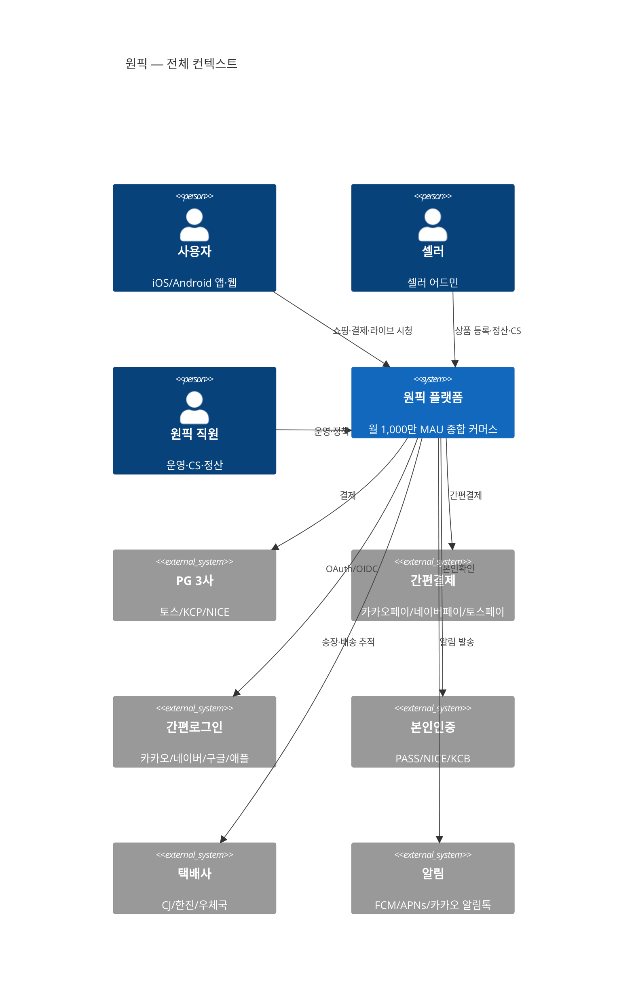
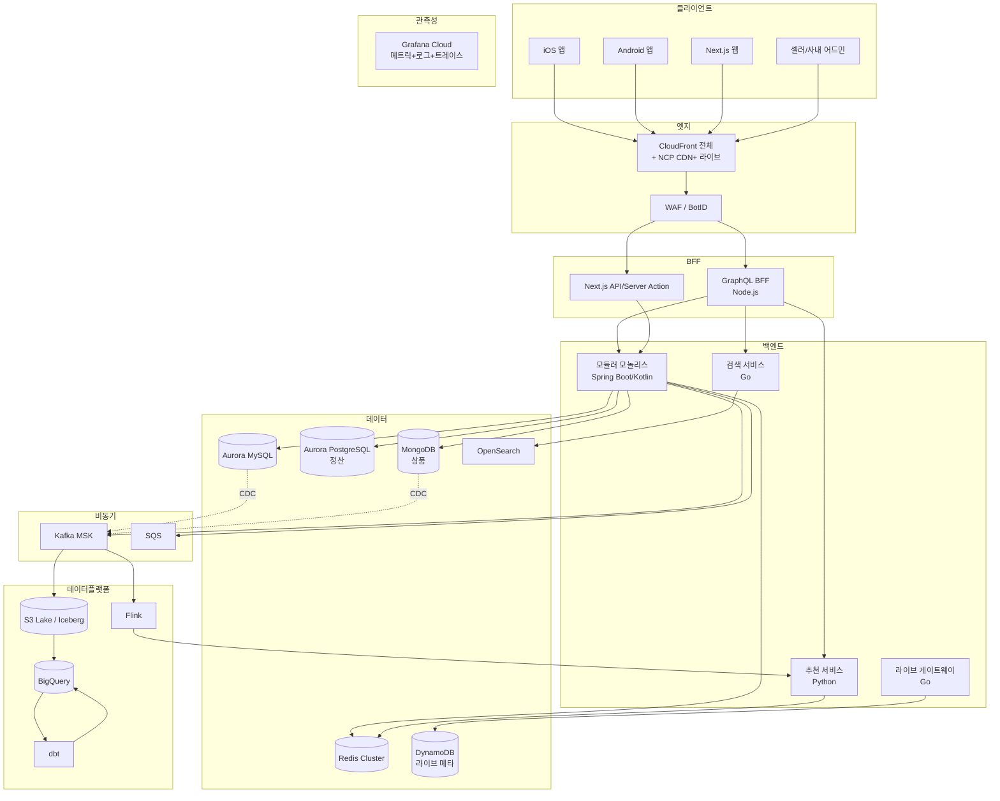
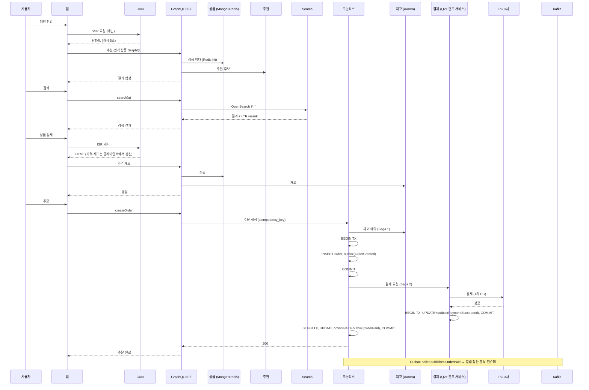
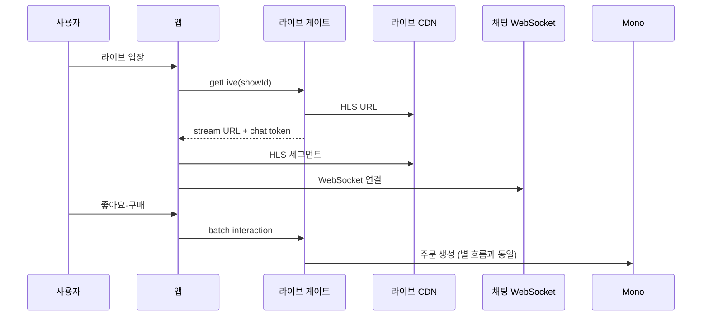

# 8장. 종합 케이스 스터디 — 원픽을 처음부터 설계한다면

> 이 책의 1~7장에서 흩어져 있던 결정들을 한 자리에 모은다.

## 이 장에서 답하는 질문

- 1~7장의 결정들이 한 서비스에서 어떻게 함께 작동하는가?
- "지금 이 시점에서 다시 시작한다면" 어떤 결정을 같게 / 다르게 할까?
- 향후 1년 / 3년의 로드맵은 어떻게 그리는가?
- 이 케이스를 자신의 프로젝트로 가져갈 때 무엇을 바꿔야 하는가?

## 들어가며

[케이스 스터디 문서](../case-study/README.md) 에서 정의한 원픽은, 1~7장 동안 영역별 의사결정의 무대가 되었다.
이 장은 그 결정들을 한 서비스의 전체 그림으로 묶고, 그림 자체를 한 번 더 검토한다.

> **이 장에 자주 등장하는 약어** (다른 장에서 풀이된 항목 재안내 — [ADR-0009](../../adr/0009-챕터-작성-표준.md) 룰 2 보완):
>
> - **MAU** Monthly Active Users (월간 활성 사용자) | **GMV** Gross Merchandise Volume (총 거래액)
> - **PG** Payment Gateway (결제 대행) | **MFA** Multi-Factor Authentication (다중 인증)
> - **BFF** Backend for Frontend | **MSA** Microservices Architecture | **MSK** Managed Streaming for Kafka
> - **EKS** Elastic Kubernetes Service | **CDC** Change Data Capture | **CDN** Content Delivery Network
> - **WAF** Web Application Firewall | **DR** Disaster Recovery (재해복구)
> - **SLO** Service Level Objective (서비스 수준 목표) | **RTO** Recovery Time Objective (복구 목표 시간) | **PII** Personally Identifiable Information (개인 식별 정보)
> - **ISMS-P** 정보보호 및 개인정보보호 관리체계 인증
> - **HLS** HTTP Live Streaming | **LTR** Learning to Rank (학습 기반 랭킹)
> - **SSR / ISR / CSR / SSG / PPR** 서버 / 증분 정적 / 클라이언트 / 정적 / 부분 사전 렌더링
> - **GPU** Graphics Processing Unit | **IDC** Internet Data Center

## 1. 한 장으로 보는 원픽 (System Context)

> 본 절은 그림 한 장으로 끝나는 도입성 절이다 ([ADR-0009](../../adr/0009-챕터-작성-표준.md) 룰 1 면제).

## 2. 한 단계 안 — Container View

> 본 절도 그림 한 장으로 끝나는 도입성 절이다 (룰 1 면제).

## 3. 1~7장의 결정 요약표

| 영역 | 결정 | 근거 (장) |
|------|------|----------|
| **아키텍처 스타일** | 모듈러 모놀리스 + 부분 추출 (검색 · 추천 · 라이브) | 1장 — 220명 · 도메인 결합 강함 · 점진 이행 |
| **클라우드** | AWS 메인 + NCP 보조 (DR + 결제 일부) | 2장 — 비용 협상력 · DR · 인력 시장 |
| **컨테이너** | EKS (서비스 약 80개) + Lambda 일부 | 2장 — 도메인팀 자율 + Managed PaaS 한계 |
| **IaC** | Terraform + Atlantis + ArgoCD | 2장 — 멀티클라우드 표준 |
| **백엔드 언어** | Spring Boot/Kotlin (도메인) + Go (검색·라이브 게이트) + Python (ML) | 3장 + ADR-0005 |
| **API** | 외부 REST · 내부 gRPC · BFF GraphQL | 3장 |
| **DB** | Aurora MySQL (코어) + PostgreSQL (정산) + MongoDB (상품) + Redis + DynamoDB (라이브) | 3장 |
| **트랜잭션** | Saga + Outbox + Idempotency | 3장 |
| **메시징** | Kafka (도메인 이벤트) + SQS (외부 작업) | 3장 |
| **모바일** | Native (Swift / Kotlin), 코드 공유는 토큰 · 스키마 |  4장 |
| **웹** | Next.js, 화면별 SSR / ISR / CSR 혼용 | 4장 |
| **BFF** (Backend for Frontend) | 모바일 GraphQL, 웹은 Next 자체가 BFF | 4장 |
| **디자인 시스템** | 토큰 + Radix UI + Storybook + Visual regression | 4장 |
| **데이터** | S3 Iceberg + BigQuery, dbt + Airflow | 5장 |
| **검색** | OpenSearch + Nori + LTR rerank | 5장 |
| **추천** | Two-tower + Flink 실시간 보정 | 5장 |
| **AI** | 외부 API + AI Gateway, 한국어 특화는 HyperCLOVA X 검토 | 5장 |
| **보안** | ISMS-P 의무 대상 가정. PG 3사 다중화. PII 별도 스키마 · 감사 | 6장 |
| **인증** | 자체 + 카카오/네이버/구글/애플, MFA 셀러 · 어드민 강제 | 6장 |
| **운영** | SRE + 플랫폼 통합본부, 도메인팀 1차 온콜, 비난 없는 회고 | 7장 |
| **조직** | Stream-aligned + Platform + Enabling, 한 팀 5~9명 ([케이스 4](../case-study/README.md#4-팀-구조)) | 7장 |

> 이 표가 본 챕터의 골격이다 — 1~7장 결정의 인덱스 역할이라 절-끝 박스는 면제 ([ADR-0009](../../adr/0009-챕터-작성-표준.md) 룰 1 면제). 1~7장 어느 결정이 후회되거나 바꿀 가치가 있는지는 7절에서 다룬다.

## 4. 핵심 시나리오 — End-to-end

### 4.1 상품 구매 흐름 (피크 시간)

> 이 시퀀스는 **[케이스 12.1](../case-study/README.md#121-1년-분기별) Q2 이후** — 결제 서비스가 모놀리스에서 분리된 구조 기준이다. Q1 시점에는 `Pay` 가 모놀리스 내부 모듈이며 `Order → Pay` 호출이 같은 프로세스 내 메서드 호출로 이뤄진다.

위 시퀀스의 Saga 2단계 의미 (3장 4.2 참고):

- **Saga 1 — 재고 예약**: 실패하면 주문 자체를 만들지 않음. 보상 불필요.
- **Saga 2 — 결제**: 실패하면 재고를 해제하는 보상 트랜잭션 발행. 결제 1차 실패 시 PG 라우터가 2차 PG 로 자동 fallback (3장 8.5).

### 4.2 라이브커머스 진입 흐름

### 4.3 명절 · 블랙프라이데이 대비

평소 대비 약 8배 트래픽 ([케이스 10.1](../case-study/README.md#101-구체-신호-수치-기준) — 작년 추석 피크 8,000 RPS 관측). 일주일 전부터 준비.

| 영역 | 준비 |
|------|------|
| 인프라 | Auto-scaling 임계 사전 조정, RI(Reserved Instance) / Spot 비율 점검 |
| 캐시 | Hot key TTL 짧게 + jitter, Redis Cluster 노드 증설 |
| DB | Reader 임시 증설, slow query 사전 점검 |
| 검색 | OpenSearch 노드 증설, hot 쿼리 캐시 |
| 결제 | PG 3사 모두 사전 통보 받음, 다중화 점검 |
| 알람 | 임계 일시 강화, 온콜 인원 증원 |
| 배포 | D-3 부터 prod 배포 동결 (긴급 외) |
| 운영 | 워룸 운영, IC (Incident Commander, 인시던트 사령관) 24/7 풀 |

### 체크리스트 — 시즌 대비 (블프 / 명절 / 라이브 동시 송출)

- [ ] 8배 트래픽 시뮬레이션 (부하 테스트) 가 D-7 까지 완료됐는가
- [ ] PG 3사 라우팅의 자동 fallback 이 drill 됐는가
- [ ] 배포 동결 일정이 모든 도메인팀에 공지됐는가
- [ ] IC 풀의 24/7 커버리지가 확보됐는가
- [ ] 사후 회고를 위한 타임라인 기록 채널이 사전에 준비됐는가

## 5. 1년 로드맵 (케이스 12.1 인용)

상세는 [케이스 12.1 — 1년 분기별](../case-study/README.md#121-1년-분기별) 참조. 본 절은 분기별 결정의 1~7장 매핑.

| 분기 | 목표 | 관련 장 |
|------|------|--------|
| Q1 | 모놀리스 모듈 경계 강제, 결제 SLO 99.99% 안정화 | 1·3·6 |
| Q2 | 결제 서비스 분리 (NCP 비동기 복제 — RPO 1분 / RTO 5분, 분기 1회 fail-over drill), 라이브 채팅 fanout (분배) 분리 | 2·3·4 |
| Q3 | Feature Store 정식화, 추천 실시간 보정 | 5 |
| Q4 | AI Gateway 도입, 리뷰 요약 · CS 챗봇 정식 출시 | 5·6 |

### 트레이드오프 — 로드맵 우선순위

| 측면 | "안정성 우선" 순서 (현 안) | "AI 우선" 순서 (대안) |
|------|------------------------|---------------------|
| 사용자 체감 | 점진적 (안정 → 신기능) | 빠름 (Q1 부터 신기능) |
| 리스크 | 낮음 (인프라 안정 후 신기능) | 높음 (불안정한 위에 AI) |
| 매출 임팩트 | 중간 (4분기) | 높음 (1분기 — 단 실패 위험) |
| 기술 부채 | 줄어듦 | 늘어남 |

원픽이 안정성 우선을 택한 이유: [케이스 10.1](../case-study/README.md#101-구체-신호-수치-기준) 의 "결제 SLO 분기 평균 70% 소진" — 현재 가용성이 빠듯해 신기능 부담을 추가로 못 짊어지는 상태.

## 6. 3년 비전 (한국 시장 한정)

상세 수치는 [케이스 12.2 — 3년 비전](../case-study/README.md#122-3년-비전-한국-시장-한정) 참조.
[케이스 13](../case-study/README.md#13-이-케이스가-의도적으로-다루지-않는-것) 의 "글로벌 다국가 운영 — 한국 시장 단일" 제약 위에서의 시나리오다.

- MAU 1,000만 → 1,500만
- GMV 1.2조 → 2조
- 라이브 매출 비중 10% → 25%
- AI 활용 — 추천 · 검색 · CS 전 영역 정착
- 개발자 220명 → 320명 (도메인팀 자율성 · 플랫폼 본부 비중 확대)
- 자체 IDC 검토 (대용량 정적 트래픽: 상품 이미지 origin 한정)

> 글로벌 진출은 본 케이스의 의도적 제외 항목이다. 진출 가정 시나리오는 별도 책에서.

### 트레이드오프 — 3년 시점에 다시 검토할 결정

> 본 표의 트리거 수치(GPU 30%, egress 25%) 는 본 절 논의를 위한 가정이다 ([케이스 2.3](../case-study/README.md#23-매출비용-가이드라인) 의 "GPU 비용 IT 비용 15% 이내" 가이드라인을 초과 임계로 가정).

| 결정 | 3년 후에도 유효할까? | 검토 트리거 (가정) |
|------|------------------|------------|
| 모듈러 모놀리스 유지 | 도메인팀 자율 배포 요구가 더 강해지면 추가 추출 검토 | 도메인팀당 일 배포 5회+ |
| AWS 메인 (NCP 보조) | AI/추천 GPU 비용이 IT 비용의 30% 넘으면 GCP 일부 이전 검토 | GPU 비용 / IT 비용 비율 |
| 자체 IDC 미운영 | 상품 이미지 egress 가 인프라 비용의 25% 넘으면 IDC 검토 | egress 비용 비율 |
| 한국 단일 시장 | (의도적 제외 — 본 책 범위 밖) | — |

## 7. "다시 시작한다면"

> 본 절의 "같은 / 다른" 결정 분리는 책의 주된 학습 패턴이다. 절 끝의 박스 대신 두 묶음 자체가 함정 / 학습 내용으로 기능한다.

같은 결정:

- 모듈러 모놀리스로 시작 (MSA 부터 가지 않음)
- Spring + Go 의 분담
- AWS + 보조 NCP
- Saga + Outbox

다르게 했을 결정:

- 데이터 플랫폼을 더 일찍 표준화 (3년차에 했어야)
- ISMS-P 대비를 사업 초기에 (사후 대응 비용이 컸음)
- 디자인 시스템을 1년차에 시작 (3년차에 시작 → 채널별 UI 갈라짐 회수 비용 큼)
- 셀러 멀티테넌시 격리를 RLS (Row-Level Security, 행 단위 보안) 까지 — 처음부터

## 8. 자신의 프로젝트로 가져갈 때

원픽은 "월 1,000만 MAU 커머스" 라는 특정 위치에 있다. 자신의 위치는 다를 것이다.

| 자신의 환경 | 같이 가져갈 것 | 다르게 / 빼야 할 것 |
|------------|-------------|------------------|
| 작은 스타트업 (10명, 10만 MAU) | NFR (Non-Functional Requirements, 비기능 요구사항) 7가지 정량화, ADR 형식 | 모놀리스 1개로 충분. EKS 도 과잉 — ECS Fargate / Cloud Run 시작. PG 3사 → 1사 + 백업 |
| 핀테크 (전금법 직접) | 결제 보안 / 감사 / PG 다중화 | 결제 영역 자체 처리 (위탁 회피 X) — 6장의 보안 · 규제 강도 더 ↑. KCMVP 모듈 검증 의무 |
| B2B SaaS | 모듈러 모놀리스, ADR, SLO | 멀티테넌시 · SSO 가 핵심 — 6장 6절을 코어로. 라이브커머스 / PG 3사는 무관 |
| 공공 · 금융 | 보안 · 감사 · 망분리 의식 | 망분리 강제 / KCMVP 의무 / 국내 클라우드 우선 — 2장과 6장의 결정 우선순위 변경 |
| 글로벌 진출 | 모듈러 → MSA 점진 이행, 관측성 표준 | 데이터 위치 · 법규(GDPR — General Data Protection Regulation, EU 일반 개인정보 보호법 등) 추가, CDN 멀티 PoP, 다국어 i18n |

원칙: **결정 자체보다 결정의 근거** 를 가져갈 것. 같은 트레이드오프가 자신의 환경에서는 다른 결정으로 이어질 수 있다.

## 9. 마지막 트레이드오프 — "끝까지 한 권의 책으로 묶일 수 있는 것"

이 책은 의도적으로 다음을 포기했다.

- **깊이의 끝**: 각 영역의 모든 패턴 · 기법을 다 다루지 못함. *DDIA*(*Designing Data-Intensive Applications*) · *Building Microservices* 등으로 보완.
- **최신성의 끝**: 책은 출간 시점에서부터 뒤처지기 시작. ADR / 회고 / 도구 갱신은 지속적인 별도 활동.
- **개별 산업 깊이**: 게임 · 미디어 · 핀테크 · 공공의 특화는 의도적으로 얕게.

대신 가져간 것:

- **한 명의 아키텍트가 전체를 조망할 수 있는 그림**
- **트레이드오프 중심의 사고 골격**
- **한국 시장이라는 구체적 무대**

## 10. 정리 — 책 전체의 체크리스트

[들어가며](../00-들어가며/) 부터 [운영과 조직](../07-운영과-조직/) 까지의 체크리스트를 한 번에.

### 사고의 틀
- [ ] 자신의 NFR 7가지를 정량화했는가
- [ ] 큰 결정은 ADR 로 남기는가
- [ ] 다이어그램(C4 Context 이상) 이 있는가

### 시스템 설계
- [ ] 도메인 경계가 코드 구조에 강제되는가
- [ ] 단일 DB 로 시작했고, 분리는 신호 기반인가
- [ ] 분산 트랜잭션이 필요한 곳에 Saga + Outbox + Idempotency 가 있는가
- [ ] 캐시 무효화 전략이 명시적인가
- [ ] 메시지가 명령 / 이벤트로 구분되는가

### 클라이언트
- [ ] 채널별 코드 공유 정책이 있는가
- [ ] 화면별 렌더링 전략이 SEO · 신선도 · 비용 기준인가
- [ ] 디자인 시스템이 lint / Storybook 으로 강제되는가
- [ ] Core Web Vitals 가 측정되는가

### 데이터 / AI
- [ ] OLTP / OLAP 가 분리되어 있는가
- [ ] 데이터 신선도 요구가 도메인별로 정의되는가
- [ ] LLM 호출이 캐시 · 라우팅 · 평가를 거치는가

### 보안 / 컴플라이언스
- [ ] 적용 법규 · 인증을 명시 확인했는가
- [ ] PII 가 분리 · 암호화 · 접근 통제 · 감사되는가
- [ ] PG 위탁 + 다중화로 결제 가용성을 보장하는가
- [ ] CI 에 SAST · SCA · Secret scan 게이트가 있는가

### 운영 / 조직
- [ ] 도메인별 SLO 가 정의 · 측정되는가
- [ ] 회고가 비난 없이 진행되고 Action Item 이 추적되는가
- [ ] 알람의 모든 항목이 실제 행동을 요구하는가
- [ ] 비용이 도메인팀의 KPI 에 포함되는가

## 더 읽을거리

> 형식: 책 = `*제목*, N판 — 저자명 (출판사, 연도) — 한 줄 요약` ([ADR-0009](../../adr/0009-챕터-작성-표준.md) 룰 4)
> 이 책을 마무리한 독자에게 권하는 다음 자리.

- *Designing Data-Intensive Applications* — Martin Kleppmann (O'Reilly, 2017) — 데이터 시스템의 깊이
- *Building Microservices*, 2판 — Sam Newman (O'Reilly, 2021) — MSA 의 깊이
- *Software Architecture: The Hard Parts* — Mark Richards, Neal Ford (O'Reilly, 2021) — 트레이드오프 사고
- *Team Topologies* — Matthew Skelton, Manuel Pais (IT Revolution Press, 2019) — 팀 구조 · 콘웨이 법칙
- *Accelerate* — Nicole Forsgren, Jez Humble, Gene Kim (IT Revolution Press, 2018) — DORA 지표
- *Staff Engineer* — Will Larson (자체 출판, 2021) — 아키텍트 · 스태프 엔지니어 역할
- *The Software Architect Elevator* — Gregor Hohpe (O'Reilly, 2020) — 아키텍트의 시야

---

## 끝맺음

좋은 아키텍트는 "정답을 가진 사람" 이 아니라 "트레이드오프를 깊이 이해하고, 그 결정을 글로 남기며, 팀과 함께 책임지는 사람" 이라고 말했다 ([1장](../01-아키텍처-기초/)).

이 책의 모든 결정은 원픽이라는 한 가상의 무대 위에서 이루어졌다.
당신의 무대는 다를 것이다. 트레이드오프의 골격이 같다면, 결정은 다를 수 있고 또 그래야 한다.

이 책을 덮은 뒤 가장 좋은 다음 행동은:

1. **자신의 서비스에 대해 케이스 스터디 한 장을 직접 써보기** — 도메인 · 규모 · 제약을 같은 형식으로
2. **첫 ADR 한 장 쓰기** — 지금 진행 중인 결정 하나를
3. **누군가에게 이 책의 한 장을 설명해보기** — 가르치는 것이 가장 빠른 학습

좋은 아키텍처를 만드는 일에 행운을.
